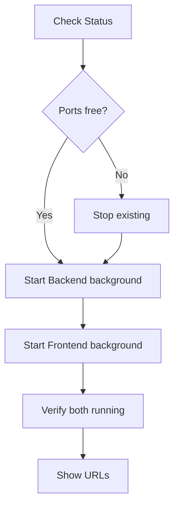

# Dev Server Skill

Manage development servers for claude-code-poneglyph.

## When to Use

| Situation | Action |
|-----------|--------|
| Starting development | Start both servers |
| Testing backend changes | Start/restart backend |
| Testing frontend changes | Start/restart frontend |
| Port conflicts | Check status, stop servers |
| Server not responding | Check status, restart |

## Core Rules

| Rule | Reason |
|------|--------|
| Always check status first | Avoid port conflicts |
| Use `run_in_background: true` | Servers persist |
| Stop before restart | Clean state |
| Monitor with TaskOutput | Debug issues |

## Quick Reference

### Services

| Service | Port | Directory | Command |
|---------|------|-----------|---------|
| Backend (Elysia) | 8080 | `claude-code-ui/server` | `bun run dev` |
| Frontend (Vite) | 5173 | `claude-code-ui/web` | `bun run dev` |

### Commands

| Action | Command |
|--------|---------|
| Check status | `bun .claude/skills/dev-server/scripts/port-status.ts` |
| Stop all | `bun .claude/skills/dev-server/scripts/stop.ts` |
| Start backend | `cd claude-code-ui/server && bun run dev` (background) |
| Start frontend | `cd claude-code-ui/web && bun run dev` (background) |

### URLs

| Service | URL |
|---------|-----|
| Backend API | `http://localhost:8080` |
| Frontend UI | `http://localhost:5173` |
| WebSocket | `ws://localhost:8080/ws` |
| Health check | `http://localhost:8080/health` |

## Workflow

### Starting Servers



### Step-by-Step

1. **Check status**
```bash
bun .claude/skills/dev-server/scripts/port-status.ts
```

2. **If ports occupied, stop**
```bash
bun .claude/skills/dev-server/scripts/stop.ts
```

3. **Start backend** (use `run_in_background: true`)
```bash
cd claude-code-ui/server && bun run dev
```

4. **Start frontend** (use `run_in_background: true`)
```bash
cd claude-code-ui/web && bun run dev
```

5. **Verify running**
```bash
bun .claude/skills/dev-server/scripts/port-status.ts
```

## Examples

### Check Server Status

```bash
# Run this first
bun .claude/skills/dev-server/scripts/port-status.ts

# Expected output:
# Port 8080: LISTENING (backend)
# Port 5173: LISTENING (frontend)
```

### Start Fresh Environment

```bash
# 1. Stop any existing servers
bun .claude/skills/dev-server/scripts/stop.ts

# 2. Start backend (run_in_background: true)
cd claude-code-ui/server && bun run dev

# 3. Start frontend (run_in_background: true)
cd claude-code-ui/web && bun run dev
```

### Restart Backend Only

```bash
# 1. Stop backend
bun .claude/skills/dev-server/scripts/stop.ts --port 8080

# 2. Start backend (run_in_background: true)
cd claude-code-ui/server && bun run dev
```

## Troubleshooting

| Problem | Cause | Solution |
|---------|-------|----------|
| Port already in use | Previous server running | Run stop script |
| Server won't start | Missing deps | `bun install` in directory |
| Connection refused | Server crashed | Check TaskOutput for errors |
| CORS errors | Backend not running | Start backend first |
| HMR not working | Vite issue | Restart frontend |

### Common Fixes

**Port in use (Windows)**
```bash
netstat -ano | findstr :8080
taskkill /PID <pid> /F
```

**Port in use (Unix)**
```bash
lsof -i :8080
kill -9 <pid>
```

**Dependency issues**
```bash
cd claude-code-ui/server && bun install
cd claude-code-ui/web && bun install
```

## Checklist

### Before Starting Servers

- [ ] Checked port status
- [ ] Stopped conflicting processes
- [ ] Dependencies installed (`bun install`)

### After Starting Servers

- [ ] Backend responding at :8080
- [ ] Frontend loading at :5173
- [ ] WebSocket connecting
- [ ] No errors in TaskOutput

---

**Version**: 1.0.0
**Spec**: SPEC-020
