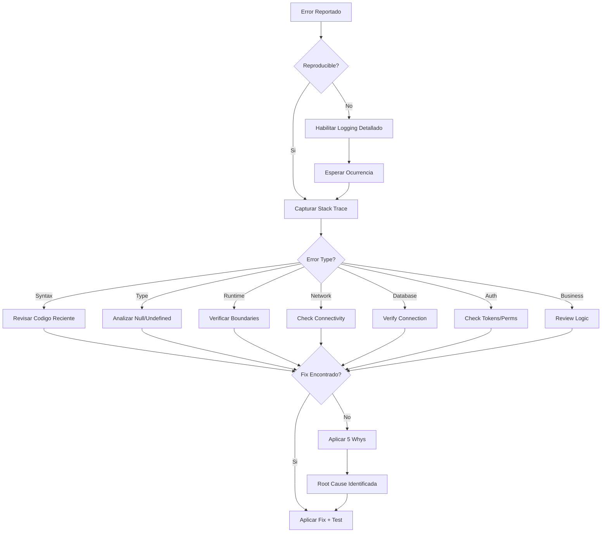

# Diagnostic Patterns

Patrones de diagnostico y debugging para aplicaciones TypeScript/Bun.

## When to Use

| Situacion | Aplica |
|-----------|--------|
| Analizando error messages y stack traces | Si |
| Debugging fallos complejos | Si |
| Investigando issues intermitentes | Si |
| Root cause analysis | Si |
| Errores en produccion sin contexto | Si |
| Simple validation errors | No - Fix input directamente |
| Known transient errors | No - Usar retry-patterns |

## Decision Tree



## Error Classification

| Category | Indicators | Common Causes | First Check |
|----------|------------|---------------|-------------|
| **Syntax** | SyntaxError, Parse error | Typo, missing bracket | Recent code changes |
| **Type** | TypeError, undefined is not | Null access, wrong type | Optional chaining |
| **Runtime** | ReferenceError, RangeError | Logic error, boundary | Input validation |
| **Network** | ECONNREFUSED, ETIMEDOUT | Service down, network | `curl` / `ping` |
| **Database** | Connection refused, constraint | DB issue, data integrity | Connection string |
| **Auth** | 401, 403 | Token expired, permissions | Token validity |
| **Business** | Custom error types | Application logic | Business rules |
| **Memory** | Heap out of memory | Memory leak, large data | Memory profiling |
| **Async** | Unhandled rejection | Missing await, race condition | Promise handling |

## Core Patterns

### Pattern 1: Error Diagnosis Function

```typescript
interface ErrorDiagnosis {
  type: string
  message: string
  code?: string
  status?: number
  stack: string[]
  context: {
    file?: string
    line?: number
    column?: number
    function?: string
    input?: unknown
  }
  suggestions: string[]
  severity: 'low' | 'medium' | 'high' | 'critical'
}

function diagnoseError(error: unknown, input?: unknown): ErrorDiagnosis {
  if (!(error instanceof Error)) {
    return {
      type: 'Unknown',
      message: String(error),
      stack: [],
      context: { input },
      suggestions: ['Convert to Error instance for better debugging'],
      severity: 'medium'
    }
  }

  const stackLines = error.stack?.split('\n').slice(1) || []
  const firstFrame = stackLines[0]?.match(/at (.+?) \((.+?):(\d+):(\d+)\)/)

  const diagnosis: ErrorDiagnosis = {
    type: error.constructor.name,
    message: error.message,
    code: (error as any).code,
    status: (error as any).status,
    stack: stackLines.slice(0, 10),
    context: {
      function: firstFrame?.[1],
      file: firstFrame?.[2],
      line: firstFrame?.[3] ? parseInt(firstFrame[3]) : undefined,
      column: firstFrame?.[4] ? parseInt(firstFrame[4]) : undefined,
      input
    },
    suggestions: [],
    severity: 'medium'
  }

  // Add type-specific suggestions
  addSuggestions(diagnosis)

  return diagnosis
}

function addSuggestions(diagnosis: ErrorDiagnosis): void {
  const { type, message, code, status } = diagnosis

  if (type === 'TypeError' && message.includes('undefined')) {
    diagnosis.suggestions.push(
      'Use optional chaining (?.) for nested property access',
      'Add null checks before accessing properties',
      'Verify data is loaded before accessing'
    )
    diagnosis.severity = 'high'
  }

  if (type === 'SyntaxError') {
    diagnosis.suggestions.push(
      'Check for missing brackets, quotes, or semicolons',
      'Run linter to detect syntax issues',
      'Review recent code changes'
    )
    diagnosis.severity = 'critical'
  }

  if (code === 'ECONNREFUSED') {
    diagnosis.suggestions.push(
      'Verify the target service is running',
      'Check the port number is correct',
      'Verify no firewall is blocking the connection'
    )
    diagnosis.severity = 'high'
  }

  if (status === 401) {
    diagnosis.suggestions.push(
      'Check if token is expired',
      'Verify authentication credentials',
      'Refresh the auth token'
    )
  }

  if (status === 429) {
    diagnosis.suggestions.push(
      'Implement rate limiting on client side',
      'Add exponential backoff',
      'Check API rate limit headers'
    )
  }
}
```

### Pattern 2: 5 Whys Analysis

```typescript
interface WhyAnalysis {
  level: number
  question: string
  answer: string
  evidence?: string
}

interface RootCauseAnalysis {
  problem: string
  whys: WhyAnalysis[]
  rootCause: string
  preventiveMeasures: string[]
}

function analyze5Whys(
  problem: string,
  answers: string[],
  evidence?: string[]
): RootCauseAnalysis {
  const whys: WhyAnalysis[] = answers.map((answer, index) => ({
    level: index + 1,
    question: index === 0
      ? `Why did ${problem}?`
      : `Why ${answers[index - 1]}?`,
    answer,
    evidence: evidence?.[index]
  }))

  return {
    problem,
    whys,
    rootCause: answers[answers.length - 1],
    preventiveMeasures: generatePreventiveMeasures(answers[answers.length - 1])
  }
}

function generatePreventiveMeasures(rootCause: string): string[] {
  const measures: string[] = []

  if (rootCause.includes('test')) {
    measures.push('Add integration tests for edge cases')
    measures.push('Implement test coverage requirements')
  }
  if (rootCause.includes('validation')) {
    measures.push('Add input validation layer')
    measures.push('Use TypeScript strict mode')
  }
  if (rootCause.includes('null') || rootCause.includes('undefined')) {
    measures.push('Enable strict null checks in TypeScript')
    measures.push('Use optional chaining consistently')
  }
  if (rootCause.includes('timeout') || rootCause.includes('network')) {
    measures.push('Implement circuit breaker pattern')
    measures.push('Add retry logic with backoff')
  }

  return measures.length > 0 ? measures : ['Document and monitor for recurrence']
}

// Usage example
const analysis = analyze5Whys(
  'API returned 500 error',
  [
    'Database query failed',
    'Connection pool was exhausted',
    'Too many concurrent requests during peak',
    'No connection pooling limit was configured',
    'Production config was not reviewed for scale'
  ],
  [
    'Error log: "SequelizeConnectionError"',
    'Pool stats: 100/100 connections used',
    'Metrics: 500 req/s vs normal 50 req/s',
    'Config file: pool.max = 100 (default)',
    'No load testing performed before launch'
  ]
)
```

### Pattern 3: Stack Trace Analysis

```typescript
interface StackFrame {
  function: string
  file: string
  line: number
  column: number
  isInternal: boolean
  isNodeModules: boolean
}

interface StackAnalysis {
  frames: StackFrame[]
  originatingFrame: StackFrame | null
  involvedFiles: string[]
  errorPath: string[]
}

function analyzeStackTrace(stack: string): StackAnalysis {
  const lines = stack.split('\n').slice(1) // Skip error message
  const frames: StackFrame[] = []

  for (const line of lines) {
    const match = line.match(/at (.+?) \((.+?):(\d+):(\d+)\)/)
    if (match) {
      frames.push({
        function: match[1],
        file: match[2],
        line: parseInt(match[3]),
        column: parseInt(match[4]),
        isInternal: match[2].startsWith('node:'),
        isNodeModules: match[2].includes('node_modules')
      })
    }
  }

  const userFrames = frames.filter(f => !f.isInternal && !f.isNodeModules)
  const involvedFiles = [...new Set(userFrames.map(f => f.file))]

  return {
    frames,
    originatingFrame: userFrames[0] || null,
    involvedFiles,
    errorPath: userFrames.map(f => `${f.function} (${f.file}:${f.line})`).reverse()
  }
}

function formatStackAnalysis(analysis: StackAnalysis): string {
  const lines: string[] = ['## Stack Trace Analysis', '']

  if (analysis.originatingFrame) {
    const { file, line, function: fn } = analysis.originatingFrame
    lines.push(`**Origin**: \`${fn}\` at \`${file}:${line}\``)
    lines.push('')
  }

  lines.push('### Call Path')
  for (const step of analysis.errorPath) {
    lines.push(`- ${step}`)
  }
  lines.push('')

  lines.push('### Involved Files')
  for (const file of analysis.involvedFiles) {
    lines.push(`- \`${file}\``)
  }

  return lines.join('\n')
}
```

## Implementation

### Complete Diagnostic Service

```typescript
import { existsSync, readFileSync } from 'fs'

interface DiagnosticContext {
  requestId?: string
  userId?: string
  endpoint?: string
  method?: string
  input?: unknown
  environment: {
    nodeVersion: string
    bunVersion: string
    platform: string
    memory: NodeJS.MemoryUsage
  }
  timestamp: string
}

interface DiagnosticReport {
  id: string
  error: ErrorDiagnosis
  stackAnalysis: StackAnalysis
  context: DiagnosticContext
  rootCause?: RootCauseAnalysis
  recommendations: string[]
}

class DiagnosticService {
  private reports: Map<string, DiagnosticReport> = new Map()

  diagnose(
    error: Error,
    context: Partial<DiagnosticContext> = {}
  ): DiagnosticReport {
    const id = crypto.randomUUID()

    const fullContext: DiagnosticContext = {
      ...context,
      environment: {
        nodeVersion: process.version,
        bunVersion: Bun.version,
        platform: process.platform,
        memory: process.memoryUsage()
      },
      timestamp: new Date().toISOString()
    }

    const diagnosis = diagnoseError(error, context.input)
    const stackAnalysis = analyzeStackTrace(error.stack || '')

    const report: DiagnosticReport = {
      id,
      error: diagnosis,
      stackAnalysis,
      context: fullContext,
      recommendations: this.generateRecommendations(diagnosis, stackAnalysis)
    }

    this.reports.set(id, report)
    return report
  }

  addRootCauseAnalysis(
    reportId: string,
    answers: string[],
    evidence?: string[]
  ): DiagnosticReport | null {
    const report = this.reports.get(reportId)
    if (!report) return null

    report.rootCause = analyze5Whys(
      report.error.message,
      answers,
      evidence
    )

    return report
  }

  private generateRecommendations(
    diagnosis: ErrorDiagnosis,
    stackAnalysis: StackAnalysis
  ): string[] {
    const recommendations: string[] = [...diagnosis.suggestions]

    // Add stack-based recommendations
    if (stackAnalysis.originatingFrame) {
      const { file, line } = stackAnalysis.originatingFrame
      recommendations.push(`Review code at ${file}:${line}`)

      // Try to read the file and add context
      if (existsSync(file)) {
        try {
          const content = readFileSync(file, 'utf-8')
          const lines = content.split('\n')
          const contextLines = lines.slice(
            Math.max(0, line - 3),
            Math.min(lines.length, line + 2)
          )
          recommendations.push(`Relevant code context:\n${contextLines.join('\n')}`)
        } catch {
          // Ignore file read errors
        }
      }
    }

    // Add severity-based recommendations
    if (diagnosis.severity === 'critical') {
      recommendations.unshift('CRITICAL: Immediate attention required')
      recommendations.push('Consider rolling back recent changes')
    }

    return recommendations
  }

  formatReport(report: DiagnosticReport): string {
    const lines: string[] = [
      '# Diagnostic Report',
      '',
      `**Report ID**: ${report.id}`,
      `**Timestamp**: ${report.context.timestamp}`,
      '',
      '## Error Summary',
      '',
      `| Field | Value |`,
      `|-------|-------|`,
      `| Type | ${report.error.type} |`,
      `| Message | ${report.error.message} |`,
      `| Severity | ${report.error.severity} |`,
    ]

    if (report.error.code) {
      lines.push(`| Code | ${report.error.code} |`)
    }
    if (report.error.status) {
      lines.push(`| Status | ${report.error.status} |`)
    }
    if (report.stackAnalysis.originatingFrame) {
      const { file, line, function: fn } = report.stackAnalysis.originatingFrame
      lines.push(`| Location | \`${file}:${line}\` |`)
      lines.push(`| Function | \`${fn}\` |`)
    }

    lines.push('')
    lines.push(formatStackAnalysis(report.stackAnalysis))

    if (report.context.requestId) {
      lines.push('')
      lines.push('## Request Context')
      lines.push('')
      lines.push(`- **Request ID**: ${report.context.requestId}`)
      if (report.context.endpoint) {
        lines.push(`- **Endpoint**: ${report.context.method || 'GET'} ${report.context.endpoint}`)
      }
      if (report.context.userId) {
        lines.push(`- **User ID**: ${report.context.userId}`)
      }
    }

    if (report.rootCause) {
      lines.push('')
      lines.push('## 5 Whys Analysis')
      lines.push('')
      for (const why of report.rootCause.whys) {
        lines.push(`**${why.level}. ${why.question}**`)
        lines.push(`> ${why.answer}`)
        if (why.evidence) {
          lines.push(`> *Evidence: ${why.evidence}*`)
        }
        lines.push('')
      }
      lines.push(`**Root Cause**: ${report.rootCause.rootCause}`)
    }

    lines.push('')
    lines.push('## Recommendations')
    lines.push('')
    for (const rec of report.recommendations) {
      lines.push(`- ${rec}`)
    }

    return lines.join('\n')
  }
}

export const diagnosticService = new DiagnosticService()
```

## Integration Examples

### Elysia Error Handler

```typescript
import { Elysia } from 'elysia'
import { diagnosticService } from './diagnostic-service'

const errorPlugin = new Elysia({ name: 'error-diagnostics' })
  .onError(({ error, request, set }) => {
    const report = diagnosticService.diagnose(error as Error, {
      requestId: request.headers.get('x-request-id') || undefined,
      endpoint: new URL(request.url).pathname,
      method: request.method
    })

    console.error(diagnosticService.formatReport(report))

    // Return user-friendly error
    set.status = (error as any).status || 500
    return {
      error: report.error.type,
      message: report.error.message,
      reportId: report.id
    }
  })

const app = new Elysia()
  .use(errorPlugin)
  .get('/test', () => {
    throw new Error('Test error for diagnostics')
  })
```

### Structured Logging

```typescript
interface StructuredLog {
  level: 'debug' | 'info' | 'warn' | 'error'
  message: string
  timestamp: string
  context: Record<string, unknown>
  error?: {
    type: string
    message: string
    stack?: string
  }
}

class Logger {
  private requestId?: string

  withRequestId(requestId: string): Logger {
    const logger = new Logger()
    logger.requestId = requestId
    return logger
  }

  error(message: string, error: Error, context: Record<string, unknown> = {}): void {
    const log: StructuredLog = {
      level: 'error',
      message,
      timestamp: new Date().toISOString(),
      context: {
        ...context,
        requestId: this.requestId
      },
      error: {
        type: error.constructor.name,
        message: error.message,
        stack: error.stack
      }
    }
    console.error(JSON.stringify(log))
  }

  info(message: string, context: Record<string, unknown> = {}): void {
    const log: StructuredLog = {
      level: 'info',
      message,
      timestamp: new Date().toISOString(),
      context: {
        ...context,
        requestId: this.requestId
      }
    }
    console.log(JSON.stringify(log))
  }

  debug(message: string, context: Record<string, unknown> = {}): void {
    if (process.env.DEBUG) {
      const log: StructuredLog = {
        level: 'debug',
        message,
        timestamp: new Date().toISOString(),
        context: {
          ...context,
          requestId: this.requestId
        }
      }
      console.log(JSON.stringify(log))
    }
  }
}

export const logger = new Logger()
```

### Request Tracing Middleware

```typescript
import { Elysia } from 'elysia'
import { logger } from './logger'

const tracingPlugin = new Elysia({ name: 'tracing' })
  .derive(({ request }) => {
    const requestId = request.headers.get('x-request-id') || crypto.randomUUID()
    const startTime = Date.now()

    return {
      requestId,
      logger: logger.withRequestId(requestId),
      timing: {
        start: startTime,
        elapsed: () => Date.now() - startTime
      }
    }
  })
  .onAfterHandle(({ requestId, timing, request, set }) => {
    logger.withRequestId(requestId).info('Request completed', {
      method: request.method,
      path: new URL(request.url).pathname,
      status: set.status,
      durationMs: timing.elapsed()
    })
  })

export { tracingPlugin }
```

## Checklist

### Error Analysis

- [ ] Identificar el tipo de error (Syntax, Type, Runtime, Network, etc.)
- [ ] Extraer mensaje de error completo
- [ ] Analizar stack trace para identificar origen
- [ ] Verificar si es reproducible
- [ ] Capturar contexto (request, user, input)

### Root Cause Analysis

- [ ] Aplicar metodo 5 Whys
- [ ] Documentar evidencia para cada "Why"
- [ ] Identificar root cause real (no sintomas)
- [ ] Definir medidas preventivas
- [ ] Verificar que la solucion aborda root cause

### Logging

- [ ] Logs estructurados en JSON
- [ ] Request ID en todos los logs
- [ ] Timestamp ISO 8601
- [ ] Context relevante sin datos sensibles
- [ ] Stack trace completo para errores

### Debugging

- [ ] Reproducir en ambiente local si es posible
- [ ] Binary search para issues intermitentes
- [ ] Diff debugging para regresiones
- [ ] Verificar configuracion de ambiente
- [ ] Revisar cambios recientes (git log)

### Post-Mortem

- [ ] Documentar timeline del incidente
- [ ] Identificar impacto (usuarios afectados, duracion)
- [ ] Documentar fix aplicado
- [ ] Agregar tests para prevenir recurrencia
- [ ] Actualizar runbooks si aplica

---

**Version**: 1.0
**Spec**: SPEC-018
**For**: error-analyzer agent
