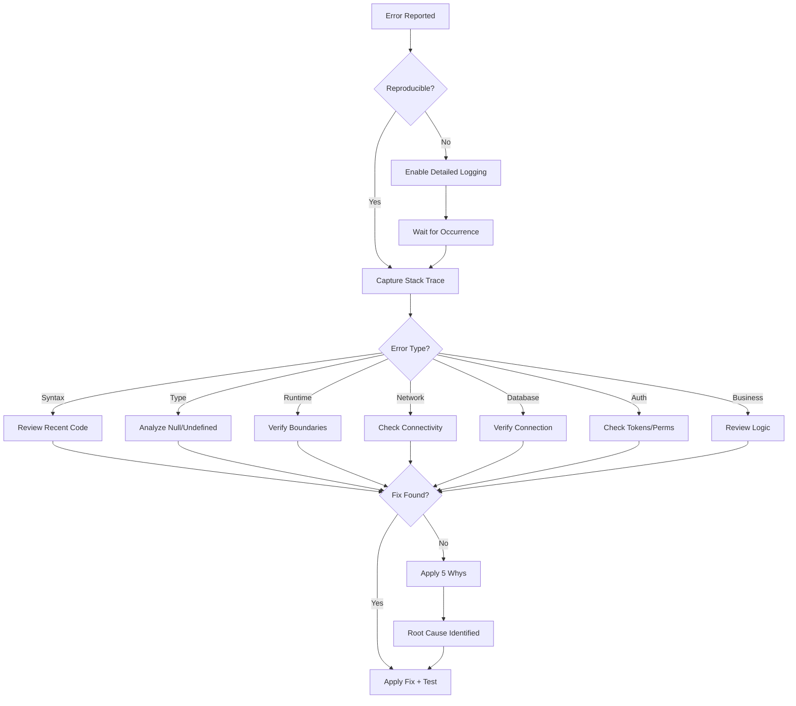

# Diagnostic Patterns

Patterns for debugging, error diagnosis, retry resilience, and failure recovery. Language-agnostic.

## When to Use

| Situation | Applies |
|-----------|---------|
| Analyzing error messages and stack traces | Yes |
| Debugging complex failures | Yes |
| Investigating intermittent issues | Yes |
| Root cause analysis | Yes |
| Errors in production without context | Yes |
| Implementing retry logic for transient failures | Yes |
| Building recovery/rollback for multi-step workflows | Yes |
| Designing saga orchestration for cross-service ops | Yes |
| Handling dead letter queues for async processing | Yes |
| Simple validation errors | No - Fix input directly |

## Decision Tree


```mermaid
flowchart TD
    A[Error Reported] --> B{Reproducible?}
    B -->|Yes| C[Capture Stack Trace]
    B -->|No| D[Enable Detailed Logging]
    C --> E{Error Type?}
    D --> F[Wait for Occurrence]
    F --> C

    E -->|Syntax| G[Review Recent Code]
    E -->|Type| H[Analyze Null/Undefined]
    E -->|Runtime| I[Verify Boundaries]
    E -->|Network| J[Check Connectivity]
    E -->|Database| K[Verify Connection]
    E -->|Auth| L[Check Tokens/Perms]
    E -->|Business| M[Review Logic]

    G --> N{Fix Found?}
    H --> N
    I --> N
    J --> N
    K --> N
    L --> N
    M --> N

    N -->|Yes| O[Apply Fix + Test]
    N -->|No| P[Apply 5 Whys]
    P --> Q[Root Cause Identified]
    Q --> O
```

## Error Classification

| Category | Indicators | Common Causes | First Check |
|----------|------------|---------------|-------------|
| **Syntax** | SyntaxError, Parse error | Typo, missing bracket | Recent code changes |
| **Type** | TypeError, undefined is not | Null access, wrong type | Optional chaining |
| **Runtime** | ReferenceError, RangeError | Logic error, boundary | Input validation |
| **Network** | ECONNREFUSED, ETIMEDOUT | Service down, network | Connectivity test |
| **Database** | Connection refused, constraint | DB issue, data integrity | Connection string |
| **Auth** | 401, 403 | Token expired, permissions | Token validity |
| **Business** | Custom error types | Application logic | Business rules |
| **Memory** | Heap out of memory | Memory leak, large data | Memory profiling |
| **Async** | Unhandled rejection | Missing await, race condition | Promise handling |

## Retry Patterns

Resilience patterns for handling transient failures.

| Strategy | When | Key Concept |
|----------|------|-------------|
| Simple Retry | Known transient, few attempts needed | Fixed max retries, no delay |
| Exponential Backoff | Network/API calls | Delay doubles each attempt, capped at max |
| Backoff + Jitter | High-concurrency systems | Random factor prevents thundering herd |
| Transient-Only Retry | Mixed error types | Classify error before deciding to retry |
| Circuit Breaker | Repeated failures to same service | CLOSED/OPEN/HALF_OPEN state machine |
| Rate Limit Handling | APIs with rate limits | Respect Retry-After headers |

### Error Classification for Retry

| Retryable (Transient) | Not Retryable (Permanent) |
|------------------------|---------------------------|
| ETIMEDOUT, ECONNRESET, ENOTFOUND | 400 Bad Request |
| 408, 429, 500, 502, 503, 504 | 401 Unauthorized |
| "socket hang up", "network timeout" | 403 Forbidden, 404 Not Found |

> Full retry patterns with pseudocode: [`references/retry-patterns.md`](${CLAUDE_SKILL_DIR}/references/retry-patterns.md)

## Recovery Strategies

Patterns for recovering from failures in multi-step operations.

| Pattern | When to Use | Key Concept |
|---------|-------------|-------------|
| Manual Rollback | 2-3 step operations with clear undo | Execute forward, compensate in reverse |
| Saga Orchestrator | Cross-service transactions | Context flows through steps, auto-compensation |
| Checkpoint/Resume | Long-running processes (hours) | Persist progress, skip completed steps on restart |
| Dead Letter Queue | Async message processing | Retry with backoff, move to DLQ after max attempts |
| Graceful Degradation | External API dependencies | Primary -> Secondary -> Cache -> Fallback |

### Quick Selection Guide

```text
Need rollback for 2-3 steps?        -> Manual Rollback
Need rollback for N services?       -> Saga Orchestrator
Process takes hours, may restart?   -> Checkpoint/Resume
Processing async messages/events?   -> DLQ + Retry
External API may be down?           -> Graceful Degradation
```

> Full error classification for recovery: [`references/error-classification.md`](${CLAUDE_SKILL_DIR}/references/error-classification.md)

## Reference Files

| Topic | File | Contents |
|-------|------|----------|
| Error Diagnosis | [`references/error-diagnosis.md`](${CLAUDE_SKILL_DIR}/references/error-diagnosis.md) | `diagnoseError` function, suggestion generation, severity classification |
| 5 Whys Analysis | [`references/5-whys-analysis.md`](${CLAUDE_SKILL_DIR}/references/5-whys-analysis.md) | Root cause analysis technique, preventive measures |
| Stack Trace Analysis | [`references/stack-trace-analysis.md`](${CLAUDE_SKILL_DIR}/references/stack-trace-analysis.md) | Stack frame parsing, originating frame identification |
| Diagnostic Service | [`references/diagnostic-service.md`](${CLAUDE_SKILL_DIR}/references/diagnostic-service.md) | Complete diagnostic orchestration with report generation |
| Retry Patterns | [`references/retry-patterns.md`](${CLAUDE_SKILL_DIR}/references/retry-patterns.md) | Backoff, circuit breaker, transient detection, rate limiting |
| Error Classification | [`references/error-classification.md`](${CLAUDE_SKILL_DIR}/references/error-classification.md) | Failure type classification, recovery priority decision tree |
| Manual Rollback | [`references/pattern-manual-rollback.md`](${CLAUDE_SKILL_DIR}/references/pattern-manual-rollback.md) | Sequential operations with reverse compensation |
| Saga Orchestrator | [`references/pattern-saga.md`](${CLAUDE_SKILL_DIR}/references/pattern-saga.md) | Cross-service transaction orchestration |
| Checkpoint/Resume | [`references/pattern-checkpoint.md`](${CLAUDE_SKILL_DIR}/references/pattern-checkpoint.md) | Persistent progress for long-running workflows |
| Dead Letter Queue | [`references/pattern-dlq.md`](${CLAUDE_SKILL_DIR}/references/pattern-dlq.md) | Message retry with exponential backoff and DLQ |
| Graceful Degradation | [`references/pattern-graceful-degradation.md`](${CLAUDE_SKILL_DIR}/references/pattern-graceful-degradation.md) | Multi-layer fallback with cache |

## Integration Examples

| Integration | File | Description |
|-------------|------|-------------|
| Structured Logging | [`integrations/structured-logging.md`](${CLAUDE_SKILL_DIR}/integrations/structured-logging.md) | JSON-based logging with request context |
| Request Tracing | [`integrations/request-tracing.md`](${CLAUDE_SKILL_DIR}/integrations/request-tracing.md) | Request ID and timing patterns |

## Checklists

| Checklist | File |
|-----------|------|
| Debugging | [`checklists/debugging-checklist.md`](${CLAUDE_SKILL_DIR}/checklists/debugging-checklist.md) |

Covers: Error Analysis, Root Cause Analysis, Logging, Debugging Techniques, Post-Mortem, Retry Implementation, Recovery/Saga Implementation, DLQ Implementation, Checkpoint Implementation, Post-Recovery.

---

**Version**: 2.0
**For**: error-analyzer, builder agents
