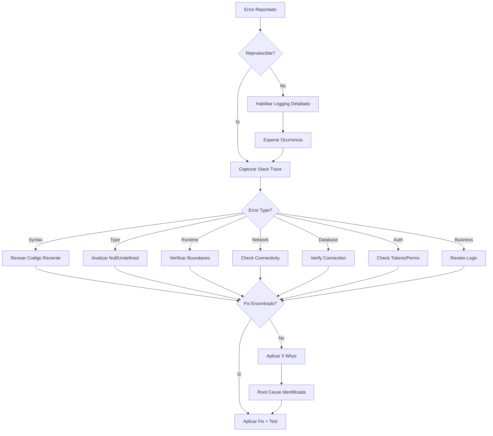

# Diagnostic Patterns

Patrones de diagnostico y debugging para aplicaciones TypeScript/Bun.

## When to Use

| Situacion | Aplica |
|-----------|--------|
| Analizando error messages y stack traces | Si |
| Debugging fallos complejos | Si |
| Investigando issues intermitentes | Si |
| Root cause analysis | Si |
| Errores en produccion sin contexto | Si |
| Simple validation errors | No - Fix input directamente |
| Known transient errors | No - Usar retry-patterns |

## Decision Tree

```mermaid
flowchart TD
    A[Error Reportado] --> B{Reproducible?}
    B -->|Si| C[Capturar Stack Trace]
    B -->|No| D[Habilitar Logging Detallado]
    C --> E{Error Type?}
    D --> F[Esperar Ocurrencia]
    F --> C

    E -->|Syntax| G[Revisar Codigo Reciente]
    E -->|Type| H[Analizar Null/Undefined]
    E -->|Runtime| I[Verificar Boundaries]
    E -->|Network| J[Check Connectivity]
    E -->|Database| K[Verify Connection]
    E -->|Auth| L[Check Tokens/Perms]
    E -->|Business| M[Review Logic]

    G --> N{Fix Encontrado?}
    H --> N
    I --> N
    J --> N
    K --> N
    L --> N
    M --> N

    N -->|Si| O[Aplicar Fix + Test]
    N -->|No| P[Aplicar 5 Whys]
    P --> Q[Root Cause Identificada]
    Q --> O
```

## Error Classification

| Category | Indicators | Common Causes | First Check |
|----------|------------|---------------|-------------|
| **Syntax** | SyntaxError, Parse error | Typo, missing bracket | Recent code changes |
| **Type** | TypeError, undefined is not | Null access, wrong type | Optional chaining |
| **Runtime** | ReferenceError, RangeError | Logic error, boundary | Input validation |
| **Network** | ECONNREFUSED, ETIMEDOUT | Service down, network | `curl` / `ping` |
| **Database** | Connection refused, constraint | DB issue, data integrity | Connection string |
| **Auth** | 401, 403 | Token expired, permissions | Token validity |
| **Business** | Custom error types | Application logic | Business rules |
| **Memory** | Heap out of memory | Memory leak, large data | Memory profiling |
| **Async** | Unhandled rejection | Missing await, race condition | Promise handling |

## Reference Files

| Topic | File | Contents |
|-------|------|----------|
| Error Diagnosis | [`references/error-diagnosis.md`](${CLAUDE_SKILL_DIR}/references/error-diagnosis.md) | `diagnoseError` function, `addSuggestions`, `ErrorDiagnosis` interface |
| 5 Whys Analysis | [`references/5-whys-analysis.md`](${CLAUDE_SKILL_DIR}/references/5-whys-analysis.md) | `WhyAnalysis` interface, `analyze5Whys`, preventive measures |
| Stack Trace Analysis | [`references/stack-trace-analysis.md`](${CLAUDE_SKILL_DIR}/references/stack-trace-analysis.md) | `parseStackTrace`, `formatStackAnalysis`, `StackFrame` interface |
| Diagnostic Service | [`references/diagnostic-service.md`](${CLAUDE_SKILL_DIR}/references/diagnostic-service.md) | Complete `DiagnosticService` class with report generation |

## Integration Examples

| Integration | File | Description |
|-------------|------|-------------|
| Structured Logging | [`integrations/structured-logging.md`](${CLAUDE_SKILL_DIR}/integrations/structured-logging.md) | JSON-based logging with request context |
| Request Tracing | [`integrations/request-tracing.md`](${CLAUDE_SKILL_DIR}/integrations/request-tracing.md) | Request ID and timing middleware |

## Checklists

| Checklist | File |
|-----------|------|
| Debugging | [`checklists/debugging-checklist.md`](${CLAUDE_SKILL_DIR}/checklists/debugging-checklist.md) |

Covers: Error Analysis, Root Cause Analysis, Logging, Debugging Techniques, Post-Mortem.

---

**Version**: 1.0
**Spec**: SPEC-018
**For**: error-analyzer agent
