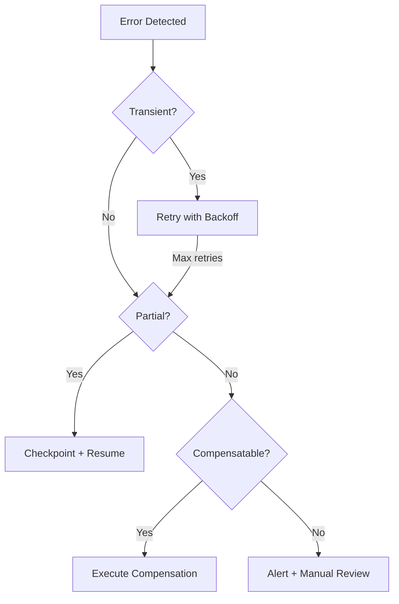

# Error Classification for Recovery

Reference for classifying errors and selecting appropriate recovery strategies.

## Classification Table

| Failure Type | Strategy | Implementation | Severity |
|--------------|----------|----------------|----------|
| Database transaction | Auto-rollback | Native DB transaction | Low |
| API call chain | Saga with compensation | Orchestrator pattern | Medium |
| Long-running process | Checkpoint/resume | Persistent checkpoints | Medium |
| External service | Circuit breaker + cache | Fallback to stale data | Medium |
| Message processing | Retry + DLQ | Exponential backoff | Low |
| Partial update | Idempotent retry | Idempotency keys | High |
| Distributed transaction | 2PC or Saga | Depends on consistency needs | High |
| File operations | Atomic write + backup | Temp file + rename | Low |

## Decision Matrix

| Indicator | Transient | Permanent | Partial |
|-----------|-----------|-----------|---------|
| **Retry helps?** | Yes | No | Maybe |
| **Strategy** | Retry + backoff | Compensate + alert | Checkpoint + resume |
| **Timeout** | Increase timeout | Fail fast | Save progress |
| **Data state** | Unchanged | Rollback needed | Mixed |

## Common Causes by Type

### Transient Failures
- Network timeouts
- Database connection pool exhaustion
- Rate limiting (429)
- Service temporarily unavailable (503)

### Permanent Failures
- Validation errors (400)
- Authentication failures (401/403)
- Resource not found (404)
- Business rule violations

### Partial Failures
- Batch processing with some items failing
- Multi-step workflow interrupted mid-execution
- Distributed transaction with mixed outcomes

## Recovery Priority

