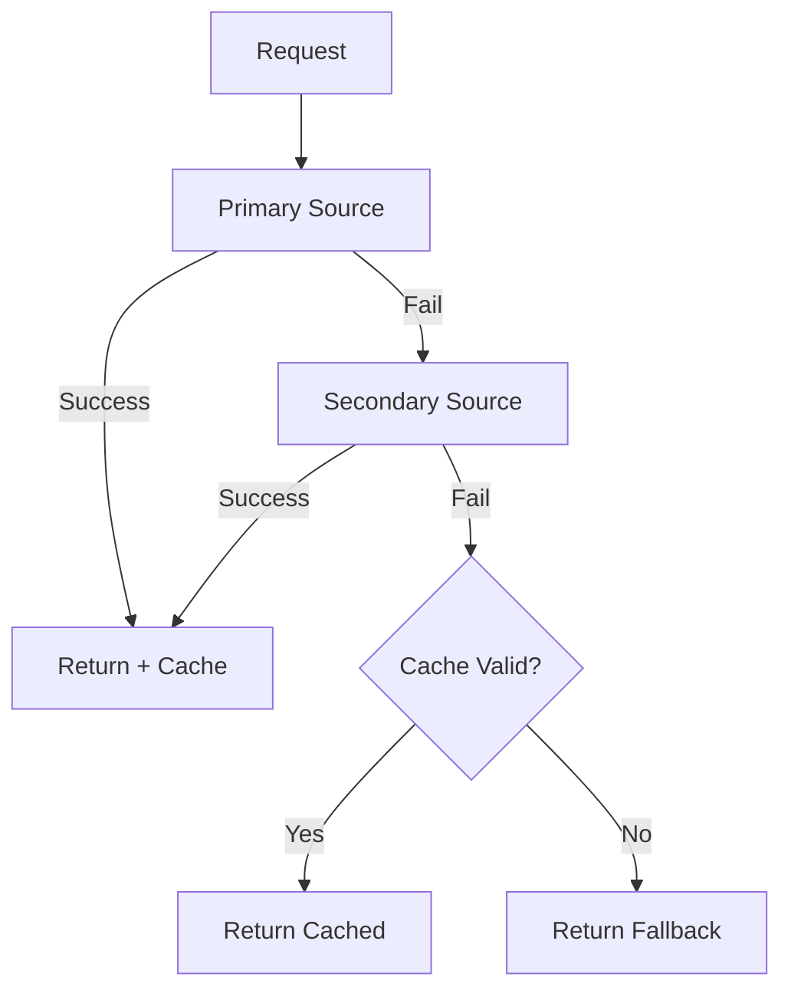

# Pattern: Graceful Degradation

Fallback through layers of service quality when primary sources fail.

## When to Use

- External API dependencies that may be unavailable
- Services with cache layers
- Non-critical features that can degrade without blocking the user
- Recommendation engines, analytics, personalization

## Core Concept

```pseudocode
DegradationConfig:
    primary = function() -> result       // Best quality source
    secondary = function() -> result     // Alternative source (optional)
    fallback = function() -> result      // Always-available default
    cacheTTL = number (optional)         // Cache duration in ms
```

## GracefulService

```pseudocode
GracefulService:
    cache = null  // { data, expiry }
    config = DegradationConfig

    function execute():
        // Try primary
        try:
            data = config.primary()
            updateCache(data)
            return { data, source: "primary" }
        catch primaryError:
            log("Primary failed: {primaryError}")

        // Try secondary
        if config.secondary:
            try:
                data = config.secondary()
                updateCache(data)
                return { data, source: "secondary" }
            catch secondaryError:
                log("Secondary failed: {secondaryError}")

        // Try cache
        if cache AND cache.expiry > now():
            log("Using cached data")
            return { data: cache.data, source: "cache" }

        // Use fallback (always available, never fails)
        log("Using fallback")
        return { data: config.fallback(), source: "fallback" }

    function updateCache(data):
        if config.cacheTTL:
            cache = {
                data: data,
                expiry: now() + config.cacheTTL
            }
```

## Degradation Flow



## Usage Example

```pseudocode
recommendationService = new GracefulService({
    primary: () => mlApi.getPersonalizedRecommendations(userId),
    secondary: () => cache.get("recommendations:{userId}"),
    fallback: () => DEFAULT_RECOMMENDATIONS,
    cacheTTL: 5 * 60 * 1000  // 5 minutes
})

{ data, source } = recommendationService.execute()
log("Recommendations from {source}: {data}")
```

## Key Points

- Response includes `source` field for observability
- Successful primary/secondary results update the cache
- Cache has configurable TTL
- Fallback is synchronous (always available, never fails)
- Each layer logs its failure for debugging
