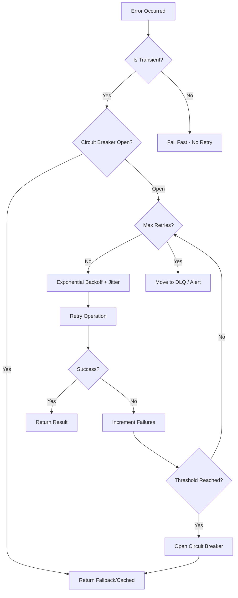

# Retry Patterns

Resilience patterns for handling transient failures. All patterns are language-agnostic.

## Error Classification

| Error Type | HTTP Status | Code | Retry? | Strategy |
|------------|-------------|------|--------|----------|
| Network timeout | - | ETIMEDOUT | Yes | Exponential backoff |
| Connection reset | - | ECONNRESET | Yes | Exponential backoff |
| DNS failure | - | ENOTFOUND | Yes | Exponential backoff |
| Rate limited | 429 | - | Yes | Respect Retry-After header |
| Server error | 500 | - | Yes | Exponential backoff |
| Bad gateway | 502 | - | Yes | Exponential backoff |
| Service unavailable | 503 | - | Yes | Exponential backoff |
| Gateway timeout | 504 | - | Yes | Exponential backoff |
| Request timeout | 408 | - | Yes | Exponential backoff |
| Bad request | 400 | - | No | Fix request |
| Unauthorized | 401 | - | No | Refresh token |
| Forbidden | 403 | - | No | Check permissions |
| Not found | 404 | - | No | Fix resource path |
| Validation error | 422 | - | No | Fix input |

## Decision Tree



## Transient Error Detection

Determine whether an error is transient before retrying:

```pseudocode
TRANSIENT_ERROR_CODES = [ECONNRESET, ETIMEDOUT, ENOTFOUND, ECONNREFUSED]
TRANSIENT_HTTP_STATUS = [408, 429, 500, 502, 503, 504]

function isTransientError(error):
    if error has code AND code in TRANSIENT_ERROR_CODES:
        return true
    if error has status AND status in TRANSIENT_HTTP_STATUS:
        return true
    if error.message contains "ECONNRESET" or "socket hang up" or "network timeout":
        return true
    return false
```

## Pattern 1: Simple Retry with Limit

Retry an operation a fixed number of times before giving up.

```pseudocode
function withRetry(operation, maxRetries = 3):
    lastError = null

    for attempt = 1 to maxRetries:
        try:
            return operation()
        catch error:
            lastError = error
            log("Attempt {attempt}/{maxRetries} failed: {error.message}")

    throw lastError
```

## Pattern 2: Exponential Backoff with Jitter

Increase delay between retries exponentially, with random jitter to prevent thundering herd.

```pseudocode
Config:
    maxRetries = 5
    baseDelayMs = 1000
    maxDelayMs = 30000
    jitter = true

function withExponentialBackoff(operation, config):
    lastError = null

    for attempt = 0 to config.maxRetries - 1:
        try:
            return operation()
        catch error:
            lastError = error
            if attempt == config.maxRetries - 1:
                break

            // Calculate delay: baseDelay * 2^attempt, capped at maxDelay
            delay = min(config.baseDelayMs * 2^attempt, config.maxDelayMs)

            // Add jitter: multiply by random factor between 0.5 and 1.5
            if config.jitter:
                delay = delay * (0.5 + random())

            log("Retry {attempt + 1} after {delay}ms")
            sleep(delay)

    throw lastError
```

## Pattern 3: Retry Only Transient Errors

Combine transient detection with retry logic to avoid retrying permanent failures.

```pseudocode
function withRetryOnTransient(operation, maxRetries = 3, baseDelayMs = 1000):
    lastError = null

    for attempt = 0 to maxRetries - 1:
        try:
            return operation()
        catch error:
            lastError = error

            if NOT isTransientError(error):
                throw error  // Don't retry permanent errors

            if attempt < maxRetries - 1:
                delay = baseDelayMs * 2^attempt * (0.5 + random())
                log("Transient error, retry {attempt + 1} after {delay}ms")
                sleep(delay)

    throw lastError
```

## Circuit Breaker

Prevent repeated calls to a failing service. Three states: CLOSED (normal), OPEN (blocking), HALF_OPEN (testing).

```pseudocode
CircuitBreaker:
    state = CLOSED           // States: CLOSED, OPEN, HALF_OPEN
    failures = 0
    lastFailureTime = 0
    successesInHalfOpen = 0
    failureThreshold = configurable       // e.g., 5
    resetTimeoutMs = configurable         // e.g., 30000
    halfOpenSuccessesNeeded = configurable // e.g., 2

    function execute(operation):
        if state == OPEN:
            if now() - lastFailureTime > resetTimeoutMs:
                state = HALF_OPEN
                successesInHalfOpen = 0
            else:
                throw CircuitBreakerOpenError

        try:
            result = operation()
            onSuccess()
            return result
        catch error:
            onFailure()
            throw error

    function onSuccess():
        if state == HALF_OPEN:
            successesInHalfOpen++
            if successesInHalfOpen >= halfOpenSuccessesNeeded:
                state = CLOSED
                failures = 0
        else:
            failures = 0

    function onFailure():
        failures++
        lastFailureTime = now()
        if state == HALF_OPEN OR failures >= failureThreshold:
            state = OPEN
```

## Rate Limit Handling

Respect rate limits from external APIs by tracking request counts and honoring Retry-After headers.

```pseudocode
RateLimitedClient:
    requestTimestamps = []
    maxRequests = configurable    // e.g., 100
    windowMs = configurable       // e.g., 60000

    function execute(operation):
        waitForSlot()
        try:
            return operation()
        catch error:
            if error.status == 429:
                retryAfter = error.headers["retry-after"]
                if retryAfter:
                    sleep(retryAfter * 1000)
                    return operation()
            throw error

    function waitForSlot():
        now = currentTime()
        // Remove timestamps outside the window
        requestTimestamps = filter(t => now - t < windowMs)

        if length(requestTimestamps) >= maxRequests:
            waitTime = windowMs - (now - requestTimestamps[0])
            sleep(waitTime)

        requestTimestamps.append(now)
```

## Resilient Client (Combined Pattern)

Combine retry, timeout, and circuit breaker into a single resilient wrapper.

```pseudocode
ResilientClient:
    circuitBreaker = CircuitBreaker(config)
    cache = Map<key, {data, expiry}>

    function execute(operation, cacheKey = null):
        try:
            result = circuitBreaker.execute(
                () => withRetry(
                    () => withTimeout(operation, timeoutMs),
                    retryConfig
                )
            )

            if cacheKey:
                cache.set(cacheKey, {data: result, expiry: now() + cacheTTL})

            return result
        catch error:
            // Fallback to cache if circuit breaker is open
            if error is CircuitBreakerOpenError AND cacheKey:
                cached = cache.get(cacheKey)
                if cached AND cached.expiry > now():
                    return cached.data
            throw error
```

## Checklist

### Pre-Implementation

- [ ] Identify all transient failure points
- [ ] Classify errors as transient vs permanent
- [ ] Define appropriate retry values (not too aggressive)
- [ ] Consider rate limits of external services

### Implementation

- [ ] Use exponential backoff (not linear)
- [ ] Add jitter to prevent thundering herd
- [ ] Implement circuit breaker for external services
- [ ] Add timeouts to all network calls
- [ ] Only retry transient errors
- [ ] Respect Retry-After headers

### Monitoring

- [ ] Log all retry attempts
- [ ] Monitor circuit breaker state
- [ ] Alert on repeated failures
- [ ] Track latency metrics including retries
