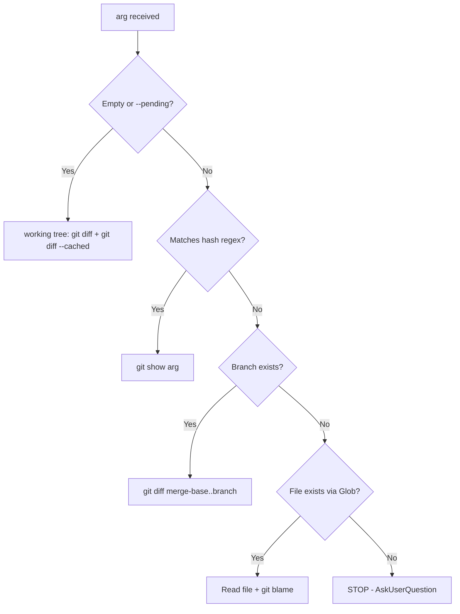
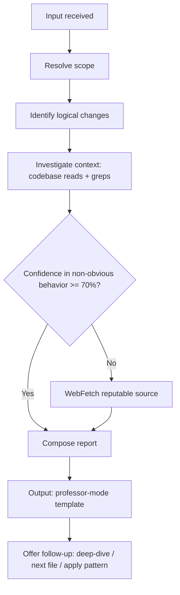

# explain-changes

Educational walkthrough of code changes. Reads the target, investigates the surrounding context, verifies non-obvious claims against official documentation, and returns a "professor-mode" report: executive summary, logical chain, numbered points, pre-anticipated Q&A.

## Underlying Principle

> The user learns by being walked through the code, not by being given the answer.

Every claim is grounded — in the codebase via Read/Grep/LSP, or in canonical documentation via WebFetch. Vague summaries are forbidden; each numbered point links back to the logical chain that justifies it.

## When to Use

| User says | Apply |
|---|---|
| "explicame los cambios pendientes" | Resolve target = working tree, run full workflow |
| "que hace este commit" + hash | Resolve target = `git show <hash>` |
| "ensename esta rama" | Resolve target = diff vs merge-base with `dev`/`main` |
| "que cambio en `apps/foo/models.py`" | Resolve target = file + git blame |
| "onboarding al modulo X" | Resolve target = file/dir, full workflow with deeper context |

## When NOT to Use

| Situation | Use instead |
|---|---|
| User already understands the change and asks "fix it" | `build` skill (Phase 3) |
| User wants quality assessment of the change | `review-patterns` skill |
| User wants to decide between approaches | `decide` skill |
| Pure debugging of a runtime error | `Skill('diagnostic-patterns')` invoked by the Lead |
| User wants to MODIFY the code | `build` skill (Phase 3) — this skill is read-only |

## Input Resolution

Argument resolution algorithm:



Edge cases (ambiguous hash, dirty + staged mix, working-tree clean with `--pending`, branch only on remote, glob with multiple matches): see `${CLAUDE_SKILL_DIR}/references/input-resolution.md`.

## Workflow



## Investigation Protocol

Before writing the report:

1. **Read the target completely** — never skim. If the target is a diff, read both pre and post versions of each touched hunk.
2. **For each logical change**, batch in parallel: Grep for symbol usages, LSP `findReferences` if symbol-level, Read associated tests (tests reveal intent).
3. **Get the commit message** when applicable (`git log -1 <hash>` or `git log -- <file>`). The message often holds the WHY.
4. **Compare with project pattern**: Grep similar code elsewhere in the repo to confirm whether this change is canonical or novel.
5. **Confidence gate**: if uncertainty about library/framework behavior is >= 30% (i.e. confidence < 70%), WebFetch the official doc.

Detailed checklist with batching rules and stack-specific guidance: `${CLAUDE_SKILL_DIR}/references/investigation-checklist.md`.

## Output Template

```markdown
## Resumen ejecutivo
- 3-5 bullets: WHAT changed and WHY.
- Mention the logical chain if changes depend on each other.

## Cadena logica
Diagram (text or mermaid) showing how each change depends on the previous one.

## Cambios punto por punto
### 1. {nombre del cambio}
- **Que hace**: 1-2 frases.
- **Por que es necesario**: razon (link a cambio previo si depende).
- **Como funciona** (si no obvio): explicacion + cita `path/file.py:line`.
- **Verificacion** (si aplica): cita literal de doc oficial con URL completa.
- **Caveats / opinion**: notas honestas, anti-patterns, mejoras posibles.

### 2. ...

## Preguntas frecuentes pre-anticipadas
- **Q**: pregunta probable (3-5).
  **A**: respuesta directa.

## Que sigue
- Profundizo en algun punto?
- Aplico el patron a otro fichero / explico cambio relacionado?
- Verifico contra otra fuente?
```

Full template, good vs bad examples, and the "professor-mode" rationale: `${CLAUDE_SKILL_DIR}/references/output-template.md`.

## Verification Gate

| Claim type | Required verification |
|---|---|
| "file X exists" | Glob/Read before citing |
| "function Y behaves like this" | Grep/LSP in codebase |
| "Django/Postgres/lib does Z" | WebFetch to official doc; literal quote with URL |
| "this is the project pattern" | Grep for >=2 other files showing the pattern |
| "this is a known bug" | Cite issue tracker / changelog / PR with URL |

Reputable sources by stack, citation format, override rules ("100% certeza" forces WebFetch): `${CLAUDE_SKILL_DIR}/references/verification-rules.md`.

> **Confidence formula** (inherited from `anti-hallucination`): file verified (+30%) + symbol verified (+25%) + clear requirements (+20%) + past success (+25%). Below 70% → verify; below domain ask-threshold → AskUserQuestion.

## Interaction Pattern

Closing every report:

1. End with explicit follow-up offer: "Profundizo en X / sigo con Y / aplico el patron a Z?"
2. If user asks a focused question → respond in-place with same rigor (verify + cite). DO NOT regenerate the full report.
3. If user says "no entiendo X" → reformulate with analogy + concrete example.
4. If question moves outside the original scope → offer to re-scope: "Esto pertenece a [otro target]. Cambio el target?"
5. If user says "ya entiendo" / "vale" → stop. No further output.

Detail per pattern (focused Q&A, re-scope, cancel, reformulation): `${CLAUDE_SKILL_DIR}/references/interaction-patterns.md`.

## Anti-Patterns

| WRONG | CORRECT |
|---|---|
| "Probablemente Django usa X" sin verificar | WebFetch + literal quote with URL |
| Resumir sin enlazar con la cadena logica | Each point references the chain step it covers |
| Citar StackOverflow / blog post como autoritativo | Only canonical sources (see verification-rules.md) |
| Inventar URLs de documentacion | Verify URL via WebFetch before citing |
| Reporte exhaustivo cuando el cambio es trivial | Calibrate depth to change complexity |
| Modificar codigo "para arreglar lo que no entiende" | This skill is read-only — use the `build` skill (Phase 3) to make changes |
| Regenerar el reporte completo en cada follow-up | Focused Q&A only re-runs the relevant verification |
| Inventar el commit message si no esta disponible | Say "no commit message available" explicitly |

## Content Map

| Topic | File | Contents |
|---|---|---|
| Input resolution | `${CLAUDE_SKILL_DIR}/references/input-resolution.md` | Full algorithm with edge cases (ambiguous hash, clean working tree, remote-only branch, multi-match glob) and the exact git commands per case. Read in step 1 of the workflow when the argument is non-trivial. |
| Investigation checklist | `${CLAUDE_SKILL_DIR}/references/investigation-checklist.md` | Step-by-step exploration: read target, batch greps/LSP, read tests, get commit message, compare with project pattern. Includes WebFetch trigger rules and parallel-batching guidance. Read in step 3 before composing the report. |
| Output template | `${CLAUDE_SKILL_DIR}/references/output-template.md` | Literal "professor-mode" template + condensed worked example (good) + bad example with annotations of what's wrong. Read in step 5 when composing the report. |
| Verification rules | `${CLAUDE_SKILL_DIR}/references/verification-rules.md` | Reputable-source table per stack (Django, DRF, Python, Postgres, TypeScript, React, Anthropic, OWASP), canonical citation format, anti-patterns, and the "100% certeza" override that forces WebFetch. Read in step 4 when verifying any non-trivial framework behavior. |
| Interaction patterns | `${CLAUDE_SKILL_DIR}/references/interaction-patterns.md` | Follow-up patterns: focused Q&A, re-scope, apply-to-other-case, cancel, reformulation with analogies. Read after emitting the first report when the user asks a follow-up question. |

---

**Version**: 1.0.0
