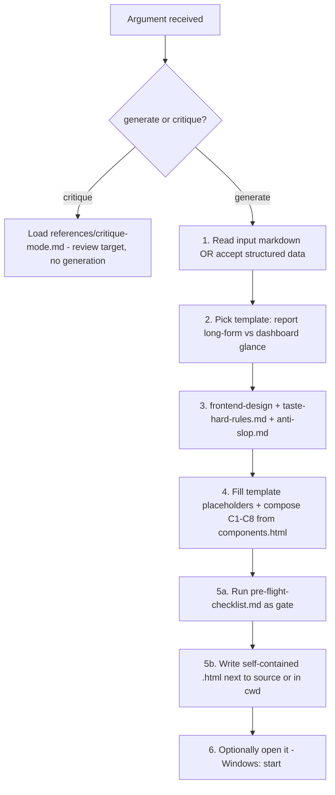

# html-report

Turns a poneglyph markdown artefact (or structured data) into one **self-contained** HTML file — inline CSS, inline SVG, dark/light, print-friendly; the single optional external request is one Google Fonts `<link>` (omit for pure-offline → system-stack fallback). The aesthetic is **editorial / technical-document** (a well-set financial filing or scientific article), NOT a SaaS dashboard: one confident non-purple accent (deep teal), strong typographic hierarchy, tabular numerals on every number that matters, deliberate section rhythm. A second mode (**critique**) reviews existing HTML/CSS against the taste corpus instead of generating.

## Underlying Principle

> Distinctiveness comes from execution (type-scale discipline, a signature serif on headings, tight tabular tables, a hand-built SVG gauge), NOT from gimmicks. The output must read as part of the same design family as `/decide`'s memo — and never as generic AI filler.

## Taste corpus & critique (references/ — load on demand)

The design quality bar lives in `references/`, loaded only when needed (keeps this SKILL.md lean; finding A7 — post-compaction budget). These are the **canonical source** for taste rules and bans; this SKILL.md points to them rather than restating (Cmd X).

| Reference | Load it when | Holds |
|---|---|---|
| `references/taste-hard-rules.md` | generating (Step 3) | measurable rules: spacing/type/color/depth/motion + WCAG, HARD vs TASTE, sourced |
| `references/anti-slop.md` | generating + critique | Absolute Bans + AI-slop tells catalog + root cause (the canonical bans home) |
| `references/pre-flight-checklist.md` | before writing (Step 5) + critique | ~22-item binary gate ("any fail → not done") |
| `references/critique-mode.md` | critique/audit requests | how to review an HTML/CSS: dimensions, severity, output format, verdict |

## When to use

| User says / situation | Apply |
|---|---|
| "pásalo a HTML" / "render this report" + a markdown path | Target = that file; pick `report` template (long-form) |
| "haz un dashboard del estado" / "at-a-glance view" | Target = same content; pick `dashboard` template |
| Finishing a `/flow --full` and wanting `report.md` as a shareable page | Render `report.md` → `report` template |
| Presenting a `retro.md` / `review.md` (scores, findings, verdict) | Render → `report` template (or `dashboard` if glance-only) |
| Structured data (scores + findings) without a markdown file | Compose directly from the component inventory |
| "critica este HTML" / "audita el diseño" / review a render before sharing | **Critique mode** — load `references/critique-mode.md`, do not generate |

## When to skip

| Situation | Use instead |
|---|---|
| User wants a strategic DECISION memo (3 perspectives) | `decide` skill (already emits its own HTML memo) |
| User wants the markdown CONTENT authored/edited, not rendered | the relevant phase skill (`critic`, `retro`, `scope`…) |
| User wants a PDF | render HTML then print-to-PDF (the template's `@media print` is built for this) |
| Trivial one-paragraph note | plain markdown — HTML scaffolding is over-engineering here (Commandment III) |
| Needs live interactivity / data refresh | out of scope — this skill emits a static snapshot, by design (no JS) |
| User wants to GENERATE arbitrary user-facing UI / a landing page | builtin `frontend-design` — this skill renders Claude Code's OWN outputs, not general UI |

## Workflow

### Step 1 — Read the input

- If the argument is a **path** (e.g. `.claude/plans/002-…/report.md`, a `retro.md`, a `review.md`): Read it fully — frontmatter + every section. Frontmatter carries the headline numbers (`mean_score`, `findings_count`, `corpus_size`, `review_verdict`, `commit_sha`, `mode`, dates) that feed the metadata-header (C8) and gauge (C1).
- If the argument is **`report` / `dashboard` + inline content**: treat the inline content as the body; ask for any missing headline numbers only if genuinely absent.
- If the argument is **`critique` + a target** (an HTML path or pasted CSS): skip generation — load `references/critique-mode.md` and review the target.
- Map every markdown block to a component **before** rendering — no orphan content. See §"report.md walkthrough" below for the canonical block→component table; the same logic applies to `retro.md` / `review.md`.

### Step 2 — Pick the template

| Pick `report.template.html` (long-form) | Pick `dashboard.template.html` (glance) |
|---|---|
| Reader needs the full evidence (sections 1–9, tables, prose) | Reader wants status at a glance: score + severity mix + top findings |
| Default for `report.md` / `retro.md` | Default for "dashboard", "estado", standups |
| Layout: sticky TOC sidebar + readable main column | Layout: KPI-card row + severity-bar + health panels + findings list (dark-first, shadcn/Raycast language) |

When unsure, default to `report` (long-form loses no information; dashboard compresses).

> **v2 layouts (feature 007)** — two more templates extend the system:
> - **`glance.template.html`** — scan-at-a-glance dark report: KPI row (color=info) + immediate-action callout + CSS-only filterable/expandable cards + drawer + next-steps. Pick for "se lee de un vistazo". **Defines the canonical dark token block** (decision template inlines it verbatim — Cmd X).
> - **`decision.template.html`** — decisions WITH comparable options (dev or non-dev: monitor/PC/shoes): recommendation hero + weighted options×criteria matrix + per-option pros/cons + criteria&weights. The `decide` skill reuses this as its base (single visual system).
>
> **Diagrams / charts — hybrid SVG-first**: compose inline SVG by hand for simple flows/comparisons/charts (self-contained, 0 JS, like the gauge/sevbar); `mermaid.js` runtime is an **opt-in declared exception** for complex graphs only (no `mmdc` in this env). Patterns + decision rule: `references/visuals-svg-first.md`.
>
> **shadcn components + interactivity** (badges/alert/separator/progress/skeleton/empty-state + tabs/tooltips CSS-only + command JS-opt-in + `:focus-visible` ring): canonical reference render at `.claude/plans/007-report-template-v2/smoke-components-shadcn.html`. Baking into `components.html` + wiring into glance/decision is a tracked future evolution (state.json `scope-extra`).

### Step 3 — Design quality: frontend-design + taste corpus (AC5)

**Explicitly invoke the builtin `frontend-design` skill** (`Skill('frontend-design')`, or — when this skill runs inside a delegated Workflow unit — instruct that unit to `Read` the frontend-design SKILL first). It produces distinctive, production-grade frontend that **avoids the generic AI aesthetic**.

Then **load the taste corpus** for the measurable bar: `references/taste-hard-rules.md` (spacing/type/color/depth/motion + WCAG) and `references/anti-slop.md` (what to never do). Use them to vet type hierarchy, spacing rhythm, color/contrast restraint, motion, and the absence of AI-slop tells. This combination — official skill + sourced hard rules — is what guarantees the output is polished, not template-flat.

### Step 4 — Fill placeholders + compose components

- `templates/report.template.html` is a **composition of the fixed C1–C8 inventory + an inlined token block** (authoring no new CSS beyond sidebar layout glue). `templates/dashboard.template.html` is a **self-contained v7/v8 redesign** (KPI-card row + health panels + findings drawer) with its own component CSS and its own dark-native token set — NOT a C1–C8 composition. Treat the two templates as distinct architectures.
- For the report template, copy component markup from `templates/components.html` (the C1–C8 reference units) and fill them with the real data.
- **Token block (report template)**: `templates/tokens.css` is the single source of truth for `report.template.html` — inline it **byte-identical** inside the `<style>` (no external `tokens.css` at render time; copy verbatim, never re-author, rename, or re-value a `--token`). The **dashboard template** intentionally ships its own dark-native token set (`--bg`, `--ink`, `--accent`, score/sev scales — shadcn/Raycast language), separate from `tokens.css`; that is by design, not a bug. Keep `tokens.css` ↔ `report.template` in lockstep; the dashboard owns its palette.
- **Dynamic-mode prose can be Markdown + copy** (`scripts/comments.ts`): a `prose` block accepts `md` (a small **code-safe** CommonMark subset — `**`bold/`*`italic/`` `code` ``/links/lists/headings + fenced code; dunders/`snake_case`/`*args` survive verbatim) instead of hand-written `html`; a `comment` block (`{md, title?, copy?}`) renders Markdown and, with `copy:true`, adds a copy-to-clipboard button that copies the RAW md (e.g. paste a review note into GitHub). Fenced code is always copyable. Self-contained, no deps, escaped + link-sanitized.
- **Two separate visual languages**: severity (`sev--blocker|major|minor|nit|ok`, tags findings) is NOT score (`score--bad|warn|mid|good`, tags numbers). Never interchange them.
- **Exact math the agent bakes in:**
  - Gauge (C1): `C = 2πr = 326.726` (r=52). `stroke-dashoffset = 326.726 * (1 - score/10)`. Value circle `transform="rotate(-90 60 60)"`. Color = score threshold. (score 7.57 → offset 79.39, `score--good`.)
  - Severity-bar (C5): segment `width % = count / total * 100`; omit zero-count segments from the bar, keep them in the legend. (10 findings → 1 BLOCKER=10%, 6 MAJOR=60%, 3 MINOR=30%, 0 NIT omitted.)
  - Progress-bar (C6): `width % = value / max * 100`; fill color = threshold.

### Step 5 — Pre-flight gate, then write the self-contained `.html`

- **5a — Pre-flight gate**: run `references/pre-flight-checklist.md` against the composed output. Any failed item → fix before writing (gate semantics).
- **5b — Write**: output path next to the source (e.g. `…/002-claude-config-deep-audit/report.html`) or in cwd if the input was inline. One file. All CSS in one inlined `<style>`. Charts = inline SVG (gauge) + CSS flex (severity-bar) + CSS width (progress-bars). No CDN, no JS framework. **One Google Fonts `<link>` is allowed** (the v1.2.0 client-grade decision — Geist + Newsreader + Geist Mono); do NOT delete it. For pure-offline, omit the `<link>` and let the system-stack fallback render. Use the `Write` tool. Do not split into multiple files.

### Step 6 — Optionally open it

- Windows: `start <file>.html`. macOS: `open`. Linux: `xdg-open`. Offer it; do not force it.

## Critique mode (review, not generate)

When asked to **critique/audit** an HTML/CSS or a render: load `references/critique-mode.md` and follow it — inspect across dimensions (typography/color/layout/depth/motion/a11y/anti-slop), emit findings with severity (BLOCKER/MAJOR/MINOR/NIT) citing the violated rule, run the pre-flight checklist, and give a verdict (CLEAN/WARN/FAIL). This is the review side that `frontend-design` (generative-only) lacks.

## Self-contained + anti-generic (HARD constraints)

| Constraint | How |
|---|---|
| **Self-contained (near)** | All CSS in one inlined `<style>`. The only external request is one Google Fonts `<link>` (v1.2.0 client-grade); omit it for pure-offline (system-stack fallback). Verify the rest is inlined by opening with network disabled. |
| **No JS** | TOC nav = anchor links + `scroll-behavior:smooth`; active state via `:target`. Gauge/bars are static markup with computed values baked in. |
| **Dark/light** | `report.template`: single `@media (prefers-color-scheme: dark)` block flips every token (inherits the memo's flip mechanism), every severity + score color has both-scheme variants. `dashboard.template`: **dark-first by design** (premium dark palette, no OS flip) — its light variant comes from `@media print`. |
| **Print-friendly** | `@media print`: white bg, drop shadows/transforms, `break-inside:avoid` on cards/tables/callouts, hide sidebar + main full width, expand link URLs via `a[href^="http"]::after`. |
| **Motion safety** | Entrance animations wrapped in `@media (prefers-reduced-motion: no-preference)`; default state is the final state. |
| **Accessibility** | Charts carry `role="img"` + `aria-label`; severity conveyed by **text label**, not color alone; amber (not yellow) for minor text to pass contrast in both modes. |
| **Anti-generic AI look** | This skill's identity: warm paper `#f7f6f3` (no pure white), one signature accent (deep teal, no purple), serif display headings, tabular numerals. Distinctiveness via execution, not gimmicks. The full **Absolute-Bans + AI-slop tells catalog lives in `references/anti-slop.md`** (canonical source — do not restate here). |
| **Fonts** | The v1.2.0 canonical render uses **Geist + Newsreader + Geist Mono via one Google Fonts `<link>`** (client-grade). System-stack fallback (`Newsreader`/Iowan/Palatino/Georgia + system sans/mono) is the pure-offline path — omit the `<link>` and the stack degrades gracefully, zero embedded bytes. Data-URI woff2 subset remains an opt-in alternative documented with KB cost. |

## Reutiliza (build on existing precedent)

| Precedent | What it provides | How html-report extends it |
|---|---|---|
| `.claude/skills/decide/templates/memo.html` | Self-contained pattern: inline CSS, `prefers-color-scheme` flip, `@media print`, radius/shadow scale, `--color-*` naming | html-report's `tokens.css` is a **superset** of memo's token architecture (same naming, same flip mechanism). `/decide` and `/html-report` must read as ONE design family (Commandment X). |
| builtin `frontend-design` skill | Distinctive, production-grade frontend that avoids generic AI aesthetics | Invoked in Step 3 as the design-quality gate (AC5). |
| `references/` taste corpus | Sourced hard rules + bans + pre-flight + critique mode | The measurable bar + the review side, layered above frontend-design. |

## Commandments cubiertos

| # | Commandment | How this skill honors it |
|---|---|---|
| **III** | Delivered code quality — simple by default, best practices, no over-engineering | One self-contained HTML, no JS framework, no build step, no CDN. Charts via plain SVG + CSS, not a charting library. System stack fonts, not embedded webfonts. Critique is markdown-mode, no helper unless justified. |
| **IV** | Blocking quality gates | The pre-flight checklist (Step 5a) gates the write; critique emits a verdict. |
| **VIII** | Optimal output — invoke the right capability well | Explicitly leverages the builtin `frontend-design` skill + a sourced taste corpus instead of hand-rolling mediocre CSS; reuses the `decide/memo.html` precedent. Good output by composition, not improvisation. |
| **X** | Poneglyph maintainability | `tokens.css` is the single source of truth for the report template (inlined byte-identical); the dashboard owns its dark-native palette by design; bans/tells live once in `references/anti-slop.md` (no dual source); `/decide` + `/html-report` share one design language. |

## Verification (smoke test)

The canonical smoke test: render the real audit at `.claude/plans/002-claude-config-deep-audit/report.md`.

1. Render it with the `report` template → `…/002-claude-config-deep-audit/report.html`.
2. **Open with network disabled** — everything except webfonts must render (Geist/Newsreader degrade to the system stack); the single Google Fonts `<link>` is the only network dependency.
3. Verify against the frontmatter (`mean_score: 7.57`, `findings_count: 10`, `corpus_size: 17`, `review_verdict: APPROVED_WITH_WARNINGS`, `commit_sha: c2eb838`, `mode: full`):
   - Gauge (C1) shows `7.57 / 10`, `score--good`, arc offset 79.39.
   - Severity-bar (C5) = 1 BLOCKER (10%) · 6 MAJOR (60%) · 3 MINOR (30%) · 0 NIT (legend only).
   - Scoring table (C2) renders the `3` for Critic as a `score--bad` pill, distinct from the BLOCKER finding row.
   - Verdict badge (C8) = `verdict--minor` (amber) for `APPROVED_WITH_WARNINGS`.
4. Toggle OS dark mode — `report.template` flips every token; `dashboard.template` is dark-first (no OS flip — its light variant is the print stylesheet). Severity/score colors stay legible (amber, not yellow).
5. Print-preview — sidebar hidden, no shadows, link URLs expanded, cards don't break across pages.
6. Run `references/pre-flight-checklist.md` against the render — all items pass.

> **Block→component coverage (report.md walkthrough)** — every block maps to a component, no orphan content:
>
> | report.md block | Component |
> |---|---|
> | Frontmatter (mean/verdict/sha/mode/dates) | C8 metadata-header |
> | `> Lectura rápida` blockquote | C4 callout `--note` |
> | §1 Executive (prose + BLOCKER) | prose + C4 callouts + C5 severity-bar |
> | §2 Top-10 table (sev rows, /flow) | C2 data-table `sev-row` mode |
> | `1 BLOCKER · 6 MAJOR · 3 MINOR · 0 NIT` | C5 severity-bar + legend |
> | §3 Quick-wins table | C2 data-table |
> | §4 Scoring 14-row table (the `3`) | C2 data-table + score-pill |
> | Mean/Median/Min/Max | C5 stat-tiles |
> | AC5 honesty check note | C4 callout `--note` |
> | §5 Cross (Genuine/Parcial verdicts) | C2 tables + verdict badges |
> | §6 Rúbrica + `> Techo n=1` | C2 + C4 callout |
> | §7 Inventory counts | C2 / C5 stat-tile grid |
> | §8 Corpus numbered lists + links | ordered lists, `--color-link` (print expands URLs) |
> | §8.5 Síntesis (ordered decisions) | ordered list |
> | §9 Limitations table | C2 data-table |
> | AC-compliance 8/8 | C6 progress-bar or C5 tile |
>
> NIT (`0 NIT`) is kept in the system though this report doesn't exercise it — `critic`'s rubric emits NIT for `review.md` rendering.

---

## Modo dynamic (generador determinista — feature 010)

Para informes **interactivos self-contained** (ver/presentar/compartir, PC+móvil) hay un **generador**: produces un JSON (`ReportData`) y un script bun emite **1 HTML** con CSS+JS inline. Baja tokens (datos vs HTML a mano) + consistencia (el diseño vive una vez).

| Pieza | Path |
|---|---|
| Contrato de datos | `scripts/contract.ts` (`ReportData`) |
| Tokens light/dark (jerarquía editorial) | `scripts/theme.ts` |
| Generador (shell + nav sticky/scrollspy + colapsables + theme toggle) | `scripts/render.ts` |
| Tabla filtrable + búsqueda | `scripts/components.ts` |
| Charts SVG + tooltip (Observable Plot opt-in) | `scripts/charts.ts` |

**Uso**: `bun run .claude/skills/html-report/scripts/render.ts < data.json > out.html`

**Cuándo**: informe que el lector **explora** (filtros, charts, nav). Para audit/retro estático largo → `report`; glance dark estático → `glance`; el **dynamic** es el interactivo low-token. **JS permitido** (feature 010) siempre con **fallback sin-JS**: secciones `
`, nav por anclas, valores de charts/tabla visibles. Charts: SVG a mano por defecto; `plotInline()` usa Observable Plot si `npx` disponible y **degrada a mano** si no (artefacto nunca depende de Plot).

---

**Version**: 1.3.0 — dynamic mode (generador determinista en `scripts/`: contract/theme/render/components/charts; JS self-contained con fallback sin-JS; charts híbridos Plot-opt-in; corrige el env-fact obsoleto de visuals-svg-first). · 1.2.0 — dashboard template redesigned (v7/v8): v5 serif-italic masthead + KPI-card body + **color = información** (score health on Mean/Median/Min, counts neutral), shadcn/Raycast language, **dark-first**, fonts Geist + Newsreader + Geist Mono (Google Fonts `<link>`; render no longer pure-offline by design — accepted for client-grade). Section heads = Geist semibold + number chip + hairline. Motion = single page fade. Taste corpus + critique mode (1.1.0) retained. Canonical reference render: `.claude/plans/002-claude-config-deep-audit/report.html`.
