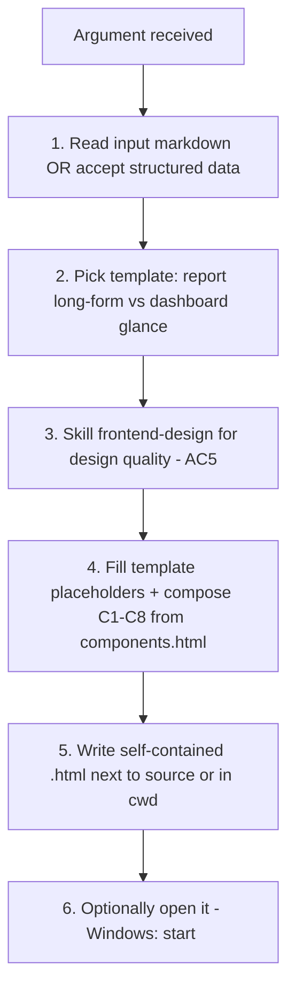

# html-report

Turns a poneglyph markdown artefact (or structured data) into one **self-contained** HTML file — inline CSS, inline SVG, zero external requests, dark/light, print-friendly. The aesthetic is **editorial / technical-document** (a well-set financial filing or scientific article), NOT a SaaS dashboard: one confident non-purple accent (deep teal), strong typographic hierarchy, tabular numerals on every number that matters, deliberate section rhythm.

## Underlying Principle

> Distinctiveness comes from execution (type-scale discipline, a signature serif on headings, tight tabular tables, a hand-built SVG gauge), NOT from gimmicks. The output must read as part of the same design family as `/decide`'s memo — and never as generic AI filler.

## When to use

| User says / situation | Apply |
|---|---|
| "pásalo a HTML" / "render this report" + a markdown path | Target = that file; pick `report` template (long-form) |
| "haz un dashboard del estado" / "at-a-glance view" | Target = same content; pick `dashboard` template |
| Finishing a `/flow --full` and wanting `report.md` as a shareable page | Render `report.md` → `report` template |
| Presenting a `retro.md` / `review.md` (scores, findings, verdict) | Render → `report` template (or `dashboard` if glance-only) |
| Structured data (scores + findings) without a markdown file | Compose directly from the component inventory |

## When to skip

| Situation | Use instead |
|---|---|
| User wants a strategic DECISION memo (3 perspectives) | `decide` skill (already emits its own HTML memo) |
| User wants the markdown CONTENT authored/edited, not rendered | the relevant phase skill (`critic`, `retro`, `scope`…) |
| User wants a PDF | render HTML then print-to-PDF (the template's `@media print` is built for this) |
| Trivial one-paragraph note | plain markdown — HTML scaffolding is over-engineering here (Commandment III) |
| Needs live interactivity / data refresh | out of scope — this skill emits a static snapshot, by design (no JS) |

## Workflow

### Step 1 — Read the input

- If the argument is a **path** (e.g. `.claude/plans/002-…/report.md`, a `retro.md`, a `review.md`): Read it fully — frontmatter + every section. Frontmatter carries the headline numbers (`mean_score`, `findings_count`, `corpus_size`, `review_verdict`, `commit_sha`, `mode`, dates) that feed the metadata-header (C8) and gauge (C1).
- If the argument is **`report` / `dashboard` + inline content**: treat the inline content as the body; ask for any missing headline numbers only if genuinely absent.
- Map every markdown block to a component **before** rendering — no orphan content. See §"report.md walkthrough" below for the canonical block→component table; the same logic applies to `retro.md` / `review.md`.

### Step 2 — Pick the template

| Pick `report.template.html` (long-form) | Pick `dashboard.template.html` (glance) |
|---|---|
| Reader needs the full evidence (sections 1–9, tables, prose) | Reader wants status at a glance: score + severity mix + top findings |
| Default for `report.md` / `retro.md` | Default for "dashboard", "estado", standups |
| Layout: sticky TOC sidebar + readable main column | Layout: hero band (gauge + severity-bar + stat-tiles) + card grid |

When unsure, default to `report` (long-form loses no information; dashboard compresses).

### Step 3 — Leverage `frontend-design` for design quality (AC5)

**Explicitly invoke the builtin `frontend-design` skill** (`Skill('frontend-design')`, or — when this skill is itself running inside a delegated builder — instruct the builder to `Read` the frontend-design SKILL first per Arch H). It exists precisely to produce distinctive, production-grade frontend that **avoids the generic AI aesthetic**. Use it to vet: type hierarchy, spacing rhythm, color restraint, and the absence of the anti-patterns listed in §"Self-contained + anti-generic". This step is what guarantees the output is polished, not template-flat.

### Step 4 — Fill placeholders + compose components

- The two page templates (`templates/report.template.html`, `templates/dashboard.template.html`) are **compositions of a fixed C1–C8 inventory + an inlined token block**. They author no new CSS beyond layout glue (sidebar grid vs hero+card grid).
- Copy component markup from `templates/components.html` (the C1–C8 reference units) and fill them with the real data.
- **Token block is sacred**: `templates/tokens.css` is the single source of truth. Both page templates inline it **byte-identical** inside their `<style>`. Self-contained means there is no external `tokens.css` at render time — copy it verbatim, never re-author, rename, or re-value a `--token`. Divergence = bug.
- **Two separate visual languages**: severity (`sev--blocker|major|minor|nit|ok`, tags findings) is NOT score (`score--bad|warn|mid|good`, tags numbers). Never interchange them.
- **Exact math the agent bakes in:**
  - Gauge (C1): `C = 2πr = 326.726` (r=52). `stroke-dashoffset = 326.726 * (1 - score/10)`. Value circle `transform="rotate(-90 60 60)"`. Color = score threshold. (score 7.57 → offset 79.39, `score--good`.)
  - Severity-bar (C5): segment `width % = count / total * 100`; omit zero-count segments from the bar, keep them in the legend. (10 findings → 1 BLOCKER=10%, 6 MAJOR=60%, 3 MINOR=30%, 0 NIT omitted.)
  - Progress-bar (C6): `width % = value / max * 100`; fill color = threshold.

### Step 5 — Write the self-contained `.html`

- Output path: next to the source (e.g. `…/002-claude-config-deep-audit/report.html`) or in cwd if the input was inline.
- One file. All CSS in one inlined `<style>`. Charts = inline SVG (gauge) + CSS flex (severity-bar) + CSS width (progress-bars). No CDN, no JS framework, no webfont fetch.
- Use the `Write` tool. Do not split into multiple files.

### Step 6 — Optionally open it

- Windows: `start <file>.html`. macOS: `open`. Linux: `xdg-open`. Offer it; do not force it.

## Self-contained + anti-generic (HARD constraints)

| Constraint | How |
|---|---|
| **Self-contained, offline** | All CSS in one inlined `<style>`. Zero external requests. Verify by opening with network disabled. |
| **No JS** | TOC nav = anchor links + `scroll-behavior:smooth`; active state via `:target`. Gauge/bars are static markup with computed values baked in. |
| **Dark/light** | Single `@media (prefers-color-scheme: dark)` block flips every token (inherits the memo's flip mechanism). Every severity + score color has both-scheme variants. |
| **Print-friendly** | `@media print`: white bg, drop shadows/transforms, `break-inside:avoid` on cards/tables/callouts, hide sidebar + main full width, expand link URLs via `a[href^="http"]::after`. |
| **Motion safety** | Entrance animations wrapped in `@media (prefers-reduced-motion: no-preference)`; default state is the final state. |
| **Accessibility** | Charts carry `role="img"` + `aria-label`; severity conveyed by **text label**, not color alone; amber (not yellow) for minor text to pass contrast in both modes. |
| **Anti-generic AI look** | NO purple, NO pure white (warm paper `#f7f6f3`), one signature accent (deep teal), serif display headings, tabular numerals. NO diagonal layouts, custom cursors, grain textures, neon gradients, or three-color rainbow bars. Distinctiveness via execution, not gimmicks. |
| **Fonts** | Refined system stack by default (`Newsreader` if locally installed → Iowan/Palatino/Georgia fallback), zero embedded bytes. Escape hatch: one subset woff2 (single weight, headings only) as data-URI, documented with KB cost — opt-in, never default. |

## Reutiliza (build on existing precedent)

| Precedent | What it provides | How html-report extends it |
|---|---|---|
| `.claude/skills/decide/templates/memo.html` | Self-contained pattern: inline CSS, `prefers-color-scheme` flip, `@media print`, radius/shadow scale, `--color-*` naming | html-report's `tokens.css` is a **superset** of memo's token architecture (same naming, same flip mechanism). `/decide` and `/html-report` must read as ONE design family (Commandment X). |
| builtin `frontend-design` skill | Distinctive, production-grade frontend that avoids generic AI aesthetics | Invoked in Step 3 as the design-quality gate (AC5). |

## Commandments cubiertos

| # | Commandment | How this skill honors it |
|---|---|---|
| **III** | Delivered code quality — simple by default, best practices, no over-engineering | One self-contained HTML, no JS framework, no build step, no CDN. Charts via plain SVG + CSS, not a charting library. System stack fonts, not embedded webfonts. The simple thing is the deliverable. |
| **VIII** | Optimal output — invoke the right capability well | Explicitly leverages the builtin `frontend-design` skill (Step 3) instead of hand-rolling mediocre CSS; reuses the `decide/memo.html` precedent instead of re-authoring tokens. Good output by composition, not improvisation. |
| **X** | Poneglyph maintainability | Single source of truth (`tokens.css`) inlined byte-identical; `/decide` + `/html-report` share one design language so the meta-system doesn't fork into two visual styles. |

## Verification (smoke test)

The canonical smoke test: render the real audit at `.claude/plans/002-claude-config-deep-audit/report.md`.

1. Render it with the `report` template → `…/002-claude-config-deep-audit/report.html`.
2. **Open with network disabled** — it must render fully (self-contained check).
3. Verify against the frontmatter (`mean_score: 7.57`, `findings_count: 10`, `corpus_size: 17`, `review_verdict: APPROVED_WITH_WARNINGS`, `commit_sha: c2eb838`, `mode: full`):
   - Gauge (C1) shows `7.57 / 10`, `score--good`, arc offset 79.39.
   - Severity-bar (C5) = 1 BLOCKER (10%) · 6 MAJOR (60%) · 3 MINOR (30%) · 0 NIT (legend only).
   - Scoring table (C2) renders the `3` for Critic as a `score--bad` pill, distinct from the BLOCKER finding row.
   - Verdict badge (C8) = `verdict--minor` (amber) for `APPROVED_WITH_WARNINGS`.
4. Toggle OS dark mode — every token flips, severity/score colors stay legible (amber, not yellow).
5. Print-preview — sidebar hidden, no shadows, link URLs expanded, cards don't break across pages.

> **Block→component coverage (report.md walkthrough)** — every block maps to a component, no orphan content:
>
> | report.md block | Component |
> |---|---|
> | Frontmatter (mean/verdict/sha/mode/dates) | C8 metadata-header |
> | `> Lectura rápida` blockquote | C4 callout `--note` |
> | §1 Executive (prose + BLOCKER) | prose + C4 callouts + C5 severity-bar |
> | §2 Top-10 table (sev rows, /flow) | C2 data-table `sev-row` mode |
> | `1 BLOCKER · 6 MAJOR · 3 MINOR · 0 NIT` | C5 severity-bar + legend |
> | §3 Quick-wins table | C2 data-table |
> | §4 Scoring 14-row table (the `3`) | C2 data-table + score-pill |
> | Mean/Median/Min/Max | C5 stat-tiles |
> | AC5 honesty check note | C4 callout `--note` |
> | §5 Cross (Genuine/Parcial verdicts) | C2 tables + verdict badges |
> | §6 Rúbrica + `> Techo n=1` | C2 + C4 callout |
> | §7 Inventory counts | C2 / C5 stat-tile grid |
> | §8 Corpus numbered lists + links | ordered lists, `--color-link` (print expands URLs) |
> | §8.5 Síntesis (ordered decisions) | ordered list |
> | §9 Limitations table | C2 data-table |
> | AC-compliance 8/8 | C6 progress-bar or C5 tile |
>
> NIT (`0 NIT`) is kept in the system though this report doesn't exercise it — `critic`'s rubric emits NIT for `review.md` rendering.

---

**Version**: 1.0.0
