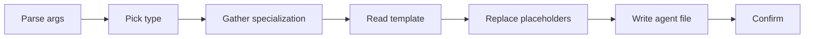

# Create Agent

Meta-skill for generating Claude Code subagents (`.claude/agents/{category}/{name}.md`) from 4 canonical templates: reader, builder, executor, researcher.

## When to Use

- User requests creating a new agent/subagent
- Scaffolding a delegated specialist
- Request for an agent template

## Official Documentation

Before generating, fetch the latest agent format: `https://code.claude.com/docs/en/sub-agents.md`

## Quick Workflow



### Step 1: Parse Arguments

| Argument | Required | Default | Description |
|----------|----------|---------|-------------|
| `agent-name` | Yes | — | Name in kebab-case |
| `type` | No | prompt user | `reader`, `builder`, `executor`, `researcher` |

### Step 2: Determine Type

If `type` was not provided, ask. The 4 types at a glance:

| Type | Tools | Permission | Use Case |
|------|-------|------------|----------|
| `reader` | Read, Grep, Glob | plan | Analysis, review, audit |
| `builder` | Read, Write, Edit, Bash, Grep, Glob, LSP | acceptEdits | Implementation, refactoring |
| `executor` | Bash, Read | default | Commands, automation |
| `researcher` | Read, Grep, Glob, WebSearch, WebFetch | plan | Investigation, documentation |

For the full frontmatter of each template (with every placeholder), read `${CLAUDE_SKILL_DIR}/references/templates-spec.md`.

### Step 3: Gather Specialization

Ask the user:

- **Domain**: e.g., security, performance, API design
- **Primary task**: e.g., review code, implement features
- **Key outputs**: e.g., reports, code changes, recommendations

### Step 4: Generate Agent File

1. Read template from `${CLAUDE_SKILL_DIR}/templates/{type}.md`
2. Replace `{{PLACEHOLDERS}}` with user-provided values
3. Write file to the category directory:

| Type | Directory |
|------|-----------|
| reader | `.claude/agents/readers/` |
| builder | `.claude/agents/builders/` |
| executor | `.claude/agents/executors/` |
| researcher | `.claude/agents/researchers/` |

### Step 5: Confirm Creation

```
## Agent Created

**Name**: {agent-name}
**Location**: .claude/agents/{category}/{agent-name}.md

### Configuration
| Field | Value |
|-------|-------|
| tools | {tools} |
| permissionMode | {mode} |

### Next Steps
1. Edit system prompt in the agent file
2. Add skills if needed: `skills: [skill-name]`
3. Test with: "delegate to {agent-name}"
```

## Arguments & Validation

| Argument | Required | Format | Description |
|----------|----------|--------|-------------|
| `agent-name` | Yes | kebab-case | Unique identifier |
| `type` | No | `reader` \| `builder` \| `executor` \| `researcher` | Agent category |

| Rule | Check | Error |
|------|-------|-------|
| Name format | kebab-case | "Agent name must be kebab-case (e.g., code-reviewer)" |
| Name unique | No existing file | "Agent {name} already exists at {path}" |
| Type valid | One of 4 types | "Type must be: reader, builder, executor, researcher" |

## Critical Reminders

1. **`description` MUST include the 3-line format** (`purpose` / `Use proactively when:` / `Keywords -`) — without it, Claude Code does NOT register the agent as a valid `subagent_type`.
2. **`name` is NOT a frontmatter field** — agents are identified by filename.
3. **`model` is NOT a frontmatter field** — model routing is dynamic, determined by the Lead per-invocation based on agent category and task complexity.
4. **`disallowedTools` is camelCase** (e.g., `Task`, `NotebookEdit`) — NOT snake_case.
5. **`tools` uses plain names only** — no scoped syntax like `Task(scout)`.
6. **`maxTurns` is dangerous** — when reached, no result is returned and work is lost. Only set in CI/production pipelines where hard stops are required; for interactive use, leave it unset.
7. **`permissionMode: plan`** is the safe default for read-only agents (readers, researchers); `acceptEdits` only for trusted builders.

## Deep references (read on demand)

| Topic | File | Contents |
|---|---|---|
| Frontmatter spec | `${CLAUDE_SKILL_DIR}/references/frontmatter-spec.md` | Full field reference (required/optional), fields NOT supported (`name`, `model`) with rationale, permission mode table, dynamic model selection matrix by agent category and complexity. Read when authoring an agent's frontmatter or when the user asks why a field doesn't work. |
| Template specifications | `${CLAUDE_SKILL_DIR}/references/templates-spec.md` | The 4 templates (reader/builder/executor/researcher) each with full frontmatter block and the complete placeholder set. Read in Step 4 when you need the exact placeholder list for a template — this reference documents what `templates/{type}.md` contains. |
| Worked examples | `${CLAUDE_SKILL_DIR}/references/examples.md` | Three complete agents end-to-end: `security-reviewer` (reader with skills), `test-runner` (executor with allowed-commands pattern), `api-implementer` (builder). Shows frontmatter + system prompt + output format + constraints. Read to see the shape of a finished agent or copy-adapt a known-good structure. Also contains the agent directory structure reference. |

## Related

- `/meta-create-skill`: Create skills for agents to use
- `extension-architect`: Meta-agent managing all extensions

---

**Version**: 1.1.0
