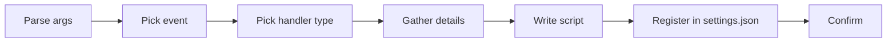

# Create Hook

Meta-skill for generating Claude Code hooks. Produces the hook script (typically `.ts` with `bun`) plus the `settings.json` entry that registers it on a specific event.

## When to Use

- User requests creating a new hook
- Need for tool validation or automation
- Request for event-driven behavior (pre/post tool, stop, permissions)

## Official Documentation

Before generating, fetch the latest hook format: `https://code.claude.com/docs/en/hooks.md`

## Quick Workflow



### Step 1: Parse Arguments

| Argument | Required | Default | Description |
|----------|----------|---------|-------------|
| `hook-name` | Yes | — | kebab-case (e.g., `format-on-save`) |
| `event` | No | prompt user | Hook event name |

### Step 2: Determine Event

Hook events are grouped by cadence: Per Session, Per Turn, Per Tool Call, Subagent, Tasks, Teams, Config, Filesystem, Worktree, Context, UI, System. The most common are:

| Cadence | Event | Common Use |
|---------|-------|------------|
| Per Tool Call | `PreToolUse` | Validation, blocking, enforcement |
| Per Tool Call | `PostToolUse` | Formatting, metrics, context tracking |
| Per Turn | `UserPromptSubmit` | Memory injection, prompt transform |
| Per Turn | `Stop` | Trace logging, test validation |
| Per Turn | `StopFailure` | Error recording, alerting |
| Subagent | `SubagentStop` | Scoring, expertise extraction |

For the complete catalog of 25+ events with stdin shapes, read `${CLAUDE_SKILL_DIR}/references/events-catalog.md`.

### Step 3: Determine Handler Type

| Type | Use Case | Typical |
|------|----------|---------|
| `command` | Shell scripts (.ts, .sh) — 95% of hooks | Validators, loggers, formatters |
| `http` | External webhook call | Slack notifications, CI triggers |
| `prompt` | LLM-generated decision (Claude evaluates) | Complex policy checks |
| `agent` | Autonomous sub-agent (full Claude instance) | Deep analysis on events |

For the full field reference of each handler type, read `${CLAUDE_SKILL_DIR}/references/handlers-and-settings.md`.

### Step 4: Gather Hook Details

**Command hooks**: purpose, blocking (yes = exit 2 blocks), async (fire-and-forget), matcher (tool pattern), `if` filter (permission rule syntax).

**HTTP hooks**: URL, headers (use env vars for secrets), `allowedEnvVars`, timeout.

**Prompt hooks**: prompt text (use `$ARGUMENTS` for input), model, timeout.

**Agent hooks**: prompt text, model, timeout.

### Step 5: Generate Hook Files

1. Pick the appropriate template from `${CLAUDE_SKILL_DIR}/references/templates.md` (observability / validator / transform / http / prompt / agent)
2. Fill placeholders with user-provided values
3. Write script to `.claude/hooks/{hook-name}.ts` (command hooks)
4. Generate the `settings.json` entry for registration (structure in `${CLAUDE_SKILL_DIR}/references/handlers-and-settings.md`)

### Step 6: Confirm Creation

```
## Hook Created

**Name**: {hook-name}
**Event**: {event}
**Location**: .claude/hooks/{hook-name}.ts

### Configuration
| Field | Value |
|-------|-------|
| Handler | {type} |
| Event | {event} |
| Blocking | {yes/no} |
| Async | {yes/no} |
| Matcher | {matcher} |

### settings.json Entry
{Show the exact JSON to add}

### Next Steps
1. Implement hook logic in the script
2. Add the settings.json entry to your project or global settings
3. Test with: `echo '{"tool_name":"Edit"}' | bun run .claude/hooks/{hook-name}.ts`
```

## Arguments & Validation

| Argument | Required | Format | Description |
|----------|----------|--------|-------------|
| `hook-name` | Yes | kebab-case | e.g., `format-on-save` |
| `event` | No | One of documented events | Hook event name |

| Rule | Check | Error |
|------|-------|-------|
| Name format | kebab-case | "Hook name must be kebab-case (e.g., format-on-save)" |
| Name unique | No existing file | "Hook {name} already exists at .claude/hooks/{name}.ts" |
| Event valid | Documented event | "Event must be one of: PreToolUse, PostToolUse, Stop, ..." |

## Critical Reminders

1. **`stop_hook_active` guard is MANDATORY on Stop/SubagentStop hooks** — without it, `exit 2` creates an INFINITE LOOP (Claude retries the stop, hook blocks, forever). Always include `if (input.stop_hook_active) process.exit(0);` at the top.
2. **`async: true` ignores EVERYTHING** — exit code AND stdout. Only use for observability (logging, metrics). Never for validators or transforms.
3. **`exit 2` only blocks on PreToolUse and PermissionRequest** — on other events it is treated as a generic error. Design blocking hooks around these two events only.
4. **NEVER use `#!/usr/bin/env bash`** — Claude Code runs hooks with a reduced PATH where `env` is not found. Use `#!/bin/bash` (absolute) or prefer `.ts` with `#!/usr/bin/env bun` (bun is in PATH via settings.json).
5. **stdin is single-read** — `Bun.stdin.text()` / `readFileSync("/dev/stdin")` can be called only ONCE per process. Read into a variable at the top and reuse.
6. **Use `$HOME/.claude/hooks/`** for global hooks in settings.json — relative paths resolve from the PROJECT cwd, not from `~/.claude/`.
7. **Matcher evaluation**: `"*"`/empty/omitted = all; only letters/digits/`_`/`|` = exact or pipe-list; any other char = regex.
8. **Hook ordering**: multiple hooks on the same event run IN ORDER of the array — place blocking validators before async loggers.
9. **Best-effort pattern**: observability hooks should ALWAYS use `main().catch(() => process.exit(0))` to never block Claude.

## Deep references (read on demand)

| Topic | File | Contents |
|---|---|---|
| Events catalog | `${CLAUDE_SKILL_DIR}/references/events-catalog.md` | Complete reference of all 25+ hook events grouped by cadence (Per Session, Per Turn, Per Tool Call, Subagent, Tasks, Teams, Config, Filesystem, Worktree, Context, UI, System) with stdin shape and common use case for each. Read in Step 2 when picking an event or when the user asks about a specific event's payload. |
| Handlers & settings.json | `${CLAUDE_SKILL_DIR}/references/handlers-and-settings.md` | Full handler type reference (command/http/prompt/agent) with field lists, the `settings.json` entry structure (single hook / multiple / with `if` filter), matcher evaluation rules (wildcard vs pipe-list vs regex), `if` field permission rule syntax, MCP tool matching, exit code protocol, stdout JSON protocol, and the complete field table for hook entries and handler objects. Read in Step 3 for handler types and in Step 5 when generating the settings.json entry. |
| Templates | `${CLAUDE_SKILL_DIR}/references/templates.md` | Six canonical templates: command (observability for async logging, validator for blocking, transform for output modification), http (webhook), prompt (LLM-evaluated policy), agent (autonomous sub-agent). Every template is copy-ready with `{placeholder}` slots. Read in Step 5 when filling a template. |
| Worked examples | `${CLAUDE_SKILL_DIR}/references/examples.md` | Three end-to-end hooks: `format-on-edit` (PostToolUse, async, TypeScript-only), `block-dangerous` (PreToolUse, blocking, regex patterns for rm/push/drop/fork-bomb), `log-api-errors` (StopFailure, async, JSONL logging). Each shows the script + exact settings.json entry. Read to see the shape of a finished hook or copy-adapt. |
| Gotchas, dir structure, testing | `${CLAUDE_SKILL_DIR}/references/gotchas.md` | 12 critical pitfalls (shebang on Windows, stop_hook_active loops, async:true behavior, single-read stdin, $HOME in settings, timeout defaults, MCP tool names, once:true scope, hook ordering, Bun.stdin vs readFileSync, exit 2 event scope, global vs project hooks), canonical `.claude/hooks/` directory layout with `lib/` and `validators/` subdirs, and the 4 testing methods (unit, manual stdin, dry run, integration). Read BEFORE writing any hook. |

## Related

- `/meta-create-agent`: Create subagents
- `/meta-create-skill`: Create skills
- `extension-architect`: Meta-agent managing all extensions
- `.claude/rules/paths/hooks.md`: Hook-specific path rules

---

**Version**: 1.1.0
