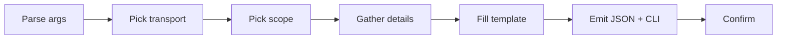

# Create MCP Server

Meta-skill for configuring MCP servers in Claude Code. Generates the JSON config entry and the equivalent CLI command for either HTTP or stdio transport.

## When to Use

- User requests adding an MCP server
- Configuring tool integrations with external services
- Connecting Claude Code to external APIs or local processes
- Setting up persistent server connections for tools

## Official Documentation

Before generating, fetch the latest MCP format: `https://code.claude.com/docs/en/mcp.md`

## Quick Workflow



### Step 1: Parse Arguments

| Argument | Required | Default | Description |
|----------|----------|---------|-------------|
| `server-name` | Yes | — | Unique kebab-case identifier |
| `transport` | No | prompt user | `http` or `stdio` |

### Step 2: Determine Transport

| Transport | Use Case | Required Info |
|-----------|----------|---------------|
| `http` | Cloud services, remote APIs, webhooks | URL + optional auth headers |
| `stdio` | Local processes, CLI tools, system access | Command + args + optional env |

For the full transport and scope decision guides, read `${CLAUDE_SKILL_DIR}/references/reference.md`.

### Step 3: Determine Scope

Ask the user: `local` (default, personal) / `project` (team-shared via `.mcp.json`) / `user` (global). **Precedence**: local > project > user.

Secrets/tokens should NEVER go in `project` scope.

### Step 4: Gather Server Details

**For HTTP**: URL, auth method, API key env var.

**For stdio**: command, args (JSON array), env vars.

### Step 5: Generate Config

Read the appropriate template from `${CLAUDE_SKILL_DIR}/references/templates.md` and produce BOTH the JSON config entry AND the equivalent CLI command.

**Output format**:

```
## MCP Server Configuration

**Server**: {server-name}
**Transport**: {http|stdio}
**Scope**: {local|project|user}

### JSON Config ({config-file})
{json entry}

### CLI Command
{claude mcp add command}

### Environment Variables Required
| Variable | Purpose | How to Set |
|----------|---------|------------|
| {VAR} | {purpose} | export {VAR}="..." |

### Verification
Run `claude mcp list` to confirm the server appears.
```

### Step 6: Confirm Setup

```
## MCP Server Configured

**Name**: {server-name}
**Transport**: {transport}
**Scope**: {scope}
**Config File**: {file path}

### Next Steps
1. Set required environment variables
2. Restart Claude Code session for changes to take effect
3. Verify with `claude mcp list`
4. Test by asking Claude to use a tool from this server
```

## Arguments & Validation

| Argument | Required | Format | Description |
|----------|----------|--------|-------------|
| `server-name` | Yes | kebab-case | Unique identifier |
| `transport` | No | `http` \| `stdio` | Server transport type |

| Rule | Check | Error |
|------|-------|-------|
| Name format | kebab-case | "Server name must be kebab-case (e.g., my-api-server)" |
| Name unique | No existing server with same name | "Server {name} already exists. Use `claude mcp remove {name}` first." |
| Transport valid | `http` or `stdio` | "Transport must be: http, stdio" |
| URL format | Valid URL for http transport | "URL must start with http:// or https://" |

## Critical Reminders

1. **Flag order**: CLI flags (`--transport`, `--scope`, `--env`, `--header`) MUST come BEFORE the server name. `--` separates server name from the command in stdio transport.
2. **Windows npx gotcha**: stdio servers using `npx` need a `cmd /c` wrapper on Windows — without it, the process may not spawn.
3. **Local scope path**: `local` scope stores in `~/.claude.json` under the project path key, NOT in `.claude/settings.local.json`.
4. **Secrets never go in `project` scope** — `.mcp.json` is committed to VCS. Use `local` or `user` for anything containing tokens.
5. **SSE transport is deprecated** — always use `http` for new remote servers.
6. **Env var expansion**: `${VAR}` fails config parse if unset. Use `${VAR:-default}` for optional variables.
7. **`headersHelper`** is the only way to inject dynamic auth (SSO, short-lived tokens) — static `headers` cannot refresh.
8. **Deferred tool loading**: MCP tools only load names at startup; tool definitions are fetched on demand. Requires Sonnet 4+ or Opus 4+.

## Deep references (read on demand)

| Topic | File | Contents |
|---|---|---|
| JSON templates | `${CLAUDE_SKILL_DIR}/references/templates.md` | Four templates: HTTP (static auth), HTTP with headersHelper (dynamic auth), stdio (Unix), stdio (Windows `cmd /c` wrapper). Every `{{PLACEHOLDER}}` documented with example replacements. Read in Step 5 when filling a template. |
| Transport/scope/auth/CLI reference | `${CLAUDE_SKILL_DIR}/references/reference.md` | Transport comparison (http/sse/stdio) with decision guide, scope table with precedence, env var expansion syntax, 4 auth methods (API key / OAuth / headersHelper / pre-configured), all `claude mcp` CLI shortcuts, and config file structure for `.mcp.json` and `~/.claude.json`. Read when deciding transport/scope or when the user asks about a specific CLI flag. |
| Worked examples | `${CLAUDE_SKILL_DIR}/references/examples.md` | Three complete configurations: GitHub MCP (stdio, project scope, with Windows variant), analytics API (http, local scope), memory server (stdio, user scope). Each shows JSON + CLI + env vars. Read to see the shape of a finished config or to copy-adapt. |
| Gotchas & troubleshooting | `${CLAUDE_SKILL_DIR}/references/gotchas.md` | 10 non-obvious gotchas (Windows npx, flag order, local scope path, OAuth flow, output limits, deferred tools, headersHelper, managed lockdown, SSE deprecation, env var expansion) plus a troubleshooting table mapping common symptoms to fixes. Read when a server fails to appear in `claude mcp list` or behaves unexpectedly. |

## Related

- `/meta-create-agent`: Create subagents
- `/meta-create-skill`: Create skills
- `/meta-create-hook`: Create hooks
- `/meta-create-rule`: Create rules
- `extension-architect`: Meta-agent managing all extensions

---

**Version**: 1.1.0
