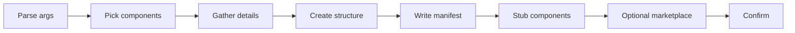

# Create Plugin

Meta-skill for creating Claude Code plugins — reusable packages that bundle skills, agents, hooks, MCP servers, LSP configs and output styles for distribution.

## When to Use

- User requests creating a new plugin
- Packaging extensions for distribution
- Request for a marketplace entry
- Bundling agents + skills + hooks + MCP + LSP into a reusable package

## Official Documentation

Before generating, fetch the latest plugin format:

- `https://code.claude.com/docs/en/plugins-reference.md` (complete schema)
- `https://code.claude.com/docs/en/plugin-marketplaces.md` (distribution)

## Quick Workflow



### Step 1: Parse Arguments

| Argument | Required | Default | Description |
|----------|----------|---------|-------------|
| `plugin-name` | Yes | — | kebab-case unique identifier |
| `components` | No | prompt user | Comma-separated: `skills,agents,hooks,mcp,lsp,output-styles` |

### Step 2: Determine Components

If `components` was not provided, ask. The 6 component types at a glance:

| Component | What It Provides | Example |
|-----------|------------------|---------|
| `skills` | Reusable knowledge and workflows | Code review checklist |
| `agents` | Subagent definitions | Database validator |
| `hooks` | Event-driven automation | Auto-format on save |
| `mcp` | MCP server integrations | External API connectors |
| `lsp` | LSP server configurations | Custom language support |
| `output-styles` | Output format templates | Markdown report style |

### Step 3: Gather Plugin Details

- **Description**: brief purpose of this plugin
- **Author**: name and optional email
- **Components**: confirm or adjust from Step 2
- **User-configurable values**: API keys, endpoints, etc. (goes into `userConfig`)

### Step 4: Generate Plugin Structure

1. Create the directory tree based on selected components (layout in `${CLAUDE_SKILL_DIR}/references/manifest-spec.md`)
2. Generate `.claude-plugin/plugin.json` from the appropriate template (`${CLAUDE_SKILL_DIR}/references/templates.md`)
3. Create component stubs for each selected component
4. Add `hooks/hooks.json` if hooks are selected
5. Add `.mcp.json` if MCP is selected
6. Add `.lsp.json` if LSP is selected

### Step 5: Optional — Generate Marketplace Entry

If the user wants to distribute the plugin:

1. Generate `marketplace.json` at the marketplace repo root (template in `${CLAUDE_SKILL_DIR}/references/templates.md`)
2. Add the plugin as a source entry
3. Include metadata (description, version, keywords)

### Step 6: Confirm Creation

```
## Plugin Created

**Name**: {plugin-name}
**Location**: {plugin-name}/

### Structure
{generated directory tree}

### Components
| Component | Path | Status |
|-----------|------|--------|
| manifest | .claude-plugin/plugin.json | Created |
| {component} | {path} | Created |

### Next Steps
1. Edit component files with your implementations
2. Test locally: `claude plugin validate`
3. Enable: `claude plugin install ./{plugin-name} --scope local`
4. Debug: `claude --debug` (shows plugin loading)
5. Distribute: add to a marketplace (see marketplace template)
```

## Arguments & Validation

| Argument | Required | Format | Description |
|----------|----------|--------|-------------|
| `plugin-name` | Yes | kebab-case | Unique identifier |
| `components` | No | comma-separated | `skills,agents,hooks,mcp,lsp,output-styles` |

| Rule | Check | Error |
|------|-------|-------|
| Name format | kebab-case, no spaces | "Plugin name must be kebab-case (e.g., code-quality-pack)" |
| Name unique | No existing plugin | "Plugin {name} already exists" |
| Components valid | From allowed list | "Invalid component: {x}. Valid: skills, agents, hooks, mcp, lsp, output-styles" |
| Paths relative | Start with `./` | "All paths must be relative, starting with ./" |
| No path traversal | No `../` in any path | "Path traversal (../) is forbidden in plugin paths" |

## Critical Reminders

1. **`.claude-plugin/` contains ONLY `plugin.json`** — skills/, agents/, hooks/ go at the plugin ROOT, never inside `.claude-plugin/`. Nesting them there hides them from auto-discovery.
2. **Plugin hooks use `hooks/hooks.json`**, NOT `settings.json` — plugins have their own hook config file.
3. **All paths must be relative and start with `./`** — absolute paths fail validation, `../` is forbidden (security).
4. **Use `${CLAUDE_PLUGIN_ROOT}` for bundled assets**, `${CLAUDE_PLUGIN_DATA}` for persistent state — `CLAUDE_PLUGIN_ROOT` changes on update.
5. **Plugin agents have restricted frontmatter**: NO `hooks`, `mcpServers`, or `permissionMode` — define these at plugin level instead.
6. **Hook event names are case-sensitive**: `PostToolUse` not `postToolUse`.
7. **Always bump `version` in `plugin.json` when publishing** — Claude Code caches at `~/.claude/plugins/cache`; same version = stale cache for existing users.
8. **Sensitive `userConfig` values** (tokens, API keys) MUST be marked `"sensitive": true` — they land in the system keychain (~2KB limit) instead of `settings.json`.
9. **Version conflicts**: if `version` appears in both `plugin.json` and `marketplace.json`, `plugin.json` wins silently — set it in ONE place.

## Deep references (read on demand)

| Topic | File | Contents |
|---|---|---|
| Manifest spec & components | `${CLAUDE_SKILL_DIR}/references/manifest-spec.md` | Full directory layout, `plugin.json` schema, every component path field (skills/agents/hooks/mcpServers/lspServers/outputStyles/userConfig/channels), `${CLAUDE_PLUGIN_ROOT}` vs `${CLAUDE_PLUGIN_DATA}`, `userConfig` behavior (keychain vs settings.json), installation scopes (user/project/local), plugin agent security restrictions, hooks-in-plugins format. Read in Step 4 when generating the manifest or when the user asks about any manifest field. |
| Templates | `${CLAUDE_SKILL_DIR}/references/templates.md` | Three complete templates — Minimal (skills-only), Full (all components with hooks.json and .mcp.json), Marketplace entry with 5 source types (relative/github/git/git-subdir/npm). Every placeholder documented with example replacements. Read in Step 4 when filling a template. |
| Worked examples | `${CLAUDE_SKILL_DIR}/references/examples.md` | Three end-to-end plugins: `code-quality-pack` (skills+hooks with PostToolUse), `database-toolkit` (skills+mcp+agents with userConfig/sensitive), and a full marketplace distribution flow with GitHub source. Read to see the shape of a finished plugin or copy-adapt. |
| Gotchas, CLI & validation | `${CLAUDE_SKILL_DIR}/references/gotchas-and-cli.md` | 11 non-obvious gotchas (manifest location, hooks.json vs settings.json, path traversal, CLAUDE_PLUGIN_ROOT instability, agent restrictions, version conflicts, strict mode, event casing, relative paths, cache staleness, symlinks), full `claude plugin` CLI reference, and a 12-item pre-publish validation checklist. Read before publishing or when troubleshooting installation. |

## Related

- `/meta-create-agent`: Create subagents for plugins
- `/meta-create-skill`: Create skills for plugins
- `/meta-create-hook`: Create hooks for plugins
- `/meta-create-rule`: Create rules (project-level, not plugin)
- `/meta-create-mcp`: Create MCP configs for plugins
- `extension-architect`: Meta-agent managing all extensions

---

**Version**: 1.1.0
