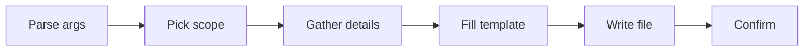

# Create Rule

Meta-skill for generating Claude Code rules (`.claude/rules/*.md`) from standardized templates. Produces either an always-on rule or a path-scoped rule.

## When to Use

- User requests creating a new rule
- Need for project conventions or coding standards
- Request for path-scoped behavior (conditional rules)

## Official Documentation

Before generating, fetch the latest rule format: `https://code.claude.com/docs/en/memory.md`

## Quick Workflow



### Step 1: Parse Arguments

Extract from `$ARGUMENTS`:

| Argument | Required | Default | Description |
|----------|----------|---------|-------------|
| `rule-name` | Yes | — | Descriptive kebab-case name |
| `scope` | No | prompt user | `always-on` or `path-scoped` |

### Step 2: Determine Scope

If `scope` was not provided, ask:

| Scope | Description | Loaded When |
|-------|-------------|-------------|
| `always-on` | Applies to all files, every session | Session start |
| `path-scoped` | Applies only to matching file patterns | Claude reads a matching file |

For the full scope decision guide (9 common scenarios mapped to scope + reason), read `${CLAUDE_SKILL_DIR}/references/rule-system.md`.

### Step 3: Gather Rule Details

**For always-on**: rule name, purpose, patterns, anti-patterns.

**For path-scoped**: rule name, file glob patterns, patterns, anti-patterns.

### Step 4: Generate Rule File

1. Read the appropriate template from `${CLAUDE_SKILL_DIR}/references/templates.md`
2. Replace placeholders with user-provided values
3. Write file to the target location:

| Scope | Location |
|-------|----------|
| always-on | `.claude/rules/{rule-name}.md` |
| path-scoped | `.claude/rules/paths/{rule-name}.md` |

### Step 5: Confirm Creation

```
## Rule Created

**Name**: {rule-name}
**Location**: .claude/rules/{path}/{rule-name}.md

### Configuration
| Field | Value |
|-------|-------|
| Scope | {always-on / path-scoped} |
| Paths | {glob patterns or "all files"} |
| Loaded | {session start / on matching file read} |
```

## Arguments & Validation

| Argument | Required | Format | Description |
|----------|----------|--------|-------------|
| `rule-name` | Yes | kebab-case | Unique descriptive identifier |
| `scope` | No | `always-on` \| `path-scoped` | Determines location and loading |

| Rule | Check | Error |
|------|-------|-------|
| Name format | Must be kebab-case | "Rule name must be kebab-case (e.g., error-handling)" |
| Name unique | No existing file at target path | "Rule {name} already exists at {path}" |
| Scope valid | `always-on` or `path-scoped` | "Scope must be: always-on or path-scoped" |
| `paths:` syntax | Unquoted glob patterns | "Use unquoted patterns in paths: frontmatter" |
| Size | Under 200 lines | Warning: "Consider splitting into multiple rules" |

## Critical Reminders

1. **`paths:` is the ONLY official frontmatter field** — other fields (`priority:`, `globs:`, `weight:`) are ignored by Claude Code.
2. **NEVER quote glob patterns in `paths:`** — quoting can fail silently. Use `- src/**/*.ts`, not `- "src/**/*.ts"`.
3. **Path-scoped rules trigger only on Read** — not on Write/Edit. If the rule must apply during file creation, make it always-on.
4. **Keep rules under 200 lines** — large rules dilute context. Split into focused files.
5. **HTML comments are stripped** before injection — do not rely on `<!-- ... -->` for content that must reach the model.
6. **Post-compact**: always-on re-injects automatically; path-scoped reloads only when matching files are read again.
7. **Project rules override user-level rules** on conflict — user rules load first.

## Deep references (read on demand)

| Topic | File | Contents |
|---|---|---|
| Rule templates & frontmatter | `${CLAUDE_SKILL_DIR}/references/templates.md` | Full always-on and path-scoped templates, every placeholder, optional sections (Examples/Exceptions/References/Checklist), frontmatter field table, body-vs-frontmatter guide. Read in Step 4 when filling a template or when you need the exact placeholder list. |
| Rule system internals | `${CLAUDE_SKILL_DIR}/references/rule-system.md` | Where rules live (project/user/paths), loading behavior, priority/load order, CLAUDE.md vs rules comparison, directory-structure layout, scope decision guide (9 scenarios). Read when deciding scope in Step 2 or when the user asks how rule loading actually works. |
| Worked examples | `${CLAUDE_SKILL_DIR}/references/examples.md` | Three complete generated rules: `error-handling` (always-on), `api-patterns` (path-scoped with status code guide), `test-conventions` (path-scoped). Read when you want to see the shape of a finished rule or copy-adapt a known-good structure. |
| Gotchas | `${CLAUDE_SKILL_DIR}/references/gotchas.md` | 8 non-obvious behaviors: quoted paths, Write-vs-Read triggering, user-level priority, official frontmatter, size guidance, post-compact reload, naming conventions, HTML comment stripping. Read when a generated rule doesn't behave as expected or when troubleshooting silent failures. |

## Related

- `/meta-create-agent`: Create subagents
- `/meta-create-skill`: Create skills
- `extension-architect`: Meta-agent managing all extensions

---

**Version**: 1.1.0
