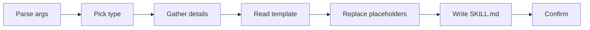

# Create Skill

Meta-skill for generating Claude Code skills from standardized templates. Generates a new skill directory with a populated `SKILL.md` based on one of 5 canonical types.

## When to Use

Activate this skill when:
- User requests creating a new skill or command
- Need to document reusable knowledge
- Request for an automated workflow
- Deep investigation scaffolding

### Where to create: Global vs Project

| Create at global (`~/.claude/skills/`) when | Create at project (`./.claude/skills/`) when |
|---|---|
| The pattern applies to ANY project using that stack | The knowledge is specific to THIS project |
| Examples are generic (from docs, well-known projects) | Examples come from the project's own code/PRs |
| e.g., `django-api`, `react-best-practices` | e.g., `naming-standards`, `project-architecture` |

Project skills follow the exact same format as global skills (same frontmatter, same Content Map pattern, same `${CLAUDE_SKILL_DIR}/` paths). The only difference is where they live on disk. The project's `skill-matching.md` rule is the discovery layer — it maps project keywords to project skill Read paths so the Lead can find them at delegation time.

## Official Documentation

Before generating, fetch the latest skill format:
`https://code.claude.com/docs/en/skills.md`

## Quick Workflow



### Step 1: Parse Arguments

Extract from `$ARGUMENTS`:

| Argument | Required | Default | Description |
|----------|----------|---------|-------------|
| `skill-name` | Yes | — | Name in kebab-case |
| `type` | No | prompt user | One of 5 canonical types |

### Step 2: Determine Type

If `type` was not provided, ask the user. The 5 types at a glance:

| Type | Invocation | Purpose |
|------|-----------|---------|
| `knowledge-base` | Auto | Domain patterns, conventions |
| `encoded-preference` | Auto | Behavioral rules, standards |
| `workflow` | Manual `/cmd` | Step-by-step tasks |
| `reference` | Auto | Lookup material, cheat sheets |
| `capability-uplift` | Auto | Tool guidance (uses reference template) |

For detailed type selection criteria and the gathering questions per type, read `${CLAUDE_SKILL_DIR}/references/skill-types.md`.

### Step 3: Gather Details

Ask the user the questions appropriate for the chosen type (domain, patterns, rules, steps, etc.). Question sets per type are in `${CLAUDE_SKILL_DIR}/references/skill-types.md`.

### Step 4: Generate Skill

1. Create directory: `.claude/skills/{skill-name}/`
2. Read template from `${CLAUDE_SKILL_DIR}/templates/{type}.md`
3. Replace `{{PLACEHOLDERS}}` with user-provided values (placeholder reference: `${CLAUDE_SKILL_DIR}/references/template-placeholders.md`)
4. Write file: `.claude/skills/{skill-name}/SKILL.md`

### Step 5: Confirm Creation

```
## Skill Created

**Name**: {skill-name}
**Location**: .claude/skills/{skill-name}/SKILL.md

### Configuration
| Field | Value |
|-------|-------|
| Type | {type} |
| Invocation | {auto|manual} |

### Next Steps
1. Edit content in SKILL.md
2. Add keywords to description for auto-trigger
3. Test with: /{skill-name} [args]
```

## Canonical Frontmatter (minimum viable)

```yaml
---
name: my-skill
description: |
  One-line purpose statement.
  Use when: trigger conditions.
  Keywords - keyword1, keyword2
type: knowledge-base
disable-model-invocation: false
effort: low
activation:
  keywords:
    - keyword1
    - keyword2
for_agents: [builder]
version: "1.0"
---
```

**Required fields**: `name`, `description`, `type`.
**Load-bearing format**: `description` must follow the 3-line `purpose / Use when: / Keywords -` shape — the global index parses it for auto-matching.

For the full field reference (all optional fields, invalid fields, invocation-model rationale), read `${CLAUDE_SKILL_DIR}/references/frontmatter-spec.md`.

## Validation Rules

| Rule | Check | Error |
|------|-------|-------|
| Name format | Must be kebab-case | "Skill name must be kebab-case (e.g., api-patterns)" |
| Name unique | No existing directory | "Skill {name} already exists" |
| Type valid | One of 5 canonical types | "Type must be: knowledge-base, encoded-preference, workflow, reference, capability-uplift" |

## Directory Layout Reminder

```
.claude/skills/{skill-name}/
├── SKILL.md           # Required entry (target: ≤ 300 lines)
├── references/        # Optional deep bundle (when entry would exceed 300 lines)
└── scripts/           # Optional helpers
```

For subdirectory conventions, the 500-line soft cap, `${CLAUDE_SKILL_DIR}` usage and the Content Map format, read `${CLAUDE_SKILL_DIR}/references/directory-structure.md`.

## Critical Reminders

1. **`allowed-tools` is NOT a valid skill frontmatter field** — it belongs on agent frontmatter as `allowedTools`. Never add it to a skill.
2. **`model` is NOT valid either** — model routing is handled dynamically by the Lead.
3. **`disable-model-invocation: true`** is for workflows and meta skills (user-initiated). Knowledge skills should be `false` so any agent can self-invoke.
4. **Description format is load-bearing** — stick to the 3-line pattern or the global skill index won't parse keywords.
5. **Keep `SKILL.md` under 500 lines** (soft cap, CRITICAL violation above). Target ≤ 300 lines for the entry and split deep content into `references/`.
6. **Reference files use minimal frontmatter** (`parent`, `name`, `description`) — they are not loaded as standalone skills.
7. **Always use `${CLAUDE_SKILL_DIR}/...`** for paths in the Content Map — never relative or absolute paths.

## Deep references (read on demand)

| Topic | File | Contents |
|---|---|---|
| Canonical frontmatter spec | `${CLAUDE_SKILL_DIR}/references/frontmatter-spec.md` | Full spec of every frontmatter field (required/optional), valid values, invalid fields (`allowed-tools`, `model`), the Agents=Behavior/Skills=Knowledge invocation model, description format. Read when authoring a skill's frontmatter and you need the complete field list or rationale for `disable-model-invocation`. |
| Skill types selection | `${CLAUDE_SKILL_DIR}/references/skill-types.md` | The 5 skill types compared side-by-side, plus the gathering questions to ask the user for each type before generating. Read in Step 2 and Step 3 of the workflow to pick a type and collect the details to fill the template. |
| Template placeholders | `${CLAUDE_SKILL_DIR}/references/template-placeholders.md` | Per-template placeholder reference: every `{{PLACEHOLDER}}` in `reference.md`, `workflow.md`, `research.md`, `knowledge-base.md`, `encoded-preference.md`, with example replacements and key body sections. Read in Step 4 when filling the template. |
| Worked examples | `${CLAUDE_SKILL_DIR}/references/examples-library.md` | Three complete end-to-end generated skills: `api-conventions` (knowledge-base), `deploy` (workflow), `arch-analysis` (reference). Read when you want to see what a finished skill of a given type looks like, or to copy-adapt a known-good structure. |
| Directory structure & `${CLAUDE_SKILL_DIR}` | `${CLAUDE_SKILL_DIR}/references/directory-structure.md` | Conventions for `references/`, `templates/`, `scripts/`, `examples/` subdirectories, the 500-line soft cap, `${CLAUDE_SKILL_DIR}` path variable usage, the 3-column Content Map format, and reference-file frontmatter. Read when organizing a skill's files on disk or when splitting a large SKILL.md into an entry + references bundle. |

## Related

- `/meta-create-agent`: Create subagents that can use skills
- `extension-architect`: Meta-agent managing all extensions

---

**Version**: 1.1.0
