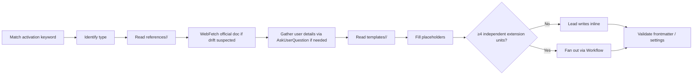

# Extension Create

Single auto-activable skill for creating any Claude Code extension type. Replaces the previous 6 `meta-create-*` skills and the `extension-architect` agent — knowledge now lives here as `references/<type>/` and `templates/<type>/`, loaded on demand when needed.

## How this skill is used

The Lead reads this `SKILL.md` when the user's prompt matches one of the activation keywords. The Lead then:

1. Identifies which extension type to create (from prompt or `AskUserQuestion`).
2. Reads the relevant `references/<type>/` bundle for spec + gotchas + examples.
3. Reads the template from `templates/<type>/` (for agent/skill) or `references/<type>/templates.md` (inline for hook/rule/mcp/plugin).
4. Optionally fetches the official Claude Code doc URL (table below) to verify against drift.
5. Writes the file(s) directly — **inline**, even for ≥5 files (the spawn tree forbids 1 agent; "isolation" is not a reason). Fans out via `Workflow` only for ≥4 independent extension units (`CLAUDE.md §When to delegate`).

## Extension Types

| Type | Output location | Templates | References bundle |
|------|-----------------|-----------|-------------------|
| Agent | `.claude/agents/<name>.md` | `templates/agent/{reader,builder,executor,researcher}.md` | `references/agent/{frontmatter-spec,templates-spec,examples}.md` |
| Skill | `.claude/skills/<name>/` | `templates/skill/{reference,workflow,research}.md` | `references/skill/{frontmatter-spec,skill-types,template-placeholders,directory-structure,examples-library}.md` |
| Hook | `.claude/hooks/<name>.ts` + `settings.json` entry | `references/hook/templates.md` (6 handler types inline) | `references/hook/{events-catalog,handlers-and-settings,gotchas,examples}.md` |
| Rule | `.claude/rules/<name>.md` | `references/rule/templates.md` | `references/rule/{rule-system,gotchas,examples}.md` |
| MCP server | `.mcp.json` entry | `references/mcp/templates.md` | `references/mcp/{reference,gotchas,examples}.md` |
| Plugin | `.claude/plugins/<name>/` | `references/plugin/templates.md` | `references/plugin/{manifest-spec,gotchas-and-cli,examples}.md` |

All paths are relative to `${CLAUDE_SKILL_DIR}/`.

## Official documentation (fetch when verifying)

| Type | URL |
|------|-----|
| Agent | `https://code.claude.com/docs/en/sub-agents.md` |
| Skill | `https://code.claude.com/docs/en/skills.md` |
| Hook | `https://code.claude.com/docs/en/hooks.md` |
| MCP | `https://code.claude.com/docs/en/mcp.md` |
| Plugin | `https://code.claude.com/docs/en/plugins.md` |

## Workflow

### Step 1 — Identify type

From the prompt's keywords or by asking the user. If ambiguous (e.g., "add a validation"), ask which type via `AskUserQuestion`.

### Step 2 — Load knowledge

Read the type-specific reference bundle (`references/<type>/`). These were the bodies of the previous 6 `meta-create-*` skills, now consolidated.

For SKILLS additionally Read `references/01-authoring-rubric.md` (vendored official authoring guidance) — the rubric is MANDATORY: apply the **eval-first rule** (≥3 evaluation scenarios BEFORE writing the skill, via the bundled `skill-creator` evals) and validate every rubric row at Step 5.

### Step 3 — Pick template variant

For agent/skill: pick the template variant (e.g., reader / builder / executor / researcher for an agent).
For hook/rule/mcp/plugin: templates are inline in `references/<type>/templates.md`.

### Step 4 — Generate

1. Read the chosen template.
2. Replace `{{PLACEHOLDERS}}` with user-provided values.
3. **For any single extension unit** (even ≥5 files): Lead writes inline (default-allow gate permits it for non-sensitive paths; the spawn tree forbids 1 agent).
4. **For ≥4 independent extension units**: fan out via `Workflow` — same spawn rule as `CLAUDE.md §When to delegate` (Trigger A).
5. For hooks: also generate the `settings.json` entry.

### Step 5 — Validate

Apply the `references/<type>/gotchas.md` or `frontmatter-spec.md` checklist before declaring success. For skills, ALSO pass the `references/01-authoring-rubric.md` checklist (description D1-D4, body B1-B9, references R1-R5, eval-first) — each deviation needs a written justification. If the extension shapes runtime behavior (skill description, output-style, behavioral rule/hook), run the golden-prompt regression: `bun .claude/evals/run.ts` (protocol: `.claude/evals/README.md`).

## Critical Reminders (cross-type)

1. **`description` 3-line format is load-bearing** — agents and skills MUST include `Use proactively when:` and `Keywords -` lines or auto-matching fails.
2. **`disallowedTools` is camelCase** — never `disallowed_tools`.
3. **Never use `#!/usr/bin/env bash`** in hooks on Windows — Claude Code's reduced PATH breaks `env`. Use `#!/bin/bash` (absolute) or prefer `.ts` with `#!/usr/bin/env bun`.
4. **Stop / SubagentStop hooks need `stop_hook_active` guard** — without it, `exit 2` creates an infinite loop.
5. **`allowed-tools` is NOT a valid skill frontmatter field** — it belongs on agent frontmatter as `allowedTools`.
6. **Hooks `async: true` ignores both exit code AND stdout** — only use for fire-and-forget observability.
7. **`exit 2` only blocks on PreToolUse and PermissionRequest** — on other events it's a generic error.

## Naming Conventions

| Item | Convention | Example |
|------|------------|---------|
| Agent file | `kebab-case.md` | `security-reviewer.md` |
| Skill directory | `kebab-case/` | `api-patterns/` |
| Skill entry | `SKILL.md` (uppercase) | always |
| Hook script | `verb-noun.ts` | `validate-bash.ts` |
| Rule file | `kebab-case.md` | `naming-standards.md` |
| MCP entry | server name in `.mcp.json` | `notion`, `figma` |
| Plugin directory | `kebab-case/` | `my-plugin/` |

## Content Map

| Topic | File | Read when |
|---|---|---|
| Skill authoring rubric (vendored official best practices + eval-first rule) | `references/01-authoring-rubric.md` | Creating or modifying ANY skill — mandatory checklist |
| Agent: frontmatter, 4 templates, worked examples | `references/agent/{frontmatter-spec,templates-spec,examples}.md` | Creating an agent |
| Skill: frontmatter, 5 types, placeholders, directory layout, worked examples | `references/skill/{frontmatter-spec,skill-types,template-placeholders,directory-structure,examples-library}.md` | Creating a skill |
| Hook: events catalog (25+), handlers + settings.json, gotchas, examples, 6 templates inline | `references/hook/{events-catalog,handlers-and-settings,gotchas,examples,templates}.md` | Creating a hook |
| Rule: rule system, gotchas, examples, templates inline | `references/rule/{rule-system,gotchas,examples,templates}.md` | Creating a rule |
| MCP: reference spec, gotchas, examples, templates inline | `references/mcp/{reference,gotchas,examples,templates}.md` | Creating an MCP server |
| Plugin: manifest spec, gotchas + CLI, examples, templates inline | `references/plugin/{manifest-spec,gotchas-and-cli,examples,templates}.md` | Creating a plugin |

## Why this design

Previously the system had 6 `meta-create-*` skills (~660 lines of system-prompt bloat per turn) plus an `extension-architect` agent that required explicit delegation. Both were over-engineered for an activity that happens ~weekly. The audit (PONEGLYPH-AUDIT.md) flagged this. After two iterations (US-012+US-020 → into-agent, then this US-013-style revision → into-skill), the final shape is: **one auto-activable skill, references loaded on demand, work executed inline in the main session, fanning out via Workflow only at ≥4 independent extension units**.

## Related

- `.claude/rules/paths/hooks.md` — hook-specific path rules
- `.claude/rules/paths/orchestration.md` — agent/skill frontmatter quick-ref
- `meta-settings-cookbook` skill — quick reference for CLAUDE.md and settings.json fields
- `Workflow` — fan out only at ≥4 independent extension units (a single unit, even ≥5 files, runs inline)
