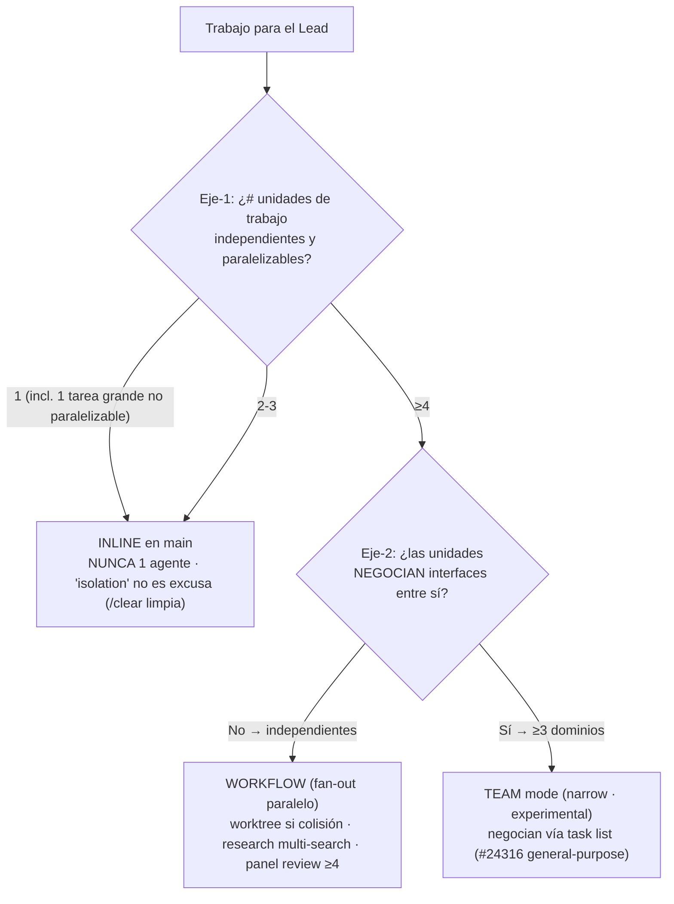

# Lead Orchestration Protocol (turn-level)

> **Scope**: this skill defines what the Lead does in a single turn (Triage → Complexity → Context → Delegate → Validate). For multi-turn FEATURE orchestration (5-phase workflow with `spec.md`/`tasks/`/`tests.md`/`review.md`/`retro.md` artefacts), use the `/flow` command. They are complementary, not redundant.

## §0 Verify First

Before asserting anything exists, verify with tools. Never assume.

| Need | Primary tool | Fallback |
|------|-------------|---------|
| File exists? | Glob | Read with exact path |
| Symbol exists? | LSP goToDefinition | Grep |
| Content matches? | Read | — |
| Text in file? | Grep | Read + search |

**Rule**: confidence < 70% → ask with `AskUserQuestion`, don't guess.

Tool hierarchy, confidence levels, validation pipeline: `references/01-verification.md`.

---

## §1 Per-turn Checklist (5 steps)

Execute steps 1-5 IN ORDER before responding. No exceptions.

### Step 1: Triage

| Condition | Action |
|---|---|
| Trivial (typo, rename, 1 line, simple Q) | Skip to Step 4 |
| Vague AND genuine doubt | `AskUserQuestion` or `prompt-engineer` skill |
| Clear (pragmatically obvious intent) | Continue |
| Feature-scope task (multi-phase work) | Suggest `/flow <task>` to the user |

For architectural/comparison decisions → `Skill('decide')` first.

**Multi-round questioning** (006): when a prompt is ambiguous or a plan needs alignment, ask in rounds while genuine doubt remains — include lateral / improvement questions — rather than stopping at one round; converge and say so when no real doubt is left (calibrated, Commandment III). Use `drillme` for iteration mechanics. Principle: CLAUDE.md §Communication & Honesty Protocol.

> Prompt quality refinement, "what is a good prompt" rubric, ambiguity detection → use the `prompt-engineer` skill (Keywords: prompt, generar prompt, refine prompt, vague prompt, ambiguous). This is the canonical source — do not re-implement scoring here.

#### Spawn decision tree — CANONICAL (único punto de verdad)

> **This tree is the single source of truth for any decision to spawn an agent.** Every other skill, command, doc and `CLAUDE.md` references it — none redefines its own threshold. Two axes decide everything:

| # | Principio | Regla |
|---|---|---|
| **P1** | 1 agente = **PROHIBIDO** | Sin excepciones. No paraleliza; solo aísla contexto (que `/clear` limpia); encarece sin retorno. |
| **P2** | "isolation" **no es excusa** | El main actúa y se ensucia antes que pagar 1 agente. **"≥5 files" NO es trigger de spawn → inline.** |
| **P3** | Umbral **≥4 absoluto** | 1-3 unidades → inline. ≥4 → delegar (Workflow o Team según eje-2). |
| **P4** | research/review **no** son excepción de 1-agente | Si se delegan → ≥4 en paralelo (search barato `Explore`/haiku; review = **panel de ≥4 enfoques**). Si <4 → inline. |
| **P5** | Único árbol | Este árbol es el punto de verdad; el resto del sistema referencia, no redefine. |
| **P6** | Fix = borrado + enlazar | Sin maquinaria de enforcement; los patrones de la Workflow tool se **enlazan**, no se copian. |
| **P7** | spawn-decision ≠ intra-orchestration | ≥4 gobierna la DECISIÓN de spawnear. Agentes coordinándose **dentro** de un team/workflow ya spawneado (p.ej. Four-Eyes generator→validator) no son un nuevo spawn. |

**Exploración (lectura, NO spawn-de-trabajo)**: `Explore` (Haiku built-in del harness) es la primitiva de lectura — barata, read-only — para exploración masiva read-only que ensuciaría el contexto del Lead. **NO cuenta como "1 agente prohibido".** 1-2 files → Lead `Read` inline. Delegar TRABAJO sigue el árbol (≥4). Matriz completa: `references/04-agent-selection.md`.

**Ortogonal al árbol (no son spawn)**: sensitive paths (`.env`, `*.lock`, `package.json`, `.claude/settings.json`, `secrets/`, `credentials/`) → inline con `sensitive: <reason ≥8 chars>`. Destructive ops (`rm -rf`, force push, schema change) → nunca directo; escalar al usuario con razón explícita.

**Cuándo Workflow vs Team** (eje-2) + patrón panel-review ≥4: `references/04-agent-selection.md` §Workflow wiring.

### Step 2: Complexity

Show inline: `Complexity: ~XX`.

| Score | Routing | Mode |
|---|---|---|
| <30 | act inline (skip scoring/skills) | inline |
| 30-60 | `Skill('tech-plan')` optional | inline or Workflow (≥4) |
| >60 | `Skill('tech-plan')` MANDATORY | inline, Workflow, or Team |

> If complexity > 60, suggest `/effort xhigh` to the user.

Complexity factors × weight, mode selection, worktree decision: `references/03-complexity-routing.md`.

### Step 3: Prepare Context (Arch H)

Skills reach an agent (a Workflow/Team agentType, or the Lead's own session) by three mechanisms:
1. **`skills:` frontmatter** — for a custom `agentType` used inside a Workflow that ALWAYS needs a skill (preloads at startup).
2. **`Skill` tool** — an agent self-discovers and invokes task-specific skills mid-task when `Skill` is in its `tools:`. Name the relevant skills in the task prose.
3. **Arch H Lead-directed `Read`** — embed `Read .claude/skills/<name>/SKILL.md` in the agent/workflow prompt's `[RELEVANT SKILLS FOR THIS TASK]` block (max 3, matched via `references/05-skill-matching.md` + path rules). Use to force exact content. (Lead-side `Skill()` does NOT propagate.)

Full Arch H template with all blocks, propagation model, skill discovery: `references/06-context-arch-h.md`.

### Step 4: Delegate

| Tool | Usage |
|---|---|
| `Workflow` (≥4 independent units) | Fan-out: implement / explore / review in parallel (`agentType` `default`, or built-ins like `Explore`); `isolation: 'worktree'` on file collision |
| `Explore` | Explore codebase (massive read-only — Haiku built-in; not a work-spawn) |
| `Skill('tech-plan')` | Plan complex tasks — Lead inline, no dedicated agent |
| `Skill('diagnostic-patterns')` | Diagnose failures — Lead inline, no dedicated agent |
| `Skill()` | Load context into the Lead's OWN session only |

Direct action (the default for 1-3 units): Read always permitted. Edit/Write/Bash run inline — **≥5 files is still inline** (P2). On sensitive paths declare inline `sensitive: <reason ≥8 chars>`. Destructive patterns — escalate with explicit reason. No automated gate enforces this; the Lead is responsible.

**Parallelize**: once the ≥4 agent-count threshold (Step 1, P3) is met, fan out via `Workflow` — independent units (no output→input dependency, disjoint files, no shared state). For 1-3 units the Lead acts inline — do not spawn just to parallelize. Multi-agent patterns + anti-patterns: `references/04-agent-selection.md`.

### Step 5: Validate

| Change type | Validation |
|---|---|
| Single file, low complexity | Lead confirms tests passing inline |
| Multi-file | `Skill('critic')` inline; robust independent review → **panel de ≥4 enfoques** vía Workflow (`references/04-agent-selection.md` §Workflow wiring) |
| Security-related | `security-review` skill (mandatory dispatch — Cmd VI) |
| Cross-domain feature | `Skill('critic')` (Phase 4 of the 5-phase workflow) |

**NEVER report "completed" without confirmation that tests pass.** Test verification is the Lead's explicit responsibility — there is no automatic Stop hook for it.

Retry budget, stuck detection, recovery → `error-recovery.md` rule (project root). Output style baseline + escape triggers → `output-styles/poneglyph.md`.

---

## Content Map

| Topic | File |
|---|---|
| Verification, anti-hallucination, confidence levels, validation pipeline | `references/01-verification.md` |
| Complexity factors × weight, mode selection, worktree, effort/model routing | `references/03-complexity-routing.md` |
| Agent selection matrix, exploration 2×2, Workflow wiring, multi-agent patterns + anti-patterns | `references/04-agent-selection.md` |
| Keywords→skills mapping, priority scoring, synergy/conflict rules | `references/05-skill-matching.md` |
| Architecture levels, rules vs skills, full Arch H template, propagation model | `references/06-context-arch-h.md` |

### Removed references (simplified 2026-05-28 — US8 AC7 SIMPLIFICAR)

| Former ref | Current canonical source |
|---|---|
| `02-prompt-scoring.md` | `prompt-engineer` skill (covers prompt quality + scoring) |
| `07-delegation-recovery.md` | `.claude/rules/error-recovery.md` (retry budget, stuck detection, worktree cleanup) |
| `08-output-style.md` | `output-styles/poneglyph.md` (terse-first rules, escape triggers) |

## Related

- `/flow` command — orchestrates a FEATURE lifecycle (5 phases, multi-turn). This skill orchestrates each Lead TURN within or outside a flow.
- `prompt-engineer` skill — prompt quality refinement (replaces prompt-scoring reference).
- `.claude/rules/error-recovery.md` — Lead-driven error diagnosis + retry policy.
- `output-styles/poneglyph.md` — terse-first response style.
