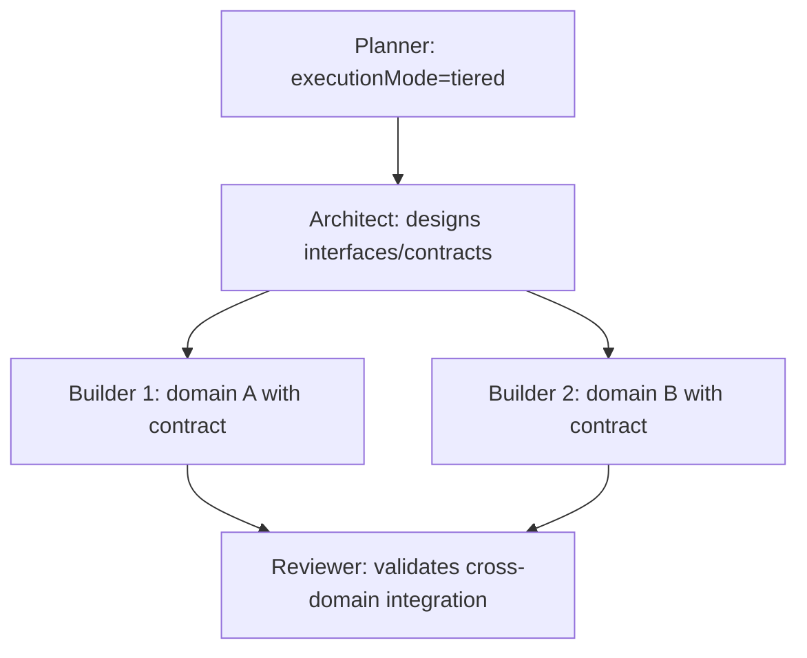

# Complexity Routing

Calculate complexity before delegating to determine if a planner is required and which execution mode to use.

## Complexity Factors

| Factor | Weight | Low (1) ~7pts | Medium (2) ~13pts | High (3) ~20pts |
|--------|--------|--------------|-------------------|-----------------|
| **Files** | 20% | 1-2 | 3-5 | 6+ |
| **Domains** | 20% | 1 | 2-3 | 4+ |
| **Dependencies** | 20% | 0-1 | 2-3 | 4+ |
| **Security** | 20% | None | Data | Auth/Crypto |
| **Integrations** | 20% | 0-1 | 2-3 | 4+ |

```
score = Σ (factor_value × weight × 100 / 3)
```

Each factor contributes a maximum of ~33 points (value=3 × 20% × 33.3). Total maximum = 100.

| Value | × Weight (20%) | × Scale (33.3) | Contribution |
|-------|----------------|----------------|-------------|
| Low (1) | 0.20 | 33.3 | ~7 |
| Medium (2) | 0.20 | 33.3 | ~13 |
| High (3) | 0.20 | 33.3 | ~20 |

## Routing by Complexity

| Score | Routing | Reason |
|-------|---------|--------|
| **< 15** | builder direct, skip scoring/skills | Trivial task (rename, typo, single-line) |
| **15-30** | builder direct | Simple task, no planning needed |
| **30-60** | planner optional | Consider plan if there is uncertainty |
| **> 60** | planner mandatory | Requires structured roadmap |

## Mode Selection Table

| Score | Domains | Shared Interfaces | Mode | Cost |
|-------|---------|-------------------|------|------|
| < 45 | Any | — | **subagents** | 1x |
| 45-60 | 2-3 | Yes (shared types/APIs) | **tiered** | ~2x |
| 45-60 | 2-3 | No (independent) | **subagents** | 1x |
| > 60 | 3+ independent (4-gate pass) | — | **team** | 3-7x |
| > 60 | 3+ (4-gate fail) | — | **subagents** | 1x |

Default is ALWAYS subagents.

## Tiered Mode

Intermediate mode for 2-3 domains with shared interfaces and complexity 45-60. Architect designs contracts before builders start in parallel.



| Step | Who | Action |
|------|-----|--------|
| 1 | Planner | Generates roadmap with `executionMode: "tiered"` |
| 2 | Lead → Architect | "Design interface contracts between domains X and Y" |
| 3 | Architect → Lead | Shared types, API signatures, data contracts |
| 4 | Lead → Builders (parallel) | Each receives its domain + architect's contracts |
| 5 | Lead → Reviewer | Validates cross-domain integration against contracts |

## 4-Gate Criteria (Team Mode Only — ALL must pass)

| Gate | Threshold |
|------|-----------|
| Complexity | > 60 |
| Independent domains | ≥ 3 with no shared files |
| Inter-agent communication | Necessary (interface negotiation) |
| Feature flag | `CLAUDE_CODE_EXPERIMENTAL_AGENT_TEAMS=1` |

Opt-out: `PONEGLYPH_DISABLE_TEAM_MODE=1` forces subagents regardless.

## Team Mode Execution

### Prerequisites

| Requirement | Check |
|-------------|-------|
| Env var active | `CLAUDE_CODE_EXPERIMENTAL_AGENT_TEAMS=1` |
| Planner recommended team | `executionMode: team` in roadmap |
| Complexity > 60 | Calculated above |
| 3+ independent domains | No shared files between domains |

### Teammate Prompt Template

Each teammate receives a prompt with:

| Field | Content |
|-------|---------|
| **Domain** | "Your domain is [X]. You only touch files in [paths]." |
| **Tasks** | Roadmap subtasks assigned to this domain |
| **Interfaces** | Contracts to expose/consume with other domains |
| **Constraint** | "DO NOT modify files outside your domain" |
| **Coordination** | "Use the task list to coordinate with other teammates" |

### Coordination Protocol

| Phase | Lead Action |
|-------|-------------|
| **Spawn** | Create one teammate per domain using the prompt template |
| **Monitor** | Review task list for progress. Do not intervene unless stuck. |
| **Interfaces** | Teammates negotiate contracts via task list (TaskCreate/TaskUpdate) |
| **Integration** | After all teammates complete, Lead runs reviewer over the full changeset |
| **Cleanup** | Verify no file conflicts between teammate outputs |

### Fallback Triggers

| Trigger | Action |
|---------|--------|
| Teammate fails 2x | Extract domain tasks → run as builder subagent |
| Multiple teammates fail | Abort team mode → full fallback to subagents |
| File conflict between teammates | Lead arbitrates via reviewer. Losing domain re-executes. |
| Env var missing but planner recommended team | Silent fallback to subagents. Log warning. |
| Teammate stuck (no progress in task list) | Extract domain → builder subagent |

> Current limitation: Teammates are always `general-purpose` (issue anthropics/claude-code#24316). They cannot use custom `.claude/agents/`. However, each teammate loads `~/.claude/` automatically — Poneglyph rules, skills and hooks apply.

## Worktree Decision

| Condition | Worktree |
|-----------|----------|
| Score >60 + planner generates >1 builder | Mandatory |
| 2+ builders in parallel (any score) | Mandatory |
| Task marked experimental | Mandatory |
| Score <30, single builder | Not needed |

> Worktree rules do NOT apply in team mode. Each teammate runs in its own Claude Code process.

## Model Routing

| Agent category | Complexity | Model |
|----------------|------------|-------|
| Code (builder, reviewer, error-analyzer) | < 30 | sonnet |
| Code (builder, reviewer, error-analyzer) | 30-50 | sonnet |
| Code (builder, reviewer, error-analyzer) | > 50 | opus |
| Read-only (scout) | < 30 | haiku |
| Read-only (scout) | 30-50 | haiku |
| Read-only (scout) | > 50 | sonnet |
| Strategic (planner, architect) | Any | opus |

## Effort Routing (Frontmatter — static)

| Agent | effort | Rationale |
|-------|--------|-----------|
| scout | `low` | Only reads files. No deep reasoning required. |
| architect | `high` | High-impact strategic decisions. |
| planner | `high` | Plan quality determines all execution. |
| error-analyzer | `high` | Deep diagnosis requires extensive reasoning. |
| builder | ❌ inherit | Depends on task. Inherits session default. |
| reviewer | ❌ inherit | Depends on review type. Inherits session default. |

> `effort` in frontmatter is static — no `effort` parameter in the Agent tool call (open issue anthropics/claude-code#25591).

## Calculation Examples

### Low Complexity (< 30)
> "Add email validation to the registration endpoint"

- Files: 1-2 (Low=1) → ~7 | Domains: 1 (Low=1) → ~7 | Dependencies: 1 (Low=1) → ~7
- Security: Data (Medium=2) → ~13 | Integrations: 0 (Low=1) → ~7
- **Total: ~41** → planner optional

### High Complexity (> 60)
> "Implement OAuth authentication system with Google and GitHub"

- Files: 6+ (High=3) → ~20 | Domains: 4+ (High=3) → ~20 | Dependencies: 4+ (High=3) → ~20
- Security: Auth (High=3) → ~20 | Integrations: 4+ (High=3) → ~20
- **Total: ~100** → planner mandatory
