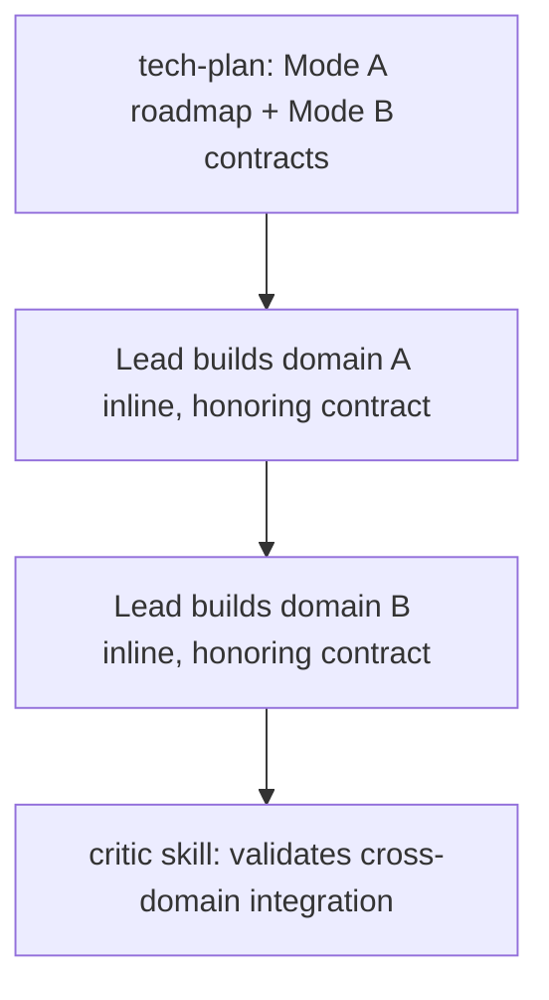

# Complexity Routing

## Contents

- [Complexity Factors](#complexity-factors)
- [Routing by Complexity](#routing-by-complexity)
- [Mode Selection Table](#mode-selection-table)
- [Tiered Mode](#tiered-mode)
- [4-Gate Criteria (Team Mode Only — ALL must pass)](#4-gate-criteria-team-mode-only-all-must-pass)
- [Team Mode Execution](#team-mode-execution)
- [Worktree Decision](#worktree-decision)
- [Model Routing](#model-routing)
- [Effort Routing (Frontmatter — static)](#effort-routing-frontmatter-static)
- [Calculation Examples](#calculation-examples)

Calculate complexity before delegating to determine if invoking the `tech-plan` skill is required and which execution mode to use.

## Complexity Factors

| Factor | Weight | Low (1) ~7pts | Medium (2) ~13pts | High (3) ~20pts |
|--------|--------|--------------|-------------------|-----------------|
| **Files** | 20% | 1-2 | 3-5 | 6+ |
| **Domains** | 20% | 1 | 2-3 | 4+ |
| **Dependencies** | 20% | 0-1 | 2-3 | 4+ |
| **Security** | 20% | None | Data | Auth/Crypto |
| **Integrations** | 20% | 0-1 | 2-3 | 4+ |

```
score = Σ (factor_value × weight × 100 / 3)
```

Each factor contributes a maximum of ~33 points (value=3 × 20% × 33.3). Total maximum = 100.

| Value | × Weight (20%) | × Scale (33.3) | Contribution |
|-------|----------------|----------------|-------------|
| Low (1) | 0.20 | 33.3 | ~7 |
| Medium (2) | 0.20 | 33.3 | ~13 |
| High (3) | 0.20 | 33.3 | ~20 |

## Routing by Complexity

| Score | Routing | Reason |
|-------|---------|--------|
| **< 15** | inline, skip scoring/skills | Trivial task (rename, typo, single-line) |
| **15-30** | inline | Simple task, no planning needed |
| **30-60** | tech-plan optional | Consider plan if there is uncertainty |
| **> 60** | tech-plan mandatory | Requires structured roadmap |

## Mode Selection Table

| Score | Units / Domains | Negotiate interfaces | Mode | Cost |
|-------|---------|-------------------|------|------|
| Any | 1-3 units | — | **inline** | 1x |
| Any | ≥4 independent READ-ONLY units | No | **Workflow** | scales w/ #units |
| Any | ≥4 independent WRITE units | No | **inline sequential** (Workflow only with explicit user opt-in — "ultracode" / direct ask) | 1x |
| 45-60 | 2-3 | Yes (shared types/APIs) | **tiered** (inline contracts) | ~2x |
| > 60 | 3+ domains (4-gate pass) | Yes | **team** (experimental) | 3-7x |
| > 60 | 3+ (4-gate fail) | — | **inline / Workflow (read-only)** | 1x+ |

Default is ALWAYS inline. Write work stays inline regardless of unit count unless the user explicitly opts in (delegation doctrine — SKILL.md P8: token multiplication, summary degradation, context loss).

## Tiered Mode

Intermediate mode for 2-3 domains with shared interfaces and complexity 45-60. The `tech-plan` skill (Mode B) designs contracts before the units are built — all inline; no separate architect agent.



| Step | Who | Action |
|------|-----|--------|
| 1 | `tech-plan` skill | Generates roadmap with `executionMode: "tiered"` and an inline Mode B section (interface contracts between domains X and Y) |
| 2 | Lead (inline, sequential) | Builds each domain honoring the Mode B contracts |
| 3 | `critic` skill | Validates cross-domain integration against contracts |

## 4-Gate Criteria (Team Mode Only — ALL must pass)

| Gate | Threshold |
|------|-----------|
| Complexity | > 60 |
| Independent domains | ≥ 3 with no shared files |
| Inter-agent communication | Necessary (interface negotiation) |
| Feature flag | `CLAUDE_CODE_EXPERIMENTAL_AGENT_TEAMS=1` |

Opt-out: `PONEGLYPH_DISABLE_TEAM_MODE=1` forces subagents regardless.

## Team Mode Execution

### Prerequisites

| Requirement | Check |
|-------------|-------|
| Env var active | `CLAUDE_CODE_EXPERIMENTAL_AGENT_TEAMS=1` |
| Planner recommended team | `executionMode: team` in roadmap |
| Complexity > 60 | Calculated above |
| 3+ independent domains | No shared files between domains |

### Teammate Prompt Template

Each teammate receives a prompt with:

| Field | Content |
|-------|---------|
| **Domain** | "Your domain is [X]. You only touch files in [paths]." |
| **Tasks** | Roadmap subtasks assigned to this domain |
| **Interfaces** | Contracts to expose/consume with other domains |
| **Constraint** | "DO NOT modify files outside your domain" |
| **Coordination** | "Use the task list to coordinate with other teammates" |

### Coordination Protocol

| Phase | Lead Action |
|-------|-------------|
| **Spawn** | Create one teammate per domain using the prompt template |
| **Monitor** | Review task list for progress. Do not intervene unless stuck. |
| **Interfaces** | Teammates negotiate contracts via task list (TaskCreate/TaskUpdate) |
| **Integration** | After all teammates complete, Lead runs `Skill('critic')` over the full changeset |
| **Cleanup** | Verify no file conflicts between teammate outputs |

### Fallback Triggers

| Trigger | Action |
|---------|--------|
| Teammate fails 2x | Fold domain tasks back → inline, or a `Workflow` unit |
| Multiple teammates fail | Abort team mode → full fallback to inline / `Workflow` |
| File conflict between teammates | Lead arbitrates (`Skill('critic')`). Losing domain re-executes. |
| Env var missing but planner recommended team | Silent fallback to inline / `Workflow`. Log warning. |
| Teammate stuck (no progress in task list) | Fold domain back → inline / `Workflow` unit |

> Current limitation: Teammates are always `general-purpose` (issue anthropics/claude-code#24316). They cannot use custom `.claude/agents/`. However, each teammate loads `~/.claude/` automatically — Poneglyph rules, skills and hooks apply.

## Worktree Decision

| Condition | Worktree |
|-----------|----------|
| ≥4 `Workflow` units with overlapping files | Mandatory |
| 2+ parallel units touching the same paths | Mandatory |
| Task marked experimental | Mandatory |
| Single inline unit (1-3) | Not needed |

> Worktree rules do NOT apply in team mode. Each teammate runs in its own Claude Code process.

## Model Routing

| Work category | Complexity | Model |
|----------------|------------|-------|
| Inline build/review (Lead session) — the default for ALL writes | any | session model (`effortLevel`) |
| Workflow unit — read-only research/review lens | any | sonnet (default) |
| Workflow unit — write (explicit opt-in only) | > 50 | opus |
| Read-only exploration (`Explore`) | any | haiku (built-in) |

## Effort Routing (Frontmatter — static)

Effort scale: `low < medium < high < xhigh`

| Work | effort | Rationale |
|-------|--------|-----------|
| `Explore` (read-only) | `low` (built-in) | Only reads files. No deep reasoning required. |
| Inline build/review | session `effortLevel` | The Lead inherits the session effort. |
| Workflow unit | per `agentType` frontmatter (or inherit) | Set on the custom agentType when one is defined. |

> `effort` in frontmatter is static — no `effort` parameter in the Agent tool call (open issue anthropics/claude-code#25591).

### xhigh

`xhigh` is available with Opus 4.7. On Opus 4.6 it behaves identically to `high`. Reserve for:

| When | Condition |
|------|-----------|
| Complexity > 80 | Maximum reasoning budget for critical tasks |
| Security audit | Auth/Crypto changes with high blast radius |
| Architecture design | Cross-domain refactors with 6+ files affected |

## Calculation Examples

### Low Complexity (< 30)
> "Add email validation to the registration endpoint"

- Files: 1-2 (Low=1) → ~7 | Domains: 1 (Low=1) → ~7 | Dependencies: 1 (Low=1) → ~7
- Security: Data (Medium=2) → ~13 | Integrations: 0 (Low=1) → ~7
- **Total: ~41** → planner optional

### High Complexity (> 60)
> "Implement OAuth authentication system with Google and GitHub"

- Files: 6+ (High=3) → ~20 | Domains: 4+ (High=3) → ~20 | Dependencies: 4+ (High=3) → ~20
- Security: Auth (High=3) → ~20 | Integrations: 4+ (High=3) → ~20
- **Total: ~100** → planner mandatory
