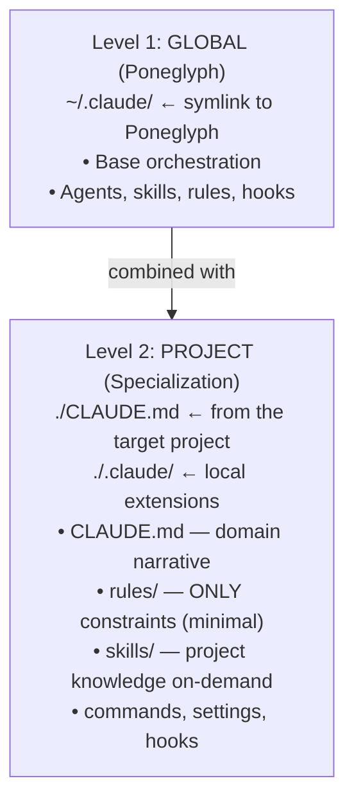

# Context Management + Arch H

## Architecture Levels

Two-level config model: global (Poneglyph) + project (specialization). Claude Code combines both at spawn.



## Rules vs Skills (Project Level)

| Use a rule when | Use a skill when |
|---|---|
| Violation is blocking (constraint) | Content is guidance, not constraint |
| Must be in context every prompt | Only useful for specific tasks |
| Short (<500 tokens) | Any size (loads on-demand via Arch H) |
| e.g., module-boundaries, contract-first | e.g., naming-standards, function-design |

## Skill Loading Limits

> The custom `builder`/`reviewer`/`scout` agents and their per-role baselines were **cut in feature 008** — work runs inline (delegation doctrine: SKILL.md §P8). Limits below govern the surfaces that still exist:

| Surface | Preload (free) | Max via Arch H Read | Notes |
|-------|--------------------|----------------|-----------|
| Lead session | everything always-loaded | n/a — `Skill()` on demand | The default executor for all write work |
| Workflow `agentType` (read-only fan-out) | `skills:` frontmatter (1-2) | 3 | Preload does not count against the Arch H max |
| Built-in `Explore` | — | 0-1 | Minimal context by design (skips CLAUDE.md/git status — restate constraints in the prompt) |

> Planning and error diagnosis are handled by the Lead invoking `Skill('tech-plan')` / `Skill('diagnostic-patterns')` directly — no dedicated subagent.

## Precedence Rules

1. **Domain-specific skills > generic skills** — always prioritize specific ones
2. **Base skills do not count** against the agent's max limit
3. **If keyword matches > agent max**: prioritize by keyword frequency in the prompt
4. **If tied**: prefer skills from the task's primary domain

## Skill Propagation Model (Empirically Verified)

Ground-truth rules for what reaches subagents. Verified via direct testing on 2026-04-10 (including Test 7, which validated Arch H).

### What reaches a subagent automatically at spawn

| Mechanism | Reaches subagent? | Notes |
|---|---|---|
| Rules from `.claude/rules/` (project + global) | **YES** | Auto-injected into the subagent's system prompt |
| `CLAUDE.md` (project + global) | **YES** | Both levels auto-propagate |
| Frontmatter `skills:` in agent definition | **YES** | Full `SKILL.md` bodies pre-injected at spawn, unconditionally (all-or-nothing) |
| Baseline skills pre-declared per agent role | **YES** | Arrive at spawn regardless of task |
| Content pasted verbatim by Lead into delegation prompt (including `MEMORY.md`) | **YES** | Behaves like any other prompt content |
| Subagent `Read`s `.claude/skills/<name>/SKILL.md` when instructed by Lead in delegation prompt (**Arch H**) | **YES** | **Validated via Test 7 on 2026-04-10** — the recommended task-specific loading mechanism |
| Project skills Read via Arch H (`./.claude/skills/<name>/SKILL.md`) | **YES** | Same mechanism as global skills |

### What does NOT reach a subagent

| Mechanism | Why not |
|---|---|
| Lead invokes `Skill()` before delegating | Loaded content stays in the Lead's context. Subagents spawn fresh. (Still true.) |
| Subagent calls `Skill()` **without** `Skill` in its `tools:` | If the agent's `tools:` omits `Skill` (or `disallowedTools` includes it), the tool is unavailable. Per-agent config choice, NOT a harness limit. Historical note (2026-05-30): the then-existing `builder`/`reviewer`/`scout` listed `Skill` and could invoke it — those agents were cut in feature 008. The mechanism stands for any Workflow `agentType` whose `tools:` include `Skill` (CC ≥2.1.133 — verified in `.claude/plans/_research-skill-activation-2026-06-09.md`). |

## Arch H Delegation Template

When delegating to any agent, the Lead MUST build the prompt with these context blocks. Omit any block that is empty.

```
[ACCUMULATED MEMORY - {agent}]
{content of MEMORY.md, last 3K tokens}

[QUALITY STANCE]
Output must be: certain, sourced, simple, style-consistent, gap-free.
Ask if doubt > 30%. Verify before asserting.

[RELEVANT SKILLS FOR THIS TASK]
Before starting, your first actions must be to Read these skill files for context.
After loading them, proceed with the task.
- Read .claude/skills/<global-skill>/SKILL.md       ← global (generic pattern)
- Read .claude/skills/<project-skill>/SKILL.md       ← project (domain knowledge)
- Read .claude/skills/<skill-3>/SKILL.md

After loading each skill file, check if its main SKILL.md has a "Content Map", "Reference Files",
or "Documentation" section (a canonical 3-column Topic | File | Contents table). If present,
consult the Contents column to judge which supporting files are semantically relevant to your
current task and Read them selectively. Do NOT read all references blindly (defeats on-demand
loading), but DO read those where the Contents row describes your task situation.

[TASK]
{task instructions}

[MEMORY OUTPUT]
When finished, include "### Memory Insights" with 1-5 reusable insights discovered during this task.
```

| Rule | Detail |
|------|--------|
| Max skills | 3 per delegation (avoid token bloat) |
| Source of truth | manual keyword match (`05-skill-matching.md` + paths rules) > omit |
| `Skill()` by the Lead | Loads context into Lead's OWN session only — does NOT propagate to subagents |
| Empty blocks | Omit the header entirely rather than leaving an empty section |
| Memory reminder | Explicit `[MEMORY OUTPUT]` is NECESSARY — agents miss the system-prompt instruction without it |

## Skill Discovery (Global + Project)

When preparing a delegation:

1. Match task keywords against `05-skill-matching.md` + the project's path rules (e.g., `.claude/rules/paths/`) — these map domain keywords → `.claude/skills/<name>/SKILL.md` paths (global + project)
2. Put the chosen `Read` instructions into the delegation prompt's `[RELEVANT SKILLS FOR THIS TASK]` block. Max 3 skills total (1-2 global + 1-2 project is a good balance)
3. For skills the agent ALWAYS needs, use the native `skills:` frontmatter field instead (preloads at startup)
4. Check if there is a specialized agent (e.g., `django-refactor-agent`, `django-security-auditor`) before routing to a generic one

## Content Map Pattern (canonical for skills with subdirectories)

Any skill that has a `references/` subdirectory **MUST** include a canonical Content Map table in its main `SKILL.md`.

**Canonical format — 3 columns**:

| Topic | File | Contents |
|---|---|---|
| Short topic name | `${CLAUDE_SKILL_DIR}/<subdir>/<file>.md` | Semantic description of what the file contains + when it is useful. Phrase as "Read when…" so the subagent can make a load decision based on task relevance. |

**Rules**:

1. **Use `${CLAUDE_SKILL_DIR}/` prefix** for all file paths — the Anthropic-official variable that resolves to the skill's own directory
2. **Contents column is load-bearing** — the subagent decides whether to Read each supporting file based on the semantic description here
3. **3 columns, not 4** — keyword triggers fold into the Contents prose naturally
4. **Reference file frontmatter is minimal** (`parent`, `name`, `description`) — not loaded as standalone skills
5. **Main SKILL.md stays ≤ 500 lines** per Anthropic official guidance
6. **Critical gotchas stay inline** in the main SKILL.md — footguns with silent-failure semantics must be surfaced in the entry file

**Subagent behavior**: when you Read a main SKILL.md that has a Content Map, consult the Contents column to judge which supporting files apply to your current task. Read the relevant ones. Do NOT read all blindly. Do NOT skip them when the Contents description matches your task even if task phrasing didn't explicitly mention the domain — semantic match is a valid trigger.

## Anti-Claims (False — Never Repeat)

1. *"Skill loaded by the Lead is automatically available to subagents."* — **False**. Lead-side `Skill()` context does not transit (unchanged).
2. ~~*"Subagents can never invoke `Skill()` dynamically."*~~ — **This claim was itself wrong; corrected 2026-05-30.** Subagents CAN invoke `Skill()` when `Skill` is in their `tools:` (CC ≥2.1.133 — verified in `.claude/plans/_research-skill-activation-2026-06-09.md`).
3. *"A prompt telling the subagent to `invoke Skill('X')` always works."* — **Conditional**: works only if the subagent has `Skill` in `tools:`. Otherwise use `Read .claude/skills/<name>/SKILL.md` (Arch H fallback).

## Orchestration Consequences

- **Rules + CLAUDE.md are the real context carriers.** Invest in them. A well-written project rule reaches every subagent automatically.
- **Three skill-loading mechanisms (corrected 2026-05-30; agents cut in 008)**: (1) `skills:` frontmatter preload on a custom Workflow `agentType` — for skills EVERY unit of that type needs; (2) `Skill` tool self-invoke — any agentType whose `tools:` include `Skill` loads task-specific skills mid-task; (3) Arch H Lead-directed `Read` — fallback to force exact content. `Read` is always in the allowlist so Arch H always works.
- **Project skills are a valid on-demand knowledge layer.** They work identically to global skills via Arch H Read — the subagent doesn't distinguish between global and project skills at Read time.
- **Rule of thumb at project level: constraint = rule, knowledge = skill.**
- **Path-scoped loader quirk**: in `.claude/rules/paths/*.md`, globs starting with `**` require at least one leading path segment. A raw `apps/...` pattern will NOT match `apps/foo.py`; use `**/apps/...` explicitly.
