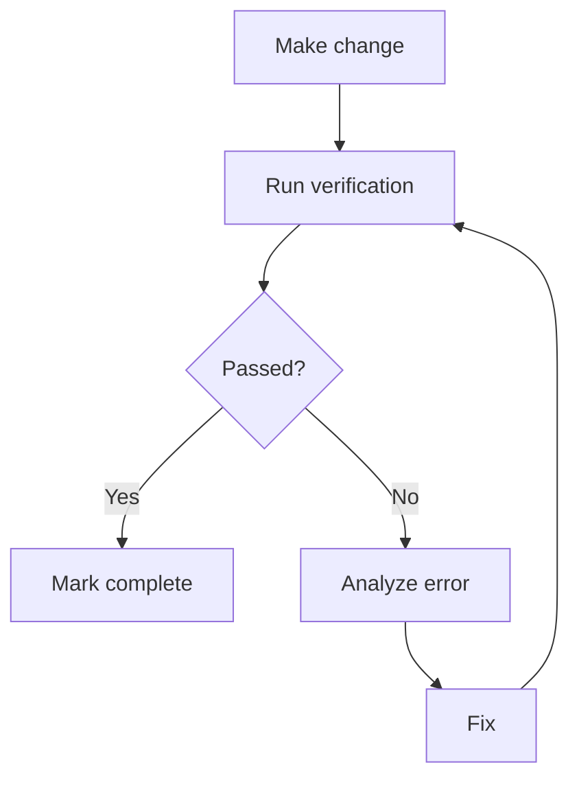

# Gap Analysis + Ground Truth — references/03

## Gap Analysis (MANDATORY)

Before each Execution Roadmap, complete this table:

### Gap Analysis Table

| Action | File | Deps | Verify Exists | Risk |
|--------|------|------|---------------|------|
| Edit | `path/existing.ts` | - | `Glob('path/existing.ts')` ✅ | Low |
| Create | `path/new.ts` | types.ts | `Glob('path/')` dir exists | Medium |
| Delete | `path/old.ts` | - | Verify no imports | High - breaking |

### Impact Analysis

| Question | How to verify |
|----------|--------------|
| What files do I touch? | List exact paths |
| What files do I create? | Verify destination dir exists |
| Do I break a public API? | `Grep('export.*FunctionName')` |
| Does it require migration? | Verify schema/type changes |

---

## Ground Truth from Environment

**Principle**: According to [Anthropic](https://www.anthropic.com/research/building-effective-agents), get feedback from the real environment at each step.

### Mandatory Verification

| After... | Run | Expect |
|----------|-----|--------|
| Edit of TypeScript code | `bun typecheck path/file.ts` | Exit 0 |
| New test file | `bun test path/file.test.ts` | Tests pass |
| Change in API endpoint | Real request or integration test | Expected response |
| Configuration change | Verify app starts | No errors |
| Dependency installation | `bun install` + import test | No errors |

### Verification Workflow

### FORBIDDEN

- Marking a step as "complete" without environment verification
- Assuming code works without running it
- Continuing to the next step if there are pending errors
