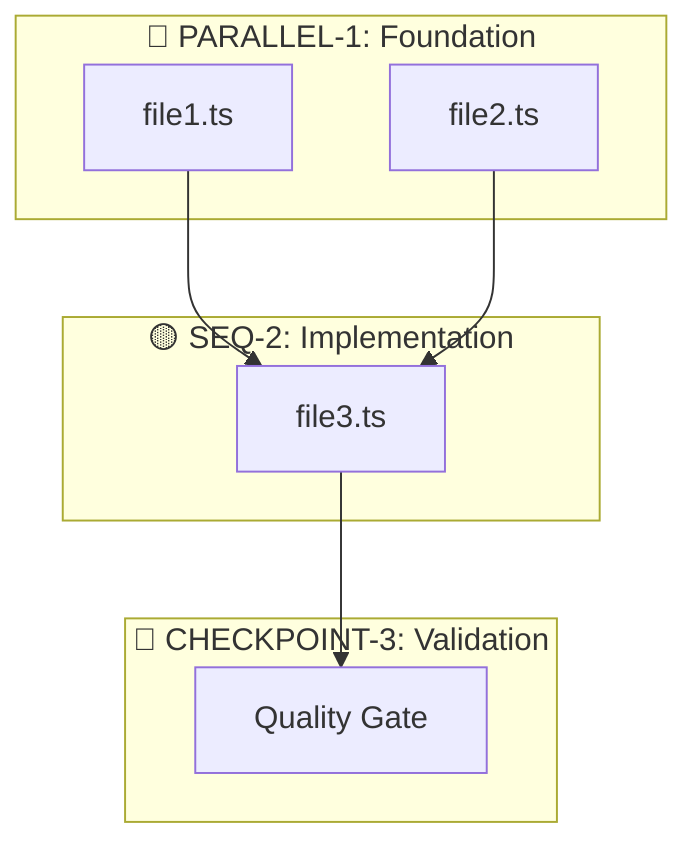
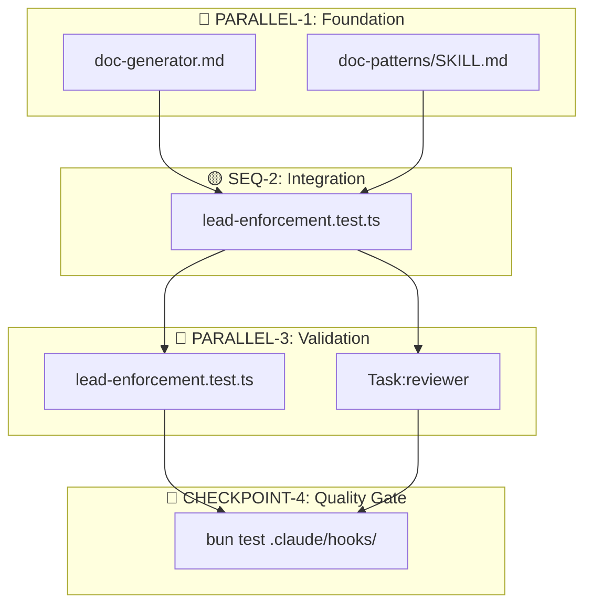

# Output Format + Example — references/06

## Mandatory Output Format

### A. Executive Summary (2 lines)

```markdown
## Executive Summary

Implement [WHAT] in [WHERE] to achieve [OBJECTIVE].
Affects [N] files, [M] are new, risk [LOW/MEDIUM/HIGH].
```

### B. Tool Inventory

| Type | Tool | Use in this task | Config |
|------|------|-----------------|--------|
| Skill | [name] | [purpose] | Auto/Manual |
| Agent | [name] | [purpose] | model, background |
| Script | [name] | [purpose] | Pre/Post |

### C. Deep Research Summary

| API/Framework | Version in project | Version consulted | Breaking changes? |
|---------------|--------------------|-------------------|-------------------|
| Elysia | 1.2.3 | 1.2.3 (official docs) | No |

### D. Gap Analysis

| Action | File | Deps | Verification | Risk |
|--------|------|------|--------------|------|
| Edit | path/file.ts | - | `Glob('path/file.ts')` | Low |
| Create | path/new.ts | types.ts | Dir exists | Medium |

### E. Dependency Graph



**Legend:**
- 🔵 = Parallel (no mutual dependencies)
- 🟡 = Sequential (requires prior step)
- 🔴 = Blocking (checkpoint, approval required)

### F. Execution Nodes

#### 🔵 PARALLEL-1: [Group name]
**Deps**: None | **Type**: 🔵 Parallel

| # | File | Tool | Skills | Verification |
|---|------|------|--------|--------------|
| 1.1 | path/file.ts | Write | skill1 | `Glob` confirms + `bun typecheck` |
| 1.2 | path/file2.ts | Write | skill2 | `Glob` confirms + `bun typecheck` |

**Execute**: `Write(file1) + Write(file2)` IN SAME MESSAGE
**Ground Truth**: `bun typecheck` after completing group

#### 🟡 SEQ-2: [Name]
**Deps**: PARALLEL-1 ✅ | **Type**: 🟡 Sequential

| # | File | Tool | Skills | Verification |
|---|------|------|--------|--------------|
| 2.1 | path/service.ts | Edit | review-patterns | `bun typecheck` |

**Execute**: AFTER PARALLEL-1
**Corresponding test**: `path/service.test.ts` (TDD enforcement)
**Ground Truth**: `bun test path/service.test.ts`

#### 🔴 CHECKPOINT-3: [Name] [Blocking]
**Deps**: SEQ-2 ✅ | **Type**: 🔴 Blocking

| # | Action | Tool | Verification |
|---|--------|------|--------------|
| 3.1 | Quality Gate | Bash | `./scripts/check.sh` |

**Execute**: PAUSE - Wait for result and approval
**Recovery**: If fails → fix errors before continuing

---

## Worked Example (condensed)

**Task**: "Add new documentation agent with associated skill"

### Executive Summary
Implement agent `doc-generator.md` with skill `doc-patterns/SKILL.md` and tests for the validation hook. Affects 4 files, 2 new, risk LOW.

### Gap Analysis

| Action | File | Deps | Verification | Risk |
|--------|------|------|--------------|------|
| Create | `.claude/agents/doc-generator.md` | - | `Glob('.claude/agents/')` dir exists | Low |
| Create | `.claude/skills/doc-patterns/SKILL.md` | - | `Glob('.claude/skills/')` dir exists | Low |
| Edit | `lead-enforcement.test.ts` | - | `Glob` ✅ | Low |
| Edit | `lead-enforcement.test.ts` | - | `Glob` ✅ | Low |

### Dependency Graph



#### 🔵 PARALLEL-1: Foundation
| # | File | Tool | Verification |
|---|------|------|--------------|
| 1.1 | `.claude/agents/doc-generator.md` | Write | `Glob` confirms |
| 1.2 | `.claude/skills/doc-patterns/SKILL.md` | Write | `Glob` confirms |

**Execute**: `Write(agent) + Write(skill)` IN SAME MESSAGE

#### 🟡 SEQ-2: Integration
| # | File | Tool | Verification |
|---|------|------|--------------|
| 2.1 | `lead-enforcement.test.ts` | Edit | `Grep('doc-patterns')` confirms |

#### 🔵 PARALLEL-3: Validation
| # | Action | Tool | Verification |
|---|--------|------|--------------|
| 3.1 | `lead-enforcement.test.ts` | Edit | `bun test .claude/hooks/` |
| 3.2 | reviewer review | Task:reviewer | - |

**Execute**: `Edit(test) + Task(reviewer, background:true)` IN SAME MESSAGE

#### 🔴 CHECKPOINT-4: Quality Gate
| # | Action | Verification |
|---|--------|--------------|
| 4.1 | `bun test ./.claude/hooks/` | Exit code 0 |

**Recovery**: If fails → fix before commit
