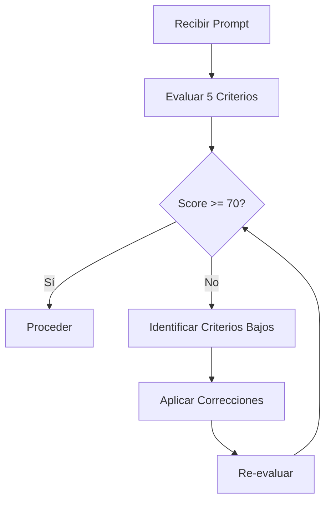

# Improvement Process

Proceso paso a paso para mejorar prompts con score < 70.

## Workflow

## Técnicas de Mejora

| Técnica | Uso | Ejemplo |
|---------|-----|---------|
| **XML Tags** | Estructurar secciones | `<context>...</context>` |
| **Chain-of-Thought** | Razonamiento paso a paso | "Primero X, luego Y" |
| **Few-Shot** | Ejemplos de input/output | "Ejemplo: dado X, retorna Y" |
| **Constraints** | Limitar scope | "Solo archivos en src/" |

## Pasos de Corrección

1. **Identificar** criterio más bajo
2. **Preguntar** información faltante al usuario
3. **Estructurar** con bullets o headers
4. **Añadir** criterios de éxito medibles
5. **Verificar** que es actionable sin más preguntas

## Preguntas Clave por Criterio

| Criterio | Preguntas |
|----------|-----------|
| Clarity | ¿Qué acción específica? ¿Sobre qué? |
| Context | ¿Qué archivos? ¿Qué tecnología? |
| Structure | ¿Puedo dividir en pasos? |
| Success | ¿Cómo sé que está completo? |
| Actionable | ¿Puedo empezar ya? |
