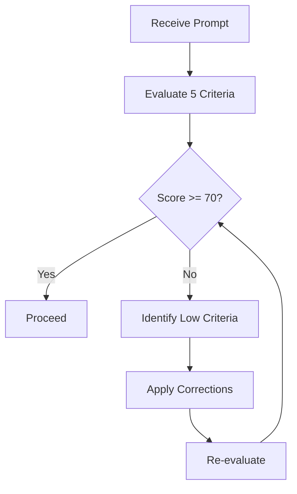

# Improvement Process

Step-by-step process to improve prompts with score < 70.

## Workflow

```mermaid
graph TD
    A[Receive Prompt] --> B[Evaluate 5 Criteria]
    B --> C{Score >= 70?}
    C -->|Yes| D[Proceed]
    C -->|No| E[Identify Low Criteria]
    E --> F[Apply Corrections]
    F --> G[Re-evaluate]
    G --> C
```

## Improvement Techniques

| Technique | Use | Example |
|---------|-----|---------|
| **XML Tags** | Structure sections | `<context>...</context>` |
| **Chain-of-Thought** | Step-by-step reasoning | "First X, then Y" |
| **Few-Shot** | Input/output examples | "Example: given X, return Y" |
| **Constraints** | Limit scope | "Only files in src/" |

## Correction Steps

1. **Identify** lowest criterion
2. **Ask** the user for missing information
3. **Structure** with bullets or headers
4. **Add** measurable success criteria
5. **Verify** it is actionable without further questions

## Key Questions by Criterion

| Criterion | Questions |
|----------|-----------|
| Clarity | What specific action? On what? |
| Context | Which files? Which technology? |
| Structure | Can I split into steps? |
| Success | How do I know it is complete? |
| Actionable | Can I start now? |
