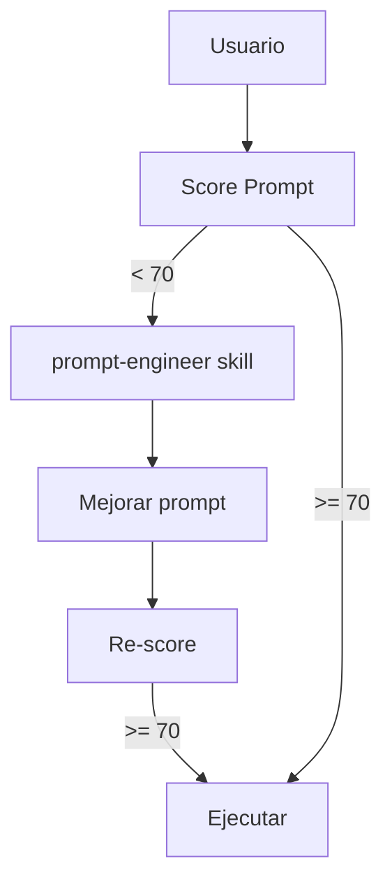

# Prompt Engineer Skill

Skill para mejorar prompts de usuario y **generar órdenes efectivas para agentes**.

## Principios Fundamentales

### 1. Especificidad > Generalidad

| ❌ Malo | ✅ Bueno |
|---------|----------|
| "arregla el bug" | "Corrige el error de autenticación en `auth.ts:45` que causa logout inesperado" |
| "mejora el código" | "Extrae la lógica de validación de `UserService.create()` a un validador dedicado" |
| "haz tests" | "Crea unit tests para `calculateTotal()` cubriendo: valores positivos, negativos, cero, y decimales" |

### 2. Contexto Explícito

El agente NO tiene tu contexto mental. Siempre incluir:

```markdown
## Contexto
- Archivo(s) relevante(s): [paths exactos]
- Problema/objetivo: [descripción clara]
- Restricciones: [qué NO hacer]
- Stack: [tecnologías si no son obvias]
```

### 3. Criterio de Éxito Definido

| Tipo | Ejemplo |
|------|---------|
| Funcional | "El endpoint debe retornar 200 con el usuario actualizado" |
| Performance | "La query debe ejecutar en < 50ms" |
| Calidad | "Sin warnings de TypeScript, coverage > 80%" |
| Verificable | "Los tests existentes deben pasar" |

---

## Delegación a Agentes

### Anatomía de un Prompt de Delegación

```markdown
[VERBO ACCIÓN] + [TARGET ESPECÍFICO] + [CONTEXTO] + [CRITERIO ÉXITO]
```

### Templates por Agente

#### Builder - Implementación

```markdown
Implementa [feature/fix] en [archivo(s)]:

**Contexto**:
- Archivo principal: `path/to/file.ts`
- Archivos relacionados: `path/to/related.ts`
- Patrón a seguir: [referencia a código existente similar]

**Requisitos**:
1. [Requisito específico 1]
2. [Requisito específico 2]
3. [Restricción: NO hacer X]

**Verificación**:
- [ ] Tests pasan: `bun test [archivo]`
- [ ] Sin errores TypeScript
- [ ] [Criterio específico]
```

#### Reviewer - Validación

```markdown
Revisa [archivo(s)/PR/cambios]:

**Foco de revisión**:
- [ ] Seguridad: [aspectos específicos]
- [ ] Performance: [métricas esperadas]
- [ ] Calidad: [estándares a verificar]

**Contexto del cambio**:
[Por qué se hizo este cambio]

**Output esperado**:
Tabla con: Severidad | Ubicación | Issue | Recomendación
```

#### Planner - Diseño

```markdown
Diseña plan de implementación para [feature]:

**Objetivo final**:
[Descripción del estado deseado]

**Restricciones**:
- Debe ser compatible con [X]
- No puede romper [Y]
- Tiempo estimado: [si aplica]

**Output esperado**:
1. Tareas ordenadas con dependencias
2. Archivos a crear/modificar
3. Riesgos identificados
4. Checkpoints de validación
```

#### Scout/Explore - Investigación

```markdown
Investiga [tema/pregunta]:

**Preguntas a responder**:
1. [Pregunta específica 1]
2. [Pregunta específica 2]

**Alcance**:
- Directorios: `src/`, `lib/`
- Profundidad: [superficial/exhaustivo]

**Output esperado**:
- Resumen de hallazgos
- Archivos relevantes encontrados
- Patrones identificados
```

#### Error-Analyzer - Diagnóstico

```markdown
Diagnostica error:

**Error observado**:
```
[Mensaje de error exacto]
```

**Contexto de reproducción**:
- Comando ejecutado: [comando]
- Estado previo: [qué funcionaba]
- Cambio reciente: [qué se modificó]

**Output esperado**:
- Root cause identificado
- Recomendación de fix
- Estrategia de recovery
```

---

## Patrones de Prompts Efectivos

### Patrón 1: Ejemplos Concretos

Cuando el objetivo es ambiguo, dar ejemplos:

```markdown
Formatea los logs como en este ejemplo:

**Input**: `{ level: 'error', msg: 'fail', ts: 123 }`
**Output**: `[ERROR] 2024-01-01T00:00:00Z - fail`

Aplica este formato a todos los logs en `logger.ts`.
```

### Patrón 2: Restricciones Explícitas

Decir qué NO hacer es tan importante como decir qué hacer:

```markdown
Refactoriza `UserService`:

**Hacer**:
- Extraer validación a clase `UserValidator`
- Usar dependency injection

**NO hacer**:
- NO cambiar la API pública (métodos existentes)
- NO modificar los tests existentes
- NO agregar nuevas dependencias
```

### Patrón 3: Referencia a Código Existente

Apuntar a patrones ya implementados:

```markdown
Crea endpoint POST /api/orders siguiendo el patrón de:
- Estructura: `src/routes/users.ts`
- Validación: `src/validators/userValidator.ts`
- Service: `src/services/UserService.ts`

El nuevo endpoint debe seguir exactamente la misma estructura.
```

### Patrón 4: Criterios de Aceptación

Usar formato Given-When-Then para claridad:

```markdown
**Given**: Usuario autenticado con rol "admin"
**When**: Hace DELETE /api/users/:id
**Then**: 
- El usuario se marca como deleted (soft delete)
- Se retorna 204
- El usuario ya no aparece en GET /api/users
```

### Patrón 5: Decomposición de Tareas Complejas

Para tareas grandes, descomponer explícitamente:

```markdown
Implementa sistema de notificaciones:

**Fase 1 - Infraestructura**:
1. Crear tabla `notifications` (schema adjunto)
2. Crear `NotificationService` con CRUD básico

**Fase 2 - Integración**:
3. Agregar hook en `UserService.create()` para notificar
4. Agregar endpoint GET /api/notifications

**Fase 3 - Verificación**:
5. Tests para cada fase
6. Documentar en API reference
```

---

## Anti-Patterns a Evitar

### ❌ Prompt Implícito

```markdown
# Malo
"Haz lo mismo que hicimos ayer con los usuarios"

# Bueno
"Aplica el patrón de soft-delete a OrderService, igual que en UserService:
- Agregar campo `deletedAt` 
- Modificar `delete()` para set deletedAt en vez de DELETE
- Filtrar deleted en queries de listado"
```

### ❌ Contexto Asumido

```markdown
# Malo
"Arregla el error que vimos"

# Bueno
"Corrige el error 'Cannot read property id of undefined' en:
- Archivo: `src/services/auth.ts:127`
- Causa probable: usuario no autenticado accediendo a req.user
- Fix esperado: validar req.user antes de acceder"
```

### ❌ Objetivo Múltiple

```markdown
# Malo
"Mejora la performance, arregla los bugs y agrega tests"

# Bueno (3 prompts separados o decomposición clara)
"Fase 1: Optimiza query en getUserOrders() - target < 100ms
Fase 2: Corrige bug de paginación (offset negativo)
Fase 3: Agrega tests para ambos fixes"
```

### ❌ Sin Verificación

```markdown
# Malo
"Implementa el feature"

# Bueno
"Implementa el feature y verifica:
- [ ] `bun test` pasa
- [ ] `bun check` sin errores
- [ ] Endpoint responde correctamente con curl de prueba"
```

---

## Scoring de Prompts

### 5 Criterios (20 pts c/u = 100)

| Criterio | 20 pts | 10 pts | 0 pts |
|----------|--------|--------|-------|
| **Claridad** | Verbo + target específico | Verbo genérico | Vago |
| **Contexto** | Paths + tech + versiones | Tech mencionada | Nada |
| **Estructura** | Secciones organizadas | Párrafos | Wall of text |
| **Criterio Éxito** | Métricas específicas | "mejor/funciona" | Ninguno |
| **Accionable** | Sin preguntas | 1-2 clarificaciones | Muy vago |

### Umbrales

| Score | Acción |
|-------|--------|
| >= 70 | Ejecutar prompt |
| 50-69 | Mejorar antes de ejecutar |
| < 50 | Rechazar y pedir clarificación |

---

## Quick Reference: Verbos por Agente

| Agente | Verbos Efectivos |
|--------|------------------|
| **builder** | Implementa, Crea, Agrega, Modifica, Corrige, Refactoriza |
| **reviewer** | Revisa, Valida, Audita, Verifica, Analiza |
| **planner** | Diseña, Planifica, Descompone, Prioriza |
| **scout** | Investiga, Encuentra, Explora, Identifica |
| **error-analyzer** | Diagnostica, Analiza, Identifica root cause |
| **architect** | Diseña arquitectura, Define interfaces, Planifica migración |

---

## Generación de System Prompts para Agentes

### Estructura Mínima Viable

```markdown
# [Nombre del Agente]

You are a [ROL] specialized in [DOMINIO].

## Primary Task
[Objetivo principal en 1-2 oraciones]

## Process
1. [Paso con herramienta específica]
2. [Paso siguiente]
3. [Verificación]

## Constraints
- [Restricción crítica 1]
- [Restricción crítica 2]

## Output Format
[Estructura esperada del output]
```

### YAML Frontmatter

```yaml
---
name: agent-name          # kebab-case
description: |
  [Descripción en 1 línea].
  Use proactively when: [triggers].
  Keywords - k1, k2, k3
model: sonnet             # haiku | sonnet | opus
tools: [Read, Glob, Grep] # herramientas permitidas
---
```

### Niveles de Permisos

| Nivel | Tools | Uso |
|-------|-------|-----|
| Read-only | Read, Glob, Grep | Análisis, review |
| Research | + WebFetch, WebSearch | Investigación |
| Writer | + Edit, Write | Implementación |
| Full | + Bash | Debugging, deploys |

---

## Ejemplos Prácticos

### Ejemplo 1: Delegación Simple a Builder

```markdown
Crea endpoint GET /api/orders/:id en `src/routes/orders.ts`:

**Requisitos**:
- Usar patrón de `src/routes/users.ts`
- Validar que orderId sea UUID válido
- Retornar 404 si orden no existe

**Verificación**:
```bash
curl http://localhost:8080/api/orders/123e4567-e89b-12d3-a456-426614174000
```
Debe retornar la orden o 404.
```

### Ejemplo 2: Investigación con Scout

```markdown
Encuentra todos los lugares donde se maneja autenticación:

**Buscar**:
- Middleware de auth
- Decoradores/guards
- Validación de tokens
- Manejo de sesiones

**Output esperado**:
Tabla con: Archivo | Tipo | Descripción
```

### Ejemplo 3: Diseño con Planner

```markdown
Planifica migración de SQLite a PostgreSQL:

**Estado actual**:
- 5 tablas en SQLite
- Drizzle ORM
- Tests con DB en memoria

**Restricciones**:
- Zero downtime
- Mantener compatibilidad con Drizzle
- Tests deben seguir funcionando

**Entregables**:
1. Plan paso a paso
2. Archivos a modificar
3. Estrategia de rollback
```

---

## Checklist de Calidad

### Antes de Delegar

- [ ] ¿El objetivo es específico y único?
- [ ] ¿Los archivos/paths están explícitos?
- [ ] ¿Hay criterio de éxito verificable?
- [ ] ¿Las restricciones están claras?
- [ ] ¿El prompt tiene score >= 70?

### Después de Recibir Resultado

- [ ] ¿Se cumplió el objetivo?
- [ ] ¿Se respetaron las restricciones?
- [ ] ¿La verificación pasa?
- [ ] ¿Hay que iterar?

---

## Common Errors to Avoid

Errores aprendidos del histórico de correcciones.

### Model Selection Errors

| ❌ Error | ✅ Corrección | Lección |
|----------|---------------|----------|
| `model: haiku` | `model: sonnet` | haiku no está disponible en la API de agentes |
| Modelo arbitrario | Verificar disponibilidad | Solo usar: `sonnet` o `opus` |

### Schema Validation Errors

| ❌ Error | ✅ Corrección | Lección |
|----------|---------------|----------|
| `fileSuggestion: true` | Eliminar propiedad | Schema requiere objeto, no boolean |
| Propiedades inventadas | Verificar schema primero | Leer schema antes de editar config |

### Platform Command Errors

| ❌ Error | ✅ Corrección | Lección |
|----------|---------------|----------|
| `Get-ChildItem` (PowerShell) | `find` o `rm -f` (bash) | En Windows con Git Bash, usar Unix commands |
| Comandos de otro OS | Detectar environment | Verificar shell disponible |

### Path Separator Errors

| ❌ Error | ✅ Corrección | Lección |
|----------|---------------|----------|
| `path\\to\\file` hardcoded | `path.join()` | Usar APIs de path para cross-platform |

### Checklist Pre-Implementación

- [ ] ¿El modelo existe y está disponible? (sonnet/opus)
- [ ] ¿El schema del archivo de config lo permite?
- [ ] ¿Los comandos son compatibles con el shell actual?
- [ ] ¿Los paths usan el separador correcto?
- [ ] ¿Hay tests para el cambio?

---

## Domain Templates

Templates específicos por dominio de trabajo.

### Security Domain Template

```markdown
[VERBO] seguridad en [componente]:

**Contexto de Seguridad**:
- Tipo de dato: [PII/credentials/tokens/etc]
- Superficie de ataque: [user input/API/file upload]
- Compliance: [OWASP Top 10/PCI-DSS/GDPR si aplica]

**Requisitos**:
1. Validar/sanitizar input en [punto específico]
2. [Requisito específico de seguridad]
3. NO [anti-patrón a evitar]

**Verificación**:
- [ ] Input malicioso manejado: `<script>`, `'; DROP TABLE`, `../../../etc/passwd`
- [ ] Tokens/secrets no logueados
- [ ] Headers de seguridad presentes

**OWASP Check**:
- [ ] A01 - Broken Access Control
- [ ] A02 - Cryptographic Failures  
- [ ] A03 - Injection
```

### Testing Domain Template

```markdown
[VERBO] tests para [componente]:

**Tipo de Test**:
- [ ] Unit (función aislada)
- [ ] Integration (múltiples módulos)
- [ ] E2E (flujo completo)

**Casos a Cubrir**:
1. Happy path: [caso normal esperado]
2. Edge cases: [límites, vacíos, máximos]
3. Error cases: [inputs inválidos, fallos de red]

**Fixtures Necesarias**:
- Mock de [servicio/dependencia]
- Data de prueba: [especificar estructura]

**Criterio de Éxito**:
- Coverage: [>80% para lógica de negocio]
- `bun test [archivo]` pasa
- Sin flaky tests
```

### Refactoring Domain Template

```markdown
[VERBO] refactoring de [componente]:

**Motivación**:
- Code smell detectado: [nombre del smell]
- Métrica actual: [complejidad ciclomática/LOC/etc]
- Métrica objetivo: [valor deseado]

**Técnica de Refactoring**:
- [ ] Extract Method/Function
- [ ] Extract Class
- [ ] Replace Conditional with Polymorphism
- [ ] Introduce Parameter Object

**Restricciones**:
- NO cambiar comportamiento externo (API pública)
- NO romper tests existentes
- Mantener backward compatibility

**Verificación**:
- [ ] Tests verdes antes y después
- [ ] Misma cobertura o mejor
- [ ] Sin warnings de TypeScript
- [ ] Code review del cambio
```

### API Design Domain Template

```markdown
[VERBO] endpoint [METHOD] [PATH]:

**Especificación**:
- Method: [GET/POST/PUT/PATCH/DELETE]
- Path: [/api/v1/resource/:id]
- Auth: [none/bearer/api-key]

**Request**:
```typescript
// Body (si aplica)
interface RequestBody {
  field: type;
}

// Query params (si aplica)
interface QueryParams {
  param?: type;
}
```

**Response**:
```typescript
// 2XX Success
interface SuccessResponse {
  data: type;
}

// 4XX/5XX Error
interface ErrorResponse {
  error: { code: string; message: string; }
}
```

**Casos**:
| Status | Condición |
|--------|----------|
| 200/201 | [Éxito] |
| 400 | [Validación fallida] |
| 404 | [Recurso no encontrado] |
```

---

## Auto-Trigger Configuration

### Cuándo se Activa Automáticamente

Esta skill se carga automáticamente cuando:

| Condición | Trigger |
|-----------|--------|
| Score < 70 | Lead detecta prompt de baja calidad |
| Keywords detectados | `prompt`, `agent`, `mejorar`, `vago`, `delegar` |
| Creación de agente | Usuario pide crear nuevo agente |
| Prompt ambiguo | Múltiples interpretaciones posibles |

### Integración con Lead Orchestrator



### Ejemplos de Auto-Trigger

**Prompt con score < 70**:
```
"Arregla los bugs"
```

**Acción del Lead**:
1. Detecta score bajo (Clarity: 0, Context: 0, Success: 0)
2. Carga `prompt-engineer` skill
3. Pide clarificación estructurada:
   - ¿Qué bugs específicos?
   - ¿En qué archivos?
   - ¿Cómo se reproducen?
4. Genera prompt mejorado con score >= 70

---

**Version**: 2.1.0
**Focus**: Delegación efectiva a agentes + Domain Templates + Auto-trigger
