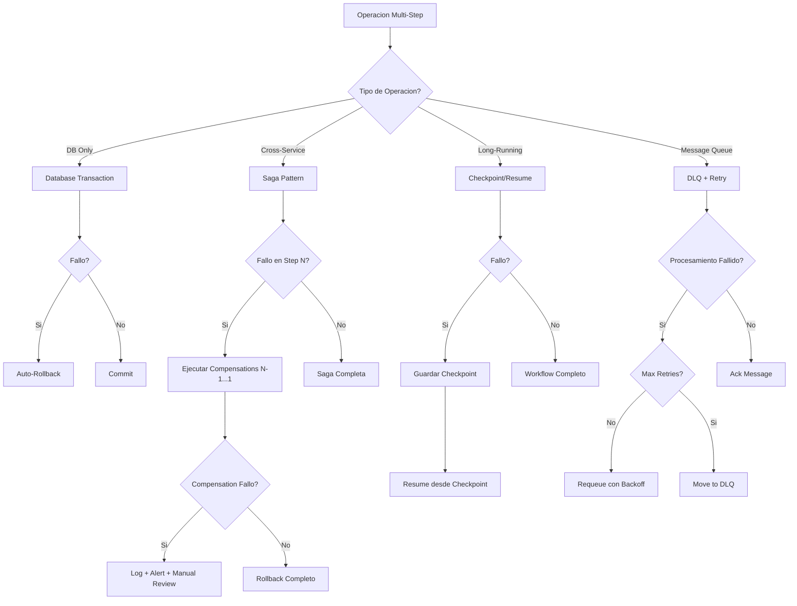

# Recovery Strategies

Patrones de recovery y rollback para aplicaciones TypeScript/Bun.

## When to Use

| Situacion | Aplica |
|-----------|--------|
| Implementando transaction rollback | Si |
| Disenando saga patterns | Si |
| Manejando partial failures | Si |
| Creando undo/compensation logic | Si |
| Long-running workflows que pueden fallar | Si |
| Message processing con reintentos | Si |
| Simple CRUD operations | No - DB transaction suficiente |
| Transient network errors | No - Usar retry-patterns |

## Decision Tree



## Error Classification for Recovery

| Failure Type | Strategy | Implementation |
|--------------|----------|----------------|
| Database transaction | Auto-rollback | Native DB transaction |
| API call chain | Saga with compensation | Orchestrator pattern |
| Long-running process | Checkpoint/resume | Persistent checkpoints |
| External service | Circuit breaker + cache | Fallback to stale data |
| Message processing | Retry + DLQ | Exponential backoff |
| Partial update | Idempotent retry | Idempotency keys |
| Distributed transaction | 2PC or Saga | Depends on consistency needs |
| File operations | Atomic write + backup | Temp file + rename |

## Core Patterns

### Pattern 1: Manual Rollback with Compensation

```typescript
interface Operation<T = void> {
  name: string
  execute: () => Promise<T>
  compensate: () => Promise<void>
}

interface ExecutionResult<T> {
  success: boolean
  data?: T
  failedAt?: string
  error?: Error
}

async function executeWithRollback<T>(
  operations: Operation<T>[]
): Promise<ExecutionResult<T>> {
  const completed: Operation<T>[] = []
  let lastResult: T | undefined

  try {
    for (const op of operations) {
      console.log(`Executing: ${op.name}`)
      lastResult = await op.execute()
      completed.push(op)
    }

    return { success: true, data: lastResult }
  } catch (error) {
    console.error(`Operation failed at: ${operations[completed.length]?.name}`)
    console.error('Error:', error)

    // Rollback in reverse order
    for (const op of completed.reverse()) {
      try {
        console.log(`Compensating: ${op.name}`)
        await op.compensate()
      } catch (compensateError) {
        console.error(`CRITICAL: Compensation failed for ${op.name}:`, compensateError)
        // Log to alerting system - manual intervention needed
      }
    }

    return {
      success: false,
      failedAt: operations[completed.length]?.name,
      error: error as Error
    }
  }
}

// Usage Example
async function createUserWithProfile(userData: UserData, profileData: ProfileData) {
  let userId: string | undefined
  let profileId: string | undefined

  return executeWithRollback([
    {
      name: 'Create User',
      execute: async () => {
        const user = await db.insert(users).values(userData).returning()
        userId = user[0].id
        return userId
      },
      compensate: async () => {
        if (userId) await db.delete(users).where(eq(users.id, userId))
      }
    },
    {
      name: 'Create Profile',
      execute: async () => {
        const profile = await db.insert(profiles).values({
          ...profileData,
          userId: userId!
        }).returning()
        profileId = profile[0].id
        return profileId
      },
      compensate: async () => {
        if (profileId) await db.delete(profiles).where(eq(profiles.id, profileId))
      }
    },
    {
      name: 'Send Welcome Email',
      execute: async () => {
        await emailService.sendWelcome(userId!)
      },
      compensate: async () => {
        // Email sent - no compensation needed, or could mark as cancelled
        console.log('Email already sent - no compensation available')
      }
    }
  ])
}
```

### Pattern 2: Saga Orchestrator

```typescript
interface SagaStep<TContext> {
  name: string
  execute: (context: TContext) => Promise<TContext>
  compensate: (context: TContext) => Promise<TContext>
  retryable?: boolean
  maxRetries?: number
}

interface SagaResult<TContext> {
  success: boolean
  context: TContext
  completedSteps: string[]
  failedStep?: string
  error?: Error
}

class Saga<TContext extends Record<string, unknown>> {
  private steps: SagaStep<TContext>[] = []
  private onStepComplete?: (step: string, context: TContext) => void
  private onStepFail?: (step: string, error: Error) => void

  addStep(step: SagaStep<TContext>): this {
    this.steps.push(step)
    return this
  }

  onComplete(callback: (step: string, context: TContext) => void): this {
    this.onStepComplete = callback
    return this
  }

  onFail(callback: (step: string, error: Error) => void): this {
    this.onStepFail = callback
    return this
  }

  async execute(initialContext: TContext): Promise<SagaResult<TContext>> {
    let context = { ...initialContext }
    const completedSteps: SagaStep<TContext>[] = []

    try {
      for (const step of this.steps) {
        console.log(`[Saga] Executing step: ${step.name}`)

        if (step.retryable) {
          context = await this.executeWithRetry(step, context)
        } else {
          context = await step.execute(context)
        }

        completedSteps.push(step)
        this.onStepComplete?.(step.name, context)
      }

      return {
        success: true,
        context,
        completedSteps: completedSteps.map(s => s.name)
      }
    } catch (error) {
      const failedStepIndex = completedSteps.length
      const failedStep = this.steps[failedStepIndex]

      console.error(`[Saga] Failed at step: ${failedStep?.name}`)
      this.onStepFail?.(failedStep?.name || 'unknown', error as Error)

      // Compensate in reverse order
      console.log('[Saga] Starting compensation...')
      for (const step of completedSteps.reverse()) {
        try {
          console.log(`[Saga] Compensating: ${step.name}`)
          context = await step.compensate(context)
        } catch (compensateError) {
          console.error(`[Saga] CRITICAL: Compensation failed for ${step.name}`)
          // This is a critical state - log and alert
          await this.handleCompensationFailure(step.name, compensateError as Error, context)
        }
      }

      return {
        success: false,
        context,
        completedSteps: completedSteps.map(s => s.name),
        failedStep: failedStep?.name,
        error: error as Error
      }
    }
  }

  private async executeWithRetry<T>(
    step: SagaStep<TContext>,
    context: TContext
  ): Promise<TContext> {
    const maxRetries = step.maxRetries || 3
    let lastError: Error

    for (let attempt = 0; attempt < maxRetries; attempt++) {
      try {
        return await step.execute(context)
      } catch (error) {
        lastError = error as Error
        if (attempt < maxRetries - 1) {
          const delay = Math.pow(2, attempt) * 1000
          console.log(`[Saga] Retry ${attempt + 1}/${maxRetries} for ${step.name} after ${delay}ms`)
          await Bun.sleep(delay)
        }
      }
    }

    throw lastError!
  }

  private async handleCompensationFailure(
    stepName: string,
    error: Error,
    context: TContext
  ): Promise<void> {
    // Log to persistent storage for manual review
    console.error({
      type: 'COMPENSATION_FAILURE',
      step: stepName,
      error: error.message,
      context,
      timestamp: new Date().toISOString()
    })
    // In production: send to alerting system, create incident ticket
  }
}

// Usage: Order Processing Saga
interface OrderContext {
  orderId?: string
  paymentId?: string
  inventoryReserved?: boolean
  shippingId?: string
  customerId: string
  items: Array<{ productId: string; quantity: number }>
  total: number
}

const orderSaga = new Saga<OrderContext>()
  .addStep({
    name: 'Create Order',
    execute: async (ctx) => {
      const order = await orderService.create({
        customerId: ctx.customerId,
        items: ctx.items,
        total: ctx.total
      })
      return { ...ctx, orderId: order.id }
    },
    compensate: async (ctx) => {
      if (ctx.orderId) {
        await orderService.cancel(ctx.orderId)
      }
      return { ...ctx, orderId: undefined }
    }
  })
  .addStep({
    name: 'Process Payment',
    execute: async (ctx) => {
      const payment = await paymentService.charge({
        customerId: ctx.customerId,
        amount: ctx.total,
        orderId: ctx.orderId!
      })
      return { ...ctx, paymentId: payment.id }
    },
    compensate: async (ctx) => {
      if (ctx.paymentId) {
        await paymentService.refund(ctx.paymentId)
      }
      return { ...ctx, paymentId: undefined }
    },
    retryable: true,
    maxRetries: 3
  })
  .addStep({
    name: 'Reserve Inventory',
    execute: async (ctx) => {
      await inventoryService.reserve(ctx.orderId!, ctx.items)
      return { ...ctx, inventoryReserved: true }
    },
    compensate: async (ctx) => {
      if (ctx.inventoryReserved && ctx.orderId) {
        await inventoryService.release(ctx.orderId)
      }
      return { ...ctx, inventoryReserved: false }
    }
  })
  .addStep({
    name: 'Create Shipment',
    execute: async (ctx) => {
      const shipment = await shippingService.create({
        orderId: ctx.orderId!,
        customerId: ctx.customerId
      })
      return { ...ctx, shippingId: shipment.id }
    },
    compensate: async (ctx) => {
      if (ctx.shippingId) {
        await shippingService.cancel(ctx.shippingId)
      }
      return { ...ctx, shippingId: undefined }
    }
  })
  .onComplete((step, ctx) => {
    console.log(`Step ${step} completed. Order: ${ctx.orderId}`)
  })
  .onFail((step, error) => {
    console.error(`Step ${step} failed:`, error.message)
  })

// Execute
const result = await orderSaga.execute({
  customerId: 'cust-123',
  items: [{ productId: 'prod-1', quantity: 2 }],
  total: 99.99
})
```

### Pattern 3: Checkpoint/Resume Workflow

```typescript
interface Checkpoint {
  id: string
  workflowId: string
  stepIndex: number
  data: unknown
  createdAt: Date
  expiresAt: Date
}

interface WorkflowStep<TData> {
  name: string
  execute: (data: TData) => Promise<TData>
}

interface WorkflowResult<TData> {
  success: boolean
  data: TData
  completedSteps: number
  resumedFromCheckpoint: boolean
}

class ResumableWorkflow<TData extends Record<string, unknown>> {
  private steps: WorkflowStep<TData>[] = []
  private checkpointTTL = 24 * 60 * 60 * 1000 // 24 hours

  constructor(
    private workflowId: string,
    private storage: CheckpointStorage
  ) {}

  addStep(step: WorkflowStep<TData>): this {
    this.steps.push(step)
    return this
  }

  async execute(initialData: TData): Promise<WorkflowResult<TData>> {
    // Check for existing checkpoint
    const checkpoint = await this.storage.get(this.workflowId)
    let startIndex = 0
    let data = initialData
    let resumedFromCheckpoint = false

    if (checkpoint && checkpoint.expiresAt > new Date()) {
      console.log(`[Workflow] Resuming from checkpoint at step ${checkpoint.stepIndex}`)
      startIndex = checkpoint.stepIndex
      data = checkpoint.data as TData
      resumedFromCheckpoint = true
    }

    try {
      for (let i = startIndex; i < this.steps.length; i++) {
        const step = this.steps[i]
        console.log(`[Workflow] Executing step ${i + 1}/${this.steps.length}: ${step.name}`)

        data = await step.execute(data)

        // Save checkpoint after each step
        await this.saveCheckpoint(i + 1, data)
      }

      // Workflow complete - clean up checkpoint
      await this.storage.delete(this.workflowId)

      return {
        success: true,
        data,
        completedSteps: this.steps.length,
        resumedFromCheckpoint
      }
    } catch (error) {
      console.error(`[Workflow] Failed at step ${startIndex + 1}:`, error)
      throw error
    }
  }

  private async saveCheckpoint(stepIndex: number, data: TData): Promise<void> {
    const checkpoint: Checkpoint = {
      id: crypto.randomUUID(),
      workflowId: this.workflowId,
      stepIndex,
      data,
      createdAt: new Date(),
      expiresAt: new Date(Date.now() + this.checkpointTTL)
    }
    await this.storage.save(checkpoint)
  }
}

// Checkpoint Storage Implementation
interface CheckpointStorage {
  save(checkpoint: Checkpoint): Promise<void>
  get(workflowId: string): Promise<Checkpoint | null>
  delete(workflowId: string): Promise<void>
}

class DatabaseCheckpointStorage implements CheckpointStorage {
  async save(checkpoint: Checkpoint): Promise<void> {
    await db.insert(checkpoints)
      .values(checkpoint)
      .onConflictDoUpdate({
        target: checkpoints.workflowId,
        set: {
          stepIndex: checkpoint.stepIndex,
          data: checkpoint.data,
          expiresAt: checkpoint.expiresAt
        }
      })
  }

  async get(workflowId: string): Promise<Checkpoint | null> {
    const result = await db.select()
      .from(checkpoints)
      .where(eq(checkpoints.workflowId, workflowId))
      .limit(1)
    return result[0] || null
  }

  async delete(workflowId: string): Promise<void> {
    await db.delete(checkpoints)
      .where(eq(checkpoints.workflowId, workflowId))
  }
}

// Usage: Data Migration Workflow
interface MigrationData {
  sourceRecords?: unknown[]
  transformedRecords?: unknown[]
  importedCount?: number
  errors?: string[]
}

const migrationWorkflow = new ResumableWorkflow<MigrationData>(
  'migration-2024-01',
  new DatabaseCheckpointStorage()
)
  .addStep({
    name: 'Extract Source Data',
    execute: async (data) => {
      const records = await sourceDb.selectAll()
      return { ...data, sourceRecords: records }
    }
  })
  .addStep({
    name: 'Transform Records',
    execute: async (data) => {
      const transformed = data.sourceRecords!.map(transformRecord)
      return { ...data, transformedRecords: transformed }
    }
  })
  .addStep({
    name: 'Load to Target',
    execute: async (data) => {
      let count = 0
      const errors: string[] = []

      for (const record of data.transformedRecords!) {
        try {
          await targetDb.insert(record)
          count++
        } catch (error) {
          errors.push(`Record ${record.id}: ${error.message}`)
        }
      }

      return { ...data, importedCount: count, errors }
    }
  })
```

## Implementation

### Complete Dead Letter Queue System

```typescript
interface Message<T = unknown> {
  id: string
  payload: T
  queue: string
  createdAt: Date
  attempts: number
  lastAttempt?: Date
  error?: string
}

interface DLQEntry<T = unknown> extends Message<T> {
  movedAt: Date
  originalQueue: string
  failureReason: string
}

interface ProcessResult {
  success: boolean
  error?: Error
  shouldRetry?: boolean
}

interface QueueConfig {
  maxAttempts: number
  baseDelayMs: number
  maxDelayMs: number
}

class MessageQueue<T> {
  private queue: Message<T>[] = []
  private dlq: DLQEntry<T>[] = []
  private processing = false

  constructor(
    private name: string,
    private config: QueueConfig = {
      maxAttempts: 5,
      baseDelayMs: 1000,
      maxDelayMs: 60000
    }
  ) {}

  async enqueue(payload: T): Promise<string> {
    const message: Message<T> = {
      id: crypto.randomUUID(),
      payload,
      queue: this.name,
      createdAt: new Date(),
      attempts: 0
    }
    this.queue.push(message)
    console.log(`[Queue:${this.name}] Enqueued message ${message.id}`)
    return message.id
  }

  async process(
    handler: (payload: T) => Promise<ProcessResult>
  ): Promise<void> {
    if (this.processing) return
    this.processing = true

    while (this.queue.length > 0) {
      const message = this.queue.shift()!
      message.attempts++
      message.lastAttempt = new Date()

      console.log(`[Queue:${this.name}] Processing message ${message.id} (attempt ${message.attempts})`)

      try {
        const result = await handler(message.payload)

        if (!result.success) {
          if (result.shouldRetry !== false) {
            await this.handleFailure(message, result.error || new Error('Processing failed'))
          } else {
            await this.moveToDLQ(message, result.error?.message || 'Non-retryable failure')
          }
        } else {
          console.log(`[Queue:${this.name}] Message ${message.id} processed successfully`)
        }
      } catch (error) {
        await this.handleFailure(message, error as Error)
      }
    }

    this.processing = false
  }

  private async handleFailure(message: Message<T>, error: Error): Promise<void> {
    message.error = error.message

    if (message.attempts >= this.config.maxAttempts) {
      await this.moveToDLQ(message, `Max attempts (${this.config.maxAttempts}) exceeded: ${error.message}`)
      return
    }

    // Calculate delay with exponential backoff
    const delay = Math.min(
      this.config.baseDelayMs * Math.pow(2, message.attempts - 1),
      this.config.maxDelayMs
    )

    console.log(`[Queue:${this.name}] Requeuing message ${message.id} after ${delay}ms`)

    await Bun.sleep(delay)
    this.queue.push(message)
  }

  private async moveToDLQ(message: Message<T>, reason: string): Promise<void> {
    const dlqEntry: DLQEntry<T> = {
      ...message,
      movedAt: new Date(),
      originalQueue: this.name,
      failureReason: reason
    }

    this.dlq.push(dlqEntry)
    console.log(`[Queue:${this.name}] Message ${message.id} moved to DLQ: ${reason}`)

    // In production: send alert
    await this.alertDLQEntry(dlqEntry)
  }

  private async alertDLQEntry(entry: DLQEntry<T>): Promise<void> {
    console.error({
      type: 'DLQ_ENTRY',
      queue: this.name,
      messageId: entry.id,
      attempts: entry.attempts,
      reason: entry.failureReason,
      timestamp: new Date().toISOString()
    })
  }

  async reprocessDLQ(
    messageId: string,
    handler: (payload: T) => Promise<ProcessResult>
  ): Promise<boolean> {
    const index = this.dlq.findIndex(m => m.id === messageId)
    if (index === -1) return false

    const entry = this.dlq[index]
    console.log(`[Queue:${this.name}] Reprocessing DLQ message ${messageId}`)

    try {
      const result = await handler(entry.payload)
      if (result.success) {
        this.dlq.splice(index, 1)
        console.log(`[Queue:${this.name}] DLQ message ${messageId} reprocessed successfully`)
        return true
      }
    } catch (error) {
      entry.error = (error as Error).message
      entry.attempts++
      entry.lastAttempt = new Date()
    }

    return false
  }

  getDLQStats(): { count: number; oldestEntry: Date | null } {
    return {
      count: this.dlq.length,
      oldestEntry: this.dlq.length > 0 ? this.dlq[0].movedAt : null
    }
  }

  getDLQEntries(): DLQEntry<T>[] {
    return [...this.dlq]
  }
}

// Usage
const orderQueue = new MessageQueue<OrderPayload>('orders', {
  maxAttempts: 5,
  baseDelayMs: 1000,
  maxDelayMs: 60000
})

// Enqueue
await orderQueue.enqueue({ orderId: 'ord-123', action: 'process' })

// Process
await orderQueue.process(async (payload) => {
  try {
    await processOrder(payload)
    return { success: true }
  } catch (error) {
    if (error.code === 'VALIDATION_ERROR') {
      return { success: false, error, shouldRetry: false }
    }
    return { success: false, error }
  }
})
```

## Integration Examples

### Elysia Saga Middleware

```typescript
import { Elysia } from 'elysia'
import { Saga } from './saga'

const sagaPlugin = new Elysia({ name: 'saga' })
  .decorate('createSaga', <T extends Record<string, unknown>>() => new Saga<T>())
  .derive(({ createSaga }) => ({
    executeSaga: async <T extends Record<string, unknown>>(
      saga: Saga<T>,
      initialContext: T
    ) => {
      const result = await saga.execute(initialContext)
      if (!result.success) {
        throw new SagaExecutionError(result.failedStep!, result.error!)
      }
      return result.context
    }
  }))

class SagaExecutionError extends Error {
  constructor(
    public failedStep: string,
    public cause: Error
  ) {
    super(`Saga failed at step: ${failedStep}`)
    this.name = 'SagaExecutionError'
  }
}

// Usage in route
const app = new Elysia()
  .use(sagaPlugin)
  .post('/orders', async ({ createSaga, executeSaga, body }) => {
    const orderSaga = createSaga<OrderContext>()
      .addStep({
        name: 'Validate',
        execute: async (ctx) => ({ ...ctx, validated: true }),
        compensate: async (ctx) => ctx
      })
      .addStep({
        name: 'Create',
        execute: async (ctx) => {
          const order = await orderService.create(ctx)
          return { ...ctx, orderId: order.id }
        },
        compensate: async (ctx) => {
          if (ctx.orderId) await orderService.delete(ctx.orderId)
          return ctx
        }
      })

    const result = await executeSaga(orderSaga, {
      customerId: body.customerId,
      items: body.items
    })

    return { orderId: result.orderId }
  })
```

### Graceful Degradation Service

```typescript
interface DegradationConfig<T> {
  primary: () => Promise<T>
  secondary?: () => Promise<T>
  fallback: () => T
  cacheTTL?: number
}

class GracefulService<T> {
  private cache: { data: T; expiry: number } | null = null

  constructor(private config: DegradationConfig<T>) {}

  async execute(): Promise<{ data: T; source: 'primary' | 'secondary' | 'cache' | 'fallback' }> {
    // Try primary
    try {
      const data = await this.config.primary()
      this.updateCache(data)
      return { data, source: 'primary' }
    } catch (primaryError) {
      console.warn('Primary failed:', primaryError)
    }

    // Try secondary
    if (this.config.secondary) {
      try {
        const data = await this.config.secondary()
        this.updateCache(data)
        return { data, source: 'secondary' }
      } catch (secondaryError) {
        console.warn('Secondary failed:', secondaryError)
      }
    }

    // Try cache
    if (this.cache && this.cache.expiry > Date.now()) {
      console.log('Using cached data')
      return { data: this.cache.data, source: 'cache' }
    }

    // Use fallback
    console.log('Using fallback')
    return { data: this.config.fallback(), source: 'fallback' }
  }

  private updateCache(data: T): void {
    if (this.config.cacheTTL) {
      this.cache = {
        data,
        expiry: Date.now() + this.config.cacheTTL
      }
    }
  }
}

// Usage
const recommendationService = new GracefulService({
  primary: () => mlApi.getPersonalizedRecommendations(userId),
  secondary: () => redisCache.get(`recommendations:${userId}`),
  fallback: () => DEFAULT_RECOMMENDATIONS,
  cacheTTL: 5 * 60 * 1000 // 5 minutes
})

const { data, source } = await recommendationService.execute()
console.log(`Recommendations from ${source}:`, data)
```

## Checklist

### Before Implementation

- [ ] Identificar todos los failure points en el workflow
- [ ] Definir compensation actions para cada step
- [ ] Determinar si necesita checkpointing (long-running)
- [ ] Evaluar si DLQ es necesario para mensajes
- [ ] Definir estrategia de idempotencia

### Saga Implementation

- [ ] Cada step tiene execute y compensate
- [ ] Compensations se ejecutan en orden reverso
- [ ] Manejar fallos de compensation (log + alert)
- [ ] Considerar retries en steps transitorios
- [ ] Logging detallado de cada step

### Checkpoint Implementation

- [ ] Checkpoints persistidos a storage durable
- [ ] TTL definido para checkpoints
- [ ] Resume automatico al reiniciar
- [ ] Cleanup de checkpoints completados
- [ ] Monitoreo de workflows estancados

### DLQ Implementation

- [ ] Max retries configurado apropiadamente
- [ ] Exponential backoff entre retries
- [ ] Alertas para nuevas entradas en DLQ
- [ ] UI/API para inspeccionar DLQ
- [ ] Proceso para reprocessar DLQ items

### Post-Recovery

- [ ] Log de todas las compensations ejecutadas
- [ ] Metricas de recovery success rate
- [ ] Alertas en compensations fallidas
- [ ] Runbook para recuperacion manual
- [ ] Tests de recovery scenarios

---

**Version**: 1.0
**Spec**: SPEC-018
**For**: error-analyzer agent
