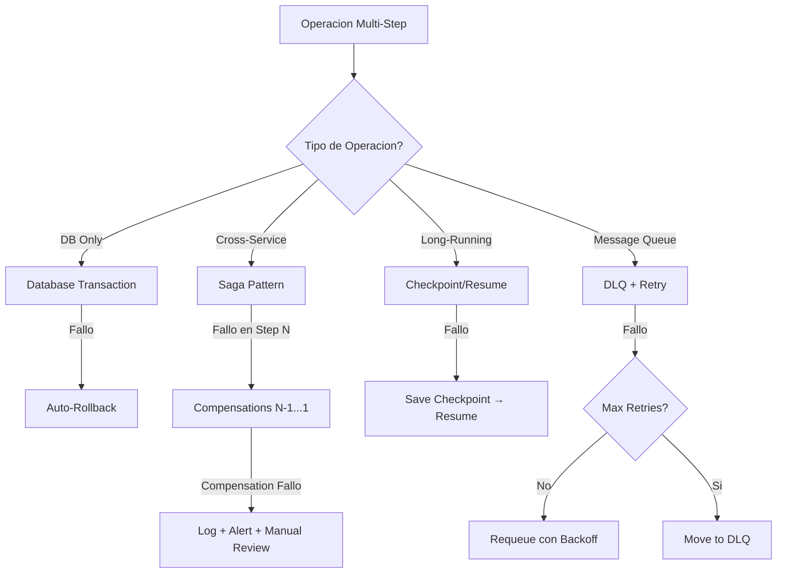

# Recovery Strategies

Patrones de recovery y rollback para aplicaciones TypeScript/Bun.

## When to Use

| Situacion | Aplica |
|-----------|--------|
| Transaction rollback, saga patterns, partial failures | Yes |
| Undo/compensation logic, long-running workflows | Yes |
| Message processing con reintentos | Yes |
| Simple CRUD operations | No - DB transaction suficiente |
| Transient network errors | No - Usar retry-patterns |

## Decision Tree


```mermaid
flowchart TD
    A[Operacion Multi-Step] --> B{Tipo de Operacion?}
    B -->|DB Only| C[Database Transaction]
    B -->|Cross-Service| D[Saga Pattern]
    B -->|Long-Running| E[Checkpoint/Resume]
    B -->|Message Queue| F[DLQ + Retry]
    C -->|Fallo| H[Auto-Rollback]
    D -->|Fallo en Step N| K[Compensations N-1...1]
    E -->|Fallo| N[Save Checkpoint → Resume]
    F -->|Fallo| R{Max Retries?}
    R -->|No| S[Requeue con Backoff]
    R -->|Si| T[Move to DLQ]
    K -->|Compensation Fallo| W[Log + Alert + Manual Review]
```

## Error Classification Summary

| Failure Type | Strategy | Pattern |
|--------------|----------|---------|
| Database transaction | Auto-rollback | Native DB transaction |
| API call chain | Saga + compensation | Orchestrator |
| Long-running process | Checkpoint/resume | Persistent checkpoints |
| External service | Circuit breaker + cache | Graceful degradation |
| Message processing | Retry + DLQ | Exponential backoff |
| Partial update | Idempotent retry | Idempotency keys |
| File operations | Atomic write + backup | Temp file + rename |

> Full classification with indicators and common causes: `${CLAUDE_SKILL_DIR}/references/error-classification.md`

## Pattern Reference

| Pattern | When to Use | Reference |
|---------|-------------|-----------|
| **Manual Rollback** | Multi-step ops across resources, clear undo actions | `${CLAUDE_SKILL_DIR}/references/pattern-manual-rollback.md` |
| **Saga Orchestrator** | Cross-service transactions (payment + inventory + shipping) | `${CLAUDE_SKILL_DIR}/references/pattern-saga.md` |
| **Checkpoint/Resume** | Data migrations, ETL pipelines, hours-long processes | `${CLAUDE_SKILL_DIR}/references/pattern-checkpoint.md` |
| **Dead Letter Queue** | Async message processing, background jobs | `${CLAUDE_SKILL_DIR}/references/pattern-dlq.md` |
| **Graceful Degradation** | External API deps, non-critical features with fallbacks | `${CLAUDE_SKILL_DIR}/references/pattern-graceful-degradation.md` |

## Examples

| Example | Description | File |
|---------|-------------|------|
| Order Saga | Cross-service order processing with compensation | `${CLAUDE_SKILL_DIR}/examples/order-saga.ts` |
| Migration Workflow | Data migration with checkpoints and resume | `${CLAUDE_SKILL_DIR}/examples/migration-workflow.ts` |

## Implementation Checklists

Per-pattern checklists (before, during, after): `${CLAUDE_SKILL_DIR}/checklists/implementation.md`

## Quick Selection Guide

```
Need rollback for 2-3 steps?        → Manual Rollback
Need rollback for N services?        → Saga Orchestrator
Process takes hours, may restart?    → Checkpoint/Resume
Processing async messages/events?    → DLQ + Retry
External API may be down?            → Graceful Degradation
```

---

**Version**: 2.0
**Spec**: SPEC-018
**For**: error-analyzer agent
