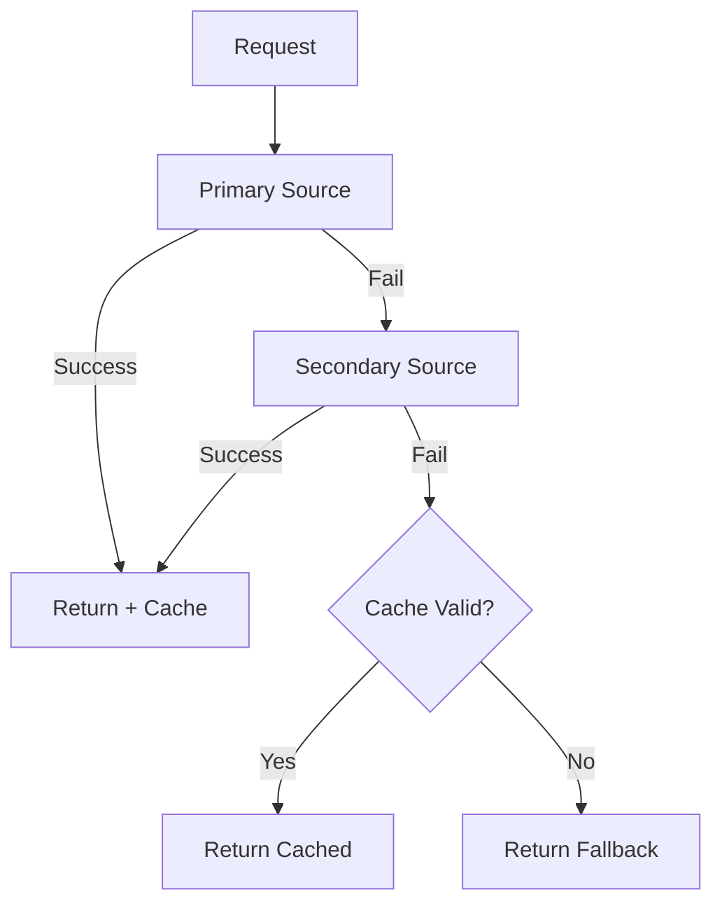

# Pattern: Graceful Degradation

Fallback through layers of service quality when primary sources fail.

## When to Use

- External API dependencies that may be unavailable
- Services with cache layers
- Non-critical features that can degrade without blocking the user
- Recommendation engines, analytics, personalization

## Core Interfaces

```typescript
interface DegradationConfig<T> {
  primary: () => Promise<T>
  secondary?: () => Promise<T>
  fallback: () => T
  cacheTTL?: number
}
```

## GracefulService Implementation

```typescript
class GracefulService<T> {
  private cache: { data: T; expiry: number } | null = null

  constructor(private config: DegradationConfig<T>) {}

  async execute(): Promise<{ data: T; source: 'primary' | 'secondary' | 'cache' | 'fallback' }> {
    // Try primary
    try {
      const data = await this.config.primary()
      this.updateCache(data)
      return { data, source: 'primary' }
    } catch (primaryError) {
      console.warn('Primary failed:', primaryError)
    }

    // Try secondary
    if (this.config.secondary) {
      try {
        const data = await this.config.secondary()
        this.updateCache(data)
        return { data, source: 'secondary' }
      } catch (secondaryError) {
        console.warn('Secondary failed:', secondaryError)
      }
    }

    // Try cache
    if (this.cache && this.cache.expiry > Date.now()) {
      console.log('Using cached data')
      return { data: this.cache.data, source: 'cache' }
    }

    // Use fallback
    console.log('Using fallback')
    return { data: this.config.fallback(), source: 'fallback' }
  }

  private updateCache(data: T): void {
    if (this.config.cacheTTL) {
      this.cache = {
        data,
        expiry: Date.now() + this.config.cacheTTL
      }
    }
  }
}
```

## Usage

```typescript
const recommendationService = new GracefulService({
  primary: () => mlApi.getPersonalizedRecommendations(userId),
  secondary: () => redisCache.get(`recommendations:${userId}`),
  fallback: () => DEFAULT_RECOMMENDATIONS,
  cacheTTL: 5 * 60 * 1000 // 5 minutes
})

const { data, source } = await recommendationService.execute()
console.log(`Recommendations from ${source}:`, data)
```

## Degradation Flow



## Key Points

- Response includes `source` field for observability
- Successful primary/secondary results update the cache
- Cache has configurable TTL
- Fallback is synchronous (always available, never fails)
- Each layer logs its failure for debugging
