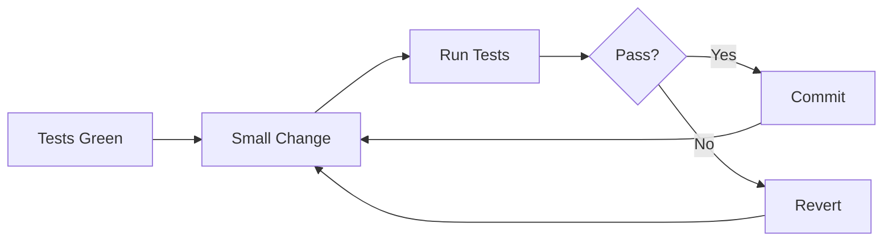

# Refactoring Patterns

Safe refactoring techniques for TypeScript/Bun codebases with SOLID principles.

## When to Use This Skill

- Extracting functions or classes from large code blocks
- Applying SOLID principles to improve architecture
- Reducing cyclomatic complexity
- Improving code readability and maintainability
- Removing code smells (long methods, duplicate code)
- Preparing code for testing

## Core Patterns

### Refactoring Safety Process



### Key Principles

| Principle | Rule |
|-----------|------|
| Atomic | One change at a time |
| Reversible | Can undo immediately |
| Tested | All tests pass after |
| Behavioral | Same inputs, same outputs |

## Extract Function

### When to Extract

- Function exceeds 20 lines
- Code block has a comment explaining "what it does"
- Same code appears in multiple places
- Complex conditional logic

### Pattern: Extract Calculation

```typescript
// BEFORE: Inline calculation logic
async function processOrder(order: Order): Promise<OrderResult> {
  // Validate
  if (!order.items.length) {
    throw new ValidationError('Order has no items')
  }
  if (!order.customerId) {
    throw new ValidationError('Order has no customer')
  }

  // Calculate subtotal with discounts
  let subtotal = 0
  for (const item of order.items) {
    let itemTotal = item.price * item.quantity
    if (item.discount) {
      itemTotal -= item.discount
    }
    if (item.quantity >= 10) {
      itemTotal *= 0.95 // 5% bulk discount
    }
    subtotal += itemTotal
  }

  // Apply tax
  const taxRate = await getTaxRate(order.shippingAddress.state)
  const tax = subtotal * taxRate

  // Calculate shipping
  let shipping = 0
  if (subtotal < 100) {
    shipping = 10
  } else if (subtotal < 200) {
    shipping = 5
  }

  const total = subtotal + tax + shipping

  // Save and return
  const savedOrder = await db.orders.create({
    ...order,
    subtotal,
    tax,
    shipping,
    total,
  })

  return { order: savedOrder, total }
}

// AFTER: Extracted functions with single responsibility
async function processOrder(order: Order): Promise<OrderResult> {
  validateOrder(order)

  const subtotal = calculateSubtotal(order.items)
  const tax = await calculateTax(subtotal, order.shippingAddress.state)
  const shipping = calculateShipping(subtotal)
  const total = subtotal + tax + shipping

  const savedOrder = await saveOrder(order, { subtotal, tax, shipping, total })

  return { order: savedOrder, total }
}

function validateOrder(order: Order): void {
  if (!order.items.length) {
    throw new ValidationError('Order has no items')
  }
  if (!order.customerId) {
    throw new ValidationError('Order has no customer')
  }
}

function calculateSubtotal(items: OrderItem[]): number {
  return items.reduce((sum, item) => sum + calculateItemTotal(item), 0)
}

function calculateItemTotal(item: OrderItem): number {
  const baseTotal = item.price * item.quantity
  const afterDiscount = baseTotal - (item.discount ?? 0)
  const bulkMultiplier = item.quantity >= 10 ? 0.95 : 1
  return afterDiscount * bulkMultiplier
}

async function calculateTax(subtotal: number, state: string): Promise<number> {
  const taxRate = await getTaxRate(state)
  return subtotal * taxRate
}

function calculateShipping(subtotal: number): number {
  if (subtotal >= 200) return 0
  if (subtotal >= 100) return 5
  return 10
}

async function saveOrder(
  order: Order,
  totals: OrderTotals
): Promise<SavedOrder> {
  return db.orders.create({ ...order, ...totals })
}
```

### Pattern: Extract Conditional

```typescript
// BEFORE: Complex nested conditionals
function getAccessLevel(user: User, resource: Resource): AccessLevel {
  if (user.role === 'admin') {
    return 'full'
  } else if (user.role === 'moderator') {
    if (resource.type === 'post') {
      return 'full'
    } else if (resource.type === 'user') {
      return 'read'
    } else {
      return 'none'
    }
  } else if (user.role === 'user') {
    if (resource.ownerId === user.id) {
      return 'full'
    } else {
      return 'read'
    }
  }
  return 'none'
}

// AFTER: Extracted with early returns
function getAccessLevel(user: User, resource: Resource): AccessLevel {
  if (isAdmin(user)) return 'full'
  if (isModerator(user)) return getModeratorAccess(resource)
  if (isOwner(user, resource)) return 'full'
  return 'read'
}

function isAdmin(user: User): boolean {
  return user.role === 'admin'
}

function isModerator(user: User): boolean {
  return user.role === 'moderator'
}

function isOwner(user: User, resource: Resource): boolean {
  return resource.ownerId === user.id
}

function getModeratorAccess(resource: Resource): AccessLevel {
  const accessMap: Record<string, AccessLevel> = {
    post: 'full',
    user: 'read',
  }
  return accessMap[resource.type] ?? 'none'
}
```

## Extract Class

### When to Extract

- Group of functions operate on same data
- Data and behavior should be encapsulated
- Single Responsibility Principle violation
- Test isolation needed

### Pattern: Data + Behavior Cohesion

```typescript
// BEFORE: Functions scattered, operating on User data
interface User {
  firstName: string
  lastName: string
  email: string
  createdAt: Date
  lastLoginAt: Date | null
}

function formatUserDisplayName(user: User): string {
  return `${user.firstName} ${user.lastName}`
}

function isUserEmailVerified(user: User): boolean {
  return user.email.includes('@') && user.lastLoginAt !== null
}

function getUserAccountAge(user: User): number {
  return Date.now() - user.createdAt.getTime()
}

function isUserActive(user: User): boolean {
  if (!user.lastLoginAt) return false
  const daysSinceLogin = (Date.now() - user.lastLoginAt.getTime()) / (1000 * 60 * 60 * 24)
  return daysSinceLogin < 30
}

// AFTER: Cohesive class
class UserPresenter {
  constructor(private readonly user: User) {}

  get displayName(): string {
    return `${this.user.firstName} ${this.user.lastName}`
  }

  get isEmailVerified(): boolean {
    return this.user.email.includes('@') && this.user.lastLoginAt !== null
  }

  get accountAgeMs(): number {
    return Date.now() - this.user.createdAt.getTime()
  }

  get isActive(): boolean {
    if (!this.user.lastLoginAt) return false
    const daysSinceLogin = this.daysSince(this.user.lastLoginAt)
    return daysSinceLogin < 30
  }

  private daysSince(date: Date): number {
    return (Date.now() - date.getTime()) / (1000 * 60 * 60 * 24)
  }
}

// Usage
const presenter = new UserPresenter(user)
console.log(presenter.displayName)
console.log(presenter.isActive)
```

### Pattern: Extract Service

```typescript
// BEFORE: Route handler doing too much
app.post('/orders', async ({ body, user }) => {
  // Validation
  if (!body.items?.length) throw new Error('No items')

  // Check inventory
  for (const item of body.items) {
    const stock = await db.inventory.find(item.productId)
    if (stock.quantity < item.quantity) {
      throw new Error(`Insufficient stock for ${item.productId}`)
    }
  }

  // Calculate totals
  let total = 0
  for (const item of body.items) {
    const product = await db.products.find(item.productId)
    total += product.price * item.quantity
  }

  // Create order
  const order = await db.orders.create({
    userId: user.id,
    items: body.items,
    total,
    status: 'pending',
  })

  // Update inventory
  for (const item of body.items) {
    await db.inventory.decrement(item.productId, item.quantity)
  }

  // Send notification
  await sendEmail(user.email, 'Order Confirmation', `Order ${order.id}`)

  return order
})

// AFTER: Extracted service with single responsibility
// services/order.service.ts
class OrderService {
  constructor(
    private readonly inventoryService: InventoryService,
    private readonly notificationService: NotificationService,
  ) {}

  async createOrder(userId: string, items: OrderItem[]): Promise<Order> {
    this.validateItems(items)
    await this.inventoryService.reserveStock(items)

    const total = await this.calculateTotal(items)
    const order = await this.saveOrder(userId, items, total)

    await this.inventoryService.commitReservation(items)
    await this.notificationService.sendOrderConfirmation(userId, order)

    return order
  }

  private validateItems(items: OrderItem[]): void {
    if (!items?.length) {
      throw new ValidationError('Order must have items')
    }
  }

  private async calculateTotal(items: OrderItem[]): Promise<number> {
    const prices = await Promise.all(
      items.map(async (item) => {
        const product = await db.products.find(item.productId)
        return product.price * item.quantity
      })
    )
    return prices.reduce((sum, price) => sum + price, 0)
  }

  private async saveOrder(
    userId: string,
    items: OrderItem[],
    total: number
  ): Promise<Order> {
    return db.orders.create({
      userId,
      items,
      total,
      status: 'pending',
    })
  }
}

// Route becomes thin
app.post('/orders', async ({ body, user }) => {
  return orderService.createOrder(user.id, body.items)
})
```

## SOLID Principles

### S - Single Responsibility

```typescript
// BAD: Class handles multiple concerns
class UserManager {
  async createUser(data: UserData) { /* ... */ }
  async sendWelcomeEmail(user: User) { /* ... */ }  // Email concern
  async generateReport(userId: string) { /* ... */ } // Reporting concern
  async validatePassword(password: string) { /* ... */ } // Validation concern
}

// GOOD: Each class has one reason to change
class UserService {
  constructor(
    private readonly emailService: EmailService,
    private readonly validator: PasswordValidator,
  ) {}

  async createUser(data: UserData): Promise<User> {
    this.validator.validate(data.password)
    const user = await this.saveUser(data)
    await this.emailService.sendWelcome(user)
    return user
  }

  private async saveUser(data: UserData): Promise<User> {
    return db.users.create(data)
  }
}

class EmailService {
  async sendWelcome(user: User): Promise<void> { /* ... */ }
  async sendPasswordReset(user: User, token: string): Promise<void> { /* ... */ }
}

class PasswordValidator {
  validate(password: string): void { /* ... */ }
}

class UserReportService {
  async generateReport(userId: string): Promise<Report> { /* ... */ }
}
```

### O - Open/Closed Principle

```typescript
// BAD: Must modify class for each new payment type
class PaymentProcessor {
  async process(type: string, amount: number): Promise<void> {
    if (type === 'card') {
      await this.processCard(amount)
    } else if (type === 'paypal') {
      await this.processPayPal(amount)
    } else if (type === 'crypto') {
      await this.processCrypto(amount)
    }
    // Must add new else-if for each payment type
  }
}

// GOOD: Open for extension, closed for modification
interface PaymentMethod {
  readonly type: string
  process(amount: number): Promise<PaymentResult>
}

class CardPayment implements PaymentMethod {
  readonly type = 'card'
  async process(amount: number): Promise<PaymentResult> {
    // Card-specific logic
    return { success: true, transactionId: '...' }
  }
}

class PayPalPayment implements PaymentMethod {
  readonly type = 'paypal'
  async process(amount: number): Promise<PaymentResult> {
    // PayPal-specific logic
    return { success: true, transactionId: '...' }
  }
}

// New payment types just implement the interface
class CryptoPayment implements PaymentMethod {
  readonly type = 'crypto'
  async process(amount: number): Promise<PaymentResult> {
    return { success: true, transactionId: '...' }
  }
}

class PaymentProcessor {
  private methods = new Map<string, PaymentMethod>()

  register(method: PaymentMethod): void {
    this.methods.set(method.type, method)
  }

  async process(type: string, amount: number): Promise<PaymentResult> {
    const method = this.methods.get(type)
    if (!method) throw new Error(`Unknown payment type: ${type}`)
    return method.process(amount)
  }
}
```

### L - Liskov Substitution Principle

```typescript
// BAD: Subclass violates base class contract
class Rectangle {
  constructor(protected width: number, protected height: number) {}

  setWidth(w: number): void { this.width = w }
  setHeight(h: number): void { this.height = h }
  getArea(): number { return this.width * this.height }
}

class Square extends Rectangle {
  setWidth(w: number): void {
    this.width = w
    this.height = w // Violates LSP: changes behavior
  }
  setHeight(h: number): void {
    this.width = h
    this.height = h // Violates LSP: changes behavior
  }
}

// GOOD: Use composition or separate interfaces
interface Shape {
  getArea(): number
}

class Rectangle implements Shape {
  constructor(
    private readonly width: number,
    private readonly height: number
  ) {}

  getArea(): number {
    return this.width * this.height
  }
}

class Square implements Shape {
  constructor(private readonly side: number) {}

  getArea(): number {
    return this.side * this.side
  }
}

// Both can be used wherever Shape is expected
function printArea(shape: Shape): void {
  console.log(`Area: ${shape.getArea()}`)
}
```

### I - Interface Segregation

```typescript
// BAD: Fat interface forces unnecessary implementations
interface Worker {
  work(): void
  eat(): void
  sleep(): void
  attendMeeting(): void
}

class Robot implements Worker {
  work(): void { /* OK */ }
  eat(): void { throw new Error('Robots do not eat') } // Forced to implement
  sleep(): void { throw new Error('Robots do not sleep') } // Forced to implement
  attendMeeting(): void { /* OK */ }
}

// GOOD: Segregated interfaces
interface Workable {
  work(): void
}

interface Feedable {
  eat(): void
}

interface Restable {
  sleep(): void
}

interface Meetable {
  attendMeeting(): void
}

class Human implements Workable, Feedable, Restable, Meetable {
  work(): void { /* ... */ }
  eat(): void { /* ... */ }
  sleep(): void { /* ... */ }
  attendMeeting(): void { /* ... */ }
}

class Robot implements Workable, Meetable {
  work(): void { /* ... */ }
  attendMeeting(): void { /* ... */ }
  // No need to implement eat/sleep
}
```

### D - Dependency Inversion

```typescript
// BAD: High-level module depends on low-level module
class UserService {
  private db = new PostgresDatabase() // Direct dependency
  private mailer = new SendGridMailer() // Direct dependency

  async createUser(data: UserData): Promise<User> {
    const user = await this.db.insert('users', data)
    await this.mailer.send(user.email, 'Welcome!')
    return user
  }
}

// GOOD: Depend on abstractions
interface Database {
  insert<T>(table: string, data: T): Promise<T>
  find<T>(table: string, id: string): Promise<T | null>
}

interface Mailer {
  send(to: string, subject: string, body: string): Promise<void>
}

class UserService {
  constructor(
    private readonly db: Database,
    private readonly mailer: Mailer,
  ) {}

  async createUser(data: UserData): Promise<User> {
    const user = await this.db.insert('users', data)
    await this.mailer.send(user.email, 'Welcome!', 'Thanks for joining')
    return user
  }
}

// Easily swap implementations
const userService = new UserService(
  new PostgresDatabase(), // or new MongoDatabase()
  new SendGridMailer(),   // or new MailgunMailer()
)

// Easy to test with mocks
const testService = new UserService(
  createMockDatabase(),
  createMockMailer(),
)
```

## Code Smells & Fixes

| Smell | Detection | Fix | Example |
|-------|-----------|-----|---------|
| Long Method | > 20 lines | Extract Function | `calculateTotal()` |
| Large Class | > 200 lines | Extract Class | Split `UserManager` |
| Long Parameter List | > 4 params | Parameter Object | `CreateUserParams` |
| Duplicated Code | 2+ identical blocks | Extract Function | `validateEmail()` |
| Feature Envy | Uses other object's data | Move Method | Move to data owner |
| Data Clumps | Same params together | Extract Value Object | `Address`, `Money` |
| Primitive Obsession | Primitives for concepts | Value Object | `Email`, `UserId` |
| Switch Statements | Repeated type checks | Polymorphism | Strategy pattern |
| Shotgun Surgery | One change, many files | Move/Inline | Consolidate |

### Pattern: Parameter Object

```typescript
// BEFORE: Long parameter list
function createUser(
  name: string,
  email: string,
  password: string,
  role: string,
  department: string,
  managerId: string | null,
  startDate: Date,
): Promise<User> {
  // ...
}

// AFTER: Parameter object
interface CreateUserParams {
  name: string
  email: string
  password: string
  role: string
  department: string
  managerId: string | null
  startDate: Date
}

function createUser(params: CreateUserParams): Promise<User> {
  const { name, email, password, role, department, managerId, startDate } = params
  // ...
}
```

### Pattern: Value Object

```typescript
// BEFORE: Primitive obsession
function sendEmail(to: string, from: string): void {
  if (!to.includes('@')) throw new Error('Invalid to')
  if (!from.includes('@')) throw new Error('Invalid from')
  // ...
}

// AFTER: Value object with validation
class Email {
  private readonly value: string

  constructor(email: string) {
    if (!email.includes('@') || !email.includes('.')) {
      throw new ValidationError(`Invalid email: ${email}`)
    }
    this.value = email.toLowerCase()
  }

  toString(): string {
    return this.value
  }

  equals(other: Email): boolean {
    return this.value === other.value
  }
}

function sendEmail(to: Email, from: Email): void {
  // Validation already done by Email class
  // ...
}
```

## Refactoring Process

### Before Starting

```bash
# 1. Ensure tests exist
bun test

# 2. Commit current state
git add .
git commit -m "checkpoint: before refactoring X"

# 3. Create feature branch
git checkout -b refactor/extract-order-service
```

### During Refactoring

| Step | Action | Verify |
|------|--------|--------|
| 1 | Identify target code smell | Document the smell |
| 2 | Write test if missing | Test passes |
| 3 | Make ONE small change | Code compiles |
| 4 | Run tests | All green |
| 5 | Commit with message | `git commit` |
| 6 | Repeat 2-5 | Until complete |

### After Completion

```bash
# 1. Run full test suite
bun test

# 2. Review changes
git diff main..HEAD

# 3. Squash if many small commits
git rebase -i main

# 4. Create PR for review
gh pr create
```

## Checklist

Before completing refactoring:

- [ ] Tests exist and pass before making any changes
- [ ] Each change is small and atomic (one thing at a time)
- [ ] Behavior is unchanged (same inputs produce same outputs)
- [ ] No new features added during refactor (separate concerns)
- [ ] All names are clear, descriptive, and follow conventions
- [ ] No dead code remains (unused functions, variables)
- [ ] Complexity is reduced (fewer lines, simpler conditionals)
- [ ] Functions are under 20 lines where possible
- [ ] Classes have single responsibility
- [ ] Dependencies are injected, not created internally
- [ ] No duplication remains (DRY principle applied)
- [ ] Tests still pass after final changes
- [ ] Changes are committed with clear messages

## Anti-Patterns

| WRONG | CORRECT |
|-------|---------|
| Big bang refactor (change everything at once) | Small incremental changes with tests between |
| Refactor + add features in same commit | Separate commits: refactor, then feature |
| Refactor without existing tests | Add characterization tests first |
| Over-abstract on first occurrence | Rule of 3: abstract when pattern repeats |
| Premature optimization | Refactor for clarity first, optimize if needed |
| Rename without search/replace all | Use IDE rename refactoring tool |
| Delete "unused" code without checking | Search for dynamic usage, tests first |
| Change function signature without updating callers | Update all call sites atomically |

## Integration

### Project-Specific Patterns

For **claude-code-poneglyph**, apply refactoring to:

| Current Location | Pattern to Apply | Target |
|------------------|------------------|--------|
| `server/src/routes/*.ts` | Extract Service | `services/` directory |
| Long route handlers | Extract Function | Named helper functions |
| Repeated validation | Parameter Object + Zod | Shared schemas |
| Direct DB access in routes | Dependency Injection | Service constructors |

### Recommended Refactoring Order

1. **Extract validation schemas** to shared location
2. **Extract services** from route handlers
3. **Apply DI** for database and external services
4. **Extract value objects** for domain concepts (SessionId, UserId)

### Testing During Refactor

```typescript
// Characterization test before refactoring
describe('processOrder (before refactor)', () => {
  it('returns same result with same input', async () => {
    const input = createTestOrder()
    const result = await processOrder(input)

    // Snapshot the behavior
    expect(result).toMatchSnapshot()
  })
})

// After refactoring, same test should pass
describe('OrderService.createOrder (after refactor)', () => {
  it('returns same result with same input', async () => {
    const input = createTestOrder()
    const result = await orderService.createOrder(input)

    // Same snapshot should match
    expect(result).toMatchSnapshot()
  })
})
```

---

**Version**: 1.0
**Spec**: SPEC-018
**For**: builder agent
