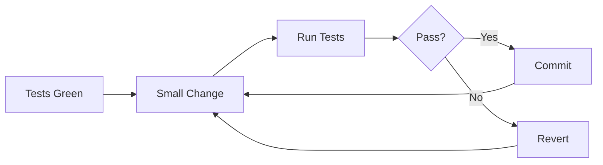

# Refactoring Patterns

Safe refactoring techniques with SOLID principles. Ejemplos adaptables a cualquier stack. Patterns son language-agnostic.

## When to Use

- Extracting functions or classes from large code blocks
- Applying SOLID principles to improve architecture
- Reducing cyclomatic complexity
- Removing code smells (long methods, duplicate code)
- Preparing code for testing

## Safety-First Process

```mermaid
graph LR
    A[Tests Green] --> B[Small Change]
    B --> C[Run Tests]
    C --> D{Pass?}
    D -->|Yes| E[Commit]
    D -->|No| F[Revert]
    E --> B
    F --> B
```

| Principle | Rule |
|-----------|------|
| Atomic | One change at a time |
| Reversible | Can undo immediately |
| Tested | All tests pass after each change |
| Behavioral | Same inputs, same outputs |

## When to Refactor (Decision Criteria)

| Trigger | Pattern | Reference |
|---------|---------|-----------|
| Function > 20 lines | Extract Function | `${CLAUDE_SKILL_DIR}/references/extract-function.md` |
| Comment explains "what it does" | Extract Function | `${CLAUDE_SKILL_DIR}/references/extract-function.md` |
| Complex nested conditionals | Extract Conditional | `${CLAUDE_SKILL_DIR}/references/extract-function.md` |
| Functions share same data | Extract Class | `${CLAUDE_SKILL_DIR}/references/extract-class.md` |
| Route handler > 30 lines | Extract Service | `${CLAUDE_SKILL_DIR}/references/extract-class.md` |
| SRP violation | Apply SOLID | `${CLAUDE_SKILL_DIR}/references/solid-principles.md` |
| > 4 parameters | Parameter Object | `${CLAUDE_SKILL_DIR}/references/code-smells-table.md` |
| Primitives for domain concepts | Value Object | `${CLAUDE_SKILL_DIR}/references/code-smells-table.md` |

## Reference Files

| Topic | File | Content |
|-------|------|---------|
| Extract Function | `${CLAUDE_SKILL_DIR}/references/extract-function.md` | Extract Calculation + Extract Conditional patterns |
| Extract Class | `${CLAUDE_SKILL_DIR}/references/extract-class.md` | Data cohesion + Extract Service patterns |
| SOLID Principles | `${CLAUDE_SKILL_DIR}/references/solid-principles.md` | S, O, L, I, D with before/after code |
| Code Smells | `${CLAUDE_SKILL_DIR}/references/code-smells-table.md` | Smell detection table + Parameter Object + Value Object |
| Process | `${CLAUDE_SKILL_DIR}/references/refactoring-process.md` | Before/during/after steps + characterization tests |

## Checklists

| Phase | File |
|-------|------|
| Before starting | `${CLAUDE_SKILL_DIR}/checklists/pre-refactoring.md` |
| After completing | `${CLAUDE_SKILL_DIR}/checklists/post-refactoring.md` |

## Quick Smell Reference

| Smell | Detection | Fix |
|-------|-----------|-----|
| Long Method | > 20 lines | Extract Function |
| Large Class | > 200 lines | Extract Class |
| Long Param List | > 4 params | Parameter Object |
| Duplicated Code | 2+ identical blocks | Extract Function |
| Feature Envy | Uses other object's data | Move Method |
| Data Clumps | Same params together | Value Object |
| Primitive Obsession | Primitives for concepts | Value Object |
| Switch Statements | Repeated type checks | Polymorphism |
| Shotgun Surgery | One change, many files | Consolidate |

## Anti-Patterns

| WRONG | CORRECT |
|-------|---------|
| Big bang refactor | Small incremental changes |
| Refactor + feature in same commit | Separate commits |
| Refactor without tests | Add characterization tests first |
| Over-abstract first occurrence | Rule of 3: abstract on repetition |
| Premature optimization | Clarity first, optimize if needed |

---

**Version**: 2.1
**Spec**: SPEC-018
**For**: builder agent
**Patterns**: Language-agnostic
