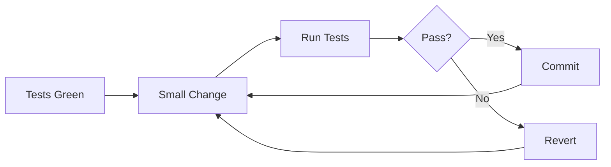

# Refactoring Process

## Safety-First Flow



## Before Starting

```bash
# 1. Ensure tests exist
bun test

# 2. Commit current state
git add .
git commit -m "checkpoint: before refactoring X"

# 3. Create feature branch
git checkout -b refactor/extract-order-service
```

## During Refactoring

| Step | Action | Verify |
|------|--------|--------|
| 1 | Identify target code smell | Document the smell |
| 2 | Write test if missing | Test passes |
| 3 | Make ONE small change | Code compiles |
| 4 | Run tests | All green |
| 5 | Commit with message | `git commit` |
| 6 | Repeat 2-5 | Until complete |

## After Completion

```bash
# 1. Run full test suite
bun test

# 2. Review changes
git diff main..HEAD

# 3. Squash if many small commits
git rebase -i main

# 4. Create PR for review
gh pr create
```

## Characterization Tests

```typescript
// Write before refactoring to capture existing behavior
describe('processOrder (before refactor)', () => {
  it('returns same result with same input', async () => {
    const input = createTestOrder()
    const result = await processOrder(input)

    // Snapshot the behavior
    expect(result).toMatchSnapshot()
  })
})

// After refactoring, same test should pass
describe('OrderService.createOrder (after refactor)', () => {
  it('returns same result with same input', async () => {
    const input = createTestOrder()
    const result = await orderService.createOrder(input)

    // Same snapshot should match
    expect(result).toMatchSnapshot()
  })
})
```

## Anti-Patterns

| WRONG | CORRECT |
|-------|---------|
| Big bang refactor (change everything at once) | Small incremental changes with tests between |
| Refactor + add features in same commit | Separate commits: refactor, then feature |
| Refactor without existing tests | Add characterization tests first |
| Over-abstract on first occurrence | Rule of 3: abstract when pattern repeats |
| Premature optimization | Refactor for clarity first, optimize if needed |
| Rename without search/replace all | Use IDE rename refactoring tool |
| Delete "unused" code without checking | Search for dynamic usage, tests first |
| Change function signature without updating callers | Update all call sites atomically |

## Integration with claude-code-poneglyph

### Project-Specific Patterns

| Current Location | Pattern to Apply | Target |
|------------------|------------------|--------|
| `src/routes/*.ts` | Extract Service | `services/` directory |
| Long route handlers | Extract Function | Named helper functions |
| Repeated validation | Parameter Object + Zod | Shared schemas |
| Direct DB access in routes | Dependency Injection | Service constructors |

### Recommended Refactoring Order

1. **Extract validation schemas** to shared location
2. **Extract services** from route handlers
3. **Apply DI** for database and external services
4. **Extract value objects** for domain concepts (SessionId, UserId)
