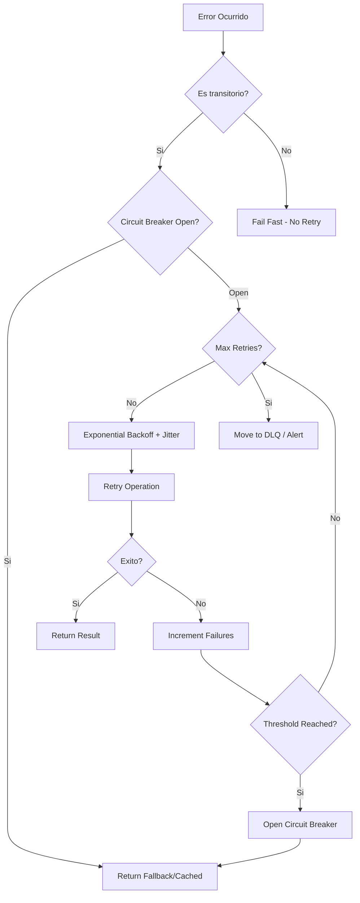

# Retry Patterns

Patrones de resiliencia para manejo de fallos transitorios en TypeScript/Bun.

## When to Use

| Situacion | Aplica |
|-----------|--------|
| Network requests que pueden fallar temporalmente | Si |
| Database connections con timeout | Si |
| External API calls con rate limiting | Si |
| Cualquier operacion con fallos transitorios | Si |
| Errores de validacion de input | No |
| Errores de autenticacion (401/403) | No |
| Recursos no encontrados (404) | No |

## Decision Tree



## Error Classification

| Error Type | HTTP Status | Code | Retry? | Strategy |
|------------|-------------|------|--------|----------|
| Network timeout | - | ETIMEDOUT | Si | Exponential backoff |
| Connection reset | - | ECONNRESET | Si | Exponential backoff |
| DNS failure | - | ENOTFOUND | Si | Exponential backoff |
| Rate limited | 429 | - | Si | Respect Retry-After |
| Server error | 500 | - | Si | Exponential backoff |
| Bad gateway | 502 | - | Si | Exponential backoff |
| Service unavailable | 503 | - | Si | Exponential backoff |
| Gateway timeout | 504 | - | Si | Exponential backoff |
| Request timeout | 408 | - | Si | Exponential backoff |
| Bad request | 400 | - | No | Fix request |
| Unauthorized | 401 | - | No | Refresh token |
| Forbidden | 403 | - | No | Check permissions |
| Not found | 404 | - | No | Fix resource path |
| Validation error | 422 | - | No | Fix input |

## Core Patterns

### Pattern 1: Simple Retry with Limit

```typescript
async function withRetry<T>(
  fn: () => Promise<T>,
  maxRetries = 3
): Promise<T> {
  let lastError: Error

  for (let attempt = 1; attempt <= maxRetries; attempt++) {
    try {
      return await fn()
    } catch (error) {
      lastError = error as Error
      console.log(`Attempt ${attempt}/${maxRetries} failed:`, error.message)
    }
  }

  throw lastError!
}

// Usage
const result = await withRetry(() => fetch(url), 3)
```

### Pattern 2: Exponential Backoff with Jitter

```typescript
interface RetryConfig {
  maxRetries: number
  baseDelayMs: number
  maxDelayMs: number
  jitter: boolean
}

const DEFAULT_RETRY_CONFIG: RetryConfig = {
  maxRetries: 5,
  baseDelayMs: 1000,
  maxDelayMs: 30000,
  jitter: true
}

async function withExponentialBackoff<T>(
  fn: () => Promise<T>,
  config: RetryConfig = DEFAULT_RETRY_CONFIG
): Promise<T> {
  let lastError: Error

  for (let attempt = 0; attempt < config.maxRetries; attempt++) {
    try {
      return await fn()
    } catch (error) {
      lastError = error as Error

      if (attempt === config.maxRetries - 1) break

      // Calculate delay with exponential backoff
      let delay = Math.min(
        config.baseDelayMs * Math.pow(2, attempt),
        config.maxDelayMs
      )

      // Add jitter to prevent thundering herd
      if (config.jitter) {
        delay = delay * (0.5 + Math.random())
      }

      console.log(`Retry ${attempt + 1} after ${Math.round(delay)}ms`)
      await Bun.sleep(delay)
    }
  }

  throw lastError!
}
```

### Pattern 3: Retry Only Transient Errors

```typescript
const TRANSIENT_ERROR_CODES = ['ECONNRESET', 'ETIMEDOUT', 'ENOTFOUND', 'ECONNREFUSED']
const TRANSIENT_HTTP_STATUS = [408, 429, 500, 502, 503, 504]

function isTransientError(error: unknown): boolean {
  if (!(error instanceof Error)) return false

  // Check error code (network errors)
  if ('code' in error && TRANSIENT_ERROR_CODES.includes(error.code as string)) {
    return true
  }

  // Check HTTP status
  if ('status' in error && TRANSIENT_HTTP_STATUS.includes(error.status as number)) {
    return true
  }

  // Check for specific error messages
  const transientMessages = ['ECONNRESET', 'socket hang up', 'network timeout']
  if (transientMessages.some(msg => error.message.includes(msg))) {
    return true
  }

  return false
}

async function withRetryOnTransient<T>(
  fn: () => Promise<T>,
  maxRetries = 3,
  baseDelayMs = 1000
): Promise<T> {
  let lastError: Error

  for (let attempt = 0; attempt < maxRetries; attempt++) {
    try {
      return await fn()
    } catch (error) {
      lastError = error as Error

      if (!isTransientError(error)) {
        throw error // Don't retry permanent errors
      }

      if (attempt < maxRetries - 1) {
        const delay = baseDelayMs * Math.pow(2, attempt) * (0.5 + Math.random())
        console.log(`Transient error, retry ${attempt + 1} after ${Math.round(delay)}ms`)
        await Bun.sleep(delay)
      }
    }
  }

  throw lastError!
}
```

## Implementation

### Complete ResilientClient Class

```typescript
type CircuitState = 'closed' | 'open' | 'half-open'

interface CircuitBreakerConfig {
  failureThreshold: number
  resetTimeoutMs: number
  halfOpenSuccesses: number
}

interface RetryConfig {
  maxRetries: number
  baseDelayMs: number
  maxDelayMs: number
  jitter: boolean
}

interface ResilienceConfig {
  retry: RetryConfig
  timeout: number
  circuitBreaker: CircuitBreakerConfig
}

class CircuitBreaker {
  private state: CircuitState = 'closed'
  private failures = 0
  private lastFailure = 0
  private successesInHalfOpen = 0

  constructor(private config: CircuitBreakerConfig) {}

  async execute<T>(fn: () => Promise<T>): Promise<T> {
    if (this.state === 'open') {
      if (Date.now() - this.lastFailure > this.config.resetTimeoutMs) {
        this.state = 'half-open'
        this.successesInHalfOpen = 0
        console.log('Circuit breaker: transitioning to half-open')
      } else {
        throw new CircuitBreakerOpenError('Circuit breaker is open')
      }
    }

    try {
      const result = await fn()
      this.onSuccess()
      return result
    } catch (error) {
      this.onFailure()
      throw error
    }
  }

  private onSuccess(): void {
    if (this.state === 'half-open') {
      this.successesInHalfOpen++
      if (this.successesInHalfOpen >= this.config.halfOpenSuccesses) {
        this.state = 'closed'
        this.failures = 0
        console.log('Circuit breaker: closed after successful half-open')
      }
    } else {
      this.failures = 0
    }
  }

  private onFailure(): void {
    this.failures++
    this.lastFailure = Date.now()

    if (this.state === 'half-open' || this.failures >= this.config.failureThreshold) {
      this.state = 'open'
      console.log(`Circuit breaker: opened after ${this.failures} failures`)
    }
  }

  getState(): CircuitState {
    return this.state
  }

  getMetrics(): { state: CircuitState; failures: number; lastFailure: Date | null } {
    return {
      state: this.state,
      failures: this.failures,
      lastFailure: this.lastFailure ? new Date(this.lastFailure) : null
    }
  }
}

class CircuitBreakerOpenError extends Error {
  constructor(message: string) {
    super(message)
    this.name = 'CircuitBreakerOpenError'
  }
}

class ResilientClient {
  private breaker: CircuitBreaker
  private cache: Map<string, { data: unknown; expiry: number }> = new Map()

  constructor(private config: ResilienceConfig) {
    this.breaker = new CircuitBreaker(config.circuitBreaker)
  }

  async execute<T>(fn: () => Promise<T>, cacheKey?: string): Promise<T> {
    try {
      const result = await this.breaker.execute(() =>
        this.withRetry(() => this.withTimeout(fn))
      )

      // Cache successful result
      if (cacheKey) {
        this.cache.set(cacheKey, { data: result, expiry: Date.now() + 300000 })
      }

      return result
    } catch (error) {
      // Try cache fallback on circuit breaker open
      if (error instanceof CircuitBreakerOpenError && cacheKey) {
        const cached = this.cache.get(cacheKey)
        if (cached && cached.expiry > Date.now()) {
          console.log('Using cached fallback due to circuit breaker')
          return cached.data as T
        }
      }
      throw error
    }
  }

  private async withTimeout<T>(fn: () => Promise<T>): Promise<T> {
    const controller = new AbortController()
    const timeoutId = setTimeout(() => controller.abort(), this.config.timeout)

    try {
      return await fn()
    } finally {
      clearTimeout(timeoutId)
    }
  }

  private async withRetry<T>(fn: () => Promise<T>): Promise<T> {
    const { maxRetries, baseDelayMs, maxDelayMs, jitter } = this.config.retry
    let lastError: Error

    for (let attempt = 0; attempt < maxRetries; attempt++) {
      try {
        return await fn()
      } catch (error) {
        lastError = error as Error

        if (!isTransientError(error)) {
          throw error
        }

        if (attempt === maxRetries - 1) break

        let delay = Math.min(baseDelayMs * Math.pow(2, attempt), maxDelayMs)
        if (jitter) delay = delay * (0.5 + Math.random())

        console.log(`Retry ${attempt + 1}/${maxRetries} after ${Math.round(delay)}ms`)
        await Bun.sleep(delay)
      }
    }

    throw lastError!
  }

  getCircuitState(): CircuitState {
    return this.breaker.getState()
  }
}

// Export singleton factory
export function createResilientClient(config?: Partial<ResilienceConfig>): ResilientClient {
  const defaultConfig: ResilienceConfig = {
    retry: {
      maxRetries: 3,
      baseDelayMs: 1000,
      maxDelayMs: 10000,
      jitter: true
    },
    timeout: 5000,
    circuitBreaker: {
      failureThreshold: 5,
      resetTimeoutMs: 30000,
      halfOpenSuccesses: 2
    }
  }

  return new ResilientClient({ ...defaultConfig, ...config })
}
```

## Integration Examples

### Elysia Plugin Integration

```typescript
import { Elysia } from 'elysia'
import { createResilientClient } from './resilient-client'

const resilientPlugin = new Elysia({ name: 'resilient' })
  .decorate('resilient', createResilientClient())
  .derive(({ resilient }) => ({
    fetchWithResilience: async <T>(url: string, options?: RequestInit): Promise<T> => {
      return resilient.execute(
        async () => {
          const response = await fetch(url, options)
          if (!response.ok) {
            const error = new Error(`HTTP ${response.status}`)
            ;(error as any).status = response.status
            throw error
          }
          return response.json()
        },
        url // Use URL as cache key
      )
    }
  }))

// Usage in routes
const app = new Elysia()
  .use(resilientPlugin)
  .get('/external-data', async ({ fetchWithResilience }) => {
    return fetchWithResilience('https://api.example.com/data')
  })
```

### Database Connection with Retry

```typescript
import { drizzle } from 'drizzle-orm/bun-sqlite'

async function createDatabaseConnection(
  dbPath: string,
  maxRetries = 5
): Promise<ReturnType<typeof drizzle>> {
  return withExponentialBackoff(
    async () => {
      const db = drizzle(dbPath)
      // Test connection
      await db.run('SELECT 1')
      return db
    },
    { maxRetries, baseDelayMs: 1000, maxDelayMs: 30000, jitter: true }
  )
}
```

### Claude API with Resilience

```typescript
import Anthropic from '@anthropic-ai/sdk'

const client = createResilientClient({
  retry: { maxRetries: 3, baseDelayMs: 2000, maxDelayMs: 30000, jitter: true },
  timeout: 120000, // Claude puede tardar
  circuitBreaker: { failureThreshold: 3, resetTimeoutMs: 60000, halfOpenSuccesses: 1 }
})

async function callClaude(prompt: string): Promise<string> {
  const anthropic = new Anthropic()

  return client.execute(async () => {
    const response = await anthropic.messages.create({
      model: 'claude-sonnet-4-20250514',
      max_tokens: 4096,
      messages: [{ role: 'user', content: prompt }]
    })
    return response.content[0].type === 'text' ? response.content[0].text : ''
  }, `claude:${prompt.substring(0, 50)}`)
}
```

### Rate Limit Handling

```typescript
interface RateLimitConfig {
  maxRequests: number
  windowMs: number
}

class RateLimitedClient {
  private requests: number[] = []

  constructor(
    private resilient: ResilientClient,
    private rateLimit: RateLimitConfig
  ) {}

  async execute<T>(fn: () => Promise<T>): Promise<T> {
    await this.waitForSlot()

    return this.resilient.execute(async () => {
      try {
        return await fn()
      } catch (error) {
        if ((error as any).status === 429) {
          const retryAfter = (error as any).headers?.['retry-after']
          if (retryAfter) {
            console.log(`Rate limited, waiting ${retryAfter}s`)
            await Bun.sleep(parseInt(retryAfter) * 1000)
            return fn()
          }
        }
        throw error
      }
    })
  }

  private async waitForSlot(): Promise<void> {
    const now = Date.now()
    this.requests = this.requests.filter(t => now - t < this.rateLimit.windowMs)

    if (this.requests.length >= this.rateLimit.maxRequests) {
      const oldestRequest = this.requests[0]
      const waitTime = this.rateLimit.windowMs - (now - oldestRequest)
      console.log(`Rate limit reached, waiting ${waitTime}ms`)
      await Bun.sleep(waitTime)
    }

    this.requests.push(now)
  }
}
```

## Checklist

### Pre-Implementation

- [ ] Identificar todos los puntos de fallo transitorios
- [ ] Clasificar errores como transitorios vs permanentes
- [ ] Definir valores de retry apropiados (no muy agresivos)
- [ ] Considerar rate limits de servicios externos

### Implementation

- [ ] Usar exponential backoff (no linear)
- [ ] Agregar jitter para evitar thundering herd
- [ ] Implementar circuit breaker para servicios externos
- [ ] Agregar timeouts a todas las llamadas de red
- [ ] Solo reintentar errores transitorios
- [ ] Respetar headers Retry-After

### Monitoring

- [ ] Loggear todos los intentos de retry
- [ ] Monitorear estado del circuit breaker
- [ ] Alertar en fallos repetidos
- [ ] Trackear metricas de latencia con retries

### Testing

- [ ] Unit tests para logica de retry
- [ ] Tests de integracion con servicios mockeados
- [ ] Tests de circuit breaker state transitions
- [ ] Load tests para verificar comportamiento bajo stress

---

**Version**: 1.0
**Spec**: SPEC-018
**For**: error-analyzer agent
