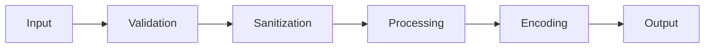

# Security Coding Patterns

Secure coding practices for TypeScript/Bun/Elysia applications following OWASP guidelines.

## When to Use This Skill

- Writing authentication or authorization code
- Handling user input from forms, APIs, or WebSockets
- Storing or transmitting sensitive data
- Working with passwords, tokens, or secrets
- Implementing session management
- Protecting against OWASP Top 10 vulnerabilities

## Core Patterns

### 1. Defense in Depth



### 2. Principle of Least Privilege

- Grant minimum permissions required
- Use role-based access control
- Validate ownership on every resource access

### 3. Fail Secure

- Default to deny
- Return generic errors to users
- Log detailed errors server-side only

## Input Validation

### Schema Validation with Zod

```typescript
import { z } from 'zod'

// User registration schema
const registerSchema = z.object({
  email: z.string()
    .email('Invalid email format')
    .max(255, 'Email too long'),
  password: z.string()
    .min(8, 'Password must be at least 8 characters')
    .max(128, 'Password too long')
    .regex(/[A-Z]/, 'Must contain uppercase letter')
    .regex(/[a-z]/, 'Must contain lowercase letter')
    .regex(/[0-9]/, 'Must contain number')
    .regex(/[^A-Za-z0-9]/, 'Must contain special character'),
  username: z.string()
    .min(3, 'Username too short')
    .max(30, 'Username too long')
    .regex(/^[a-zA-Z0-9_]+$/, 'Only alphanumeric and underscore'),
  age: z.number().int().min(13).max(120).optional(),
})

type RegisterInput = z.infer<typeof registerSchema>

function validateInput<T>(schema: z.ZodSchema<T>, data: unknown): T {
  const result = schema.safeParse(data)
  if (!result.success) {
    const errors = result.error.flatten()
    throw new ValidationError('Invalid input', errors)
  }
  return result.data
}

// Elysia integration
import { Elysia, t } from 'elysia'

const app = new Elysia()
  .post('/register', ({ body }) => {
    const validated = validateInput(registerSchema, body)
    return registerUser(validated)
  }, {
    body: t.Object({
      email: t.String({ format: 'email' }),
      password: t.String({ minLength: 8 }),
      username: t.String({ minLength: 3, maxLength: 30 }),
      age: t.Optional(t.Number({ minimum: 13 }))
    })
  })
```

### Sanitization Functions

```typescript
import { escape } from 'html-escaper'
import DOMPurify from 'dompurify'

// Sanitize for HTML output (prevent XSS)
function sanitizeHtml(input: string): string {
  return escape(input)
}

// Sanitize rich HTML content (allow safe tags)
function sanitizeRichHtml(input: string): string {
  return DOMPurify.sanitize(input, {
    ALLOWED_TAGS: ['b', 'i', 'em', 'strong', 'a', 'p', 'br'],
    ALLOWED_ATTR: ['href', 'target'],
  })
}

// Sanitize filename (prevent path traversal)
function sanitizeFilename(input: string): string {
  return input
    .replace(/[^a-zA-Z0-9._-]/g, '_')
    .replace(/\.{2,}/g, '.')
    .slice(0, 255)
}

// Sanitize for JSON output
function sanitizeForJson(obj: unknown): unknown {
  return JSON.parse(JSON.stringify(obj, (key, value) => {
    if (typeof value === 'string') {
      return value.replace(/[<>]/g, '')
    }
    return value
  }))
}
```

## Authentication

### Password Hashing (Bun Native)

```typescript
// Password hashing with Bun's built-in argon2id
interface PasswordConfig {
  algorithm: 'argon2id'
  memoryCost: number
  timeCost: number
}

const PASSWORD_CONFIG: PasswordConfig = {
  algorithm: 'argon2id',
  memoryCost: 65536, // 64 MB
  timeCost: 3,       // 3 iterations
}

async function hashPassword(password: string): Promise<string> {
  return Bun.password.hash(password, PASSWORD_CONFIG)
}

async function verifyPassword(password: string, hash: string): Promise<boolean> {
  try {
    return await Bun.password.verify(password, hash)
  } catch {
    return false // Fail secure
  }
}

// Complete login flow
async function login(email: string, password: string): Promise<AuthResult> {
  const user = await db.users.findByEmail(email)

  // Constant-time comparison to prevent timing attacks
  if (!user) {
    // Hash anyway to prevent user enumeration
    await Bun.password.hash(password, PASSWORD_CONFIG)
    throw new UnauthorizedError('Invalid credentials')
  }

  const valid = await verifyPassword(password, user.passwordHash)
  if (!valid) {
    await recordFailedLogin(user.id)
    throw new UnauthorizedError('Invalid credentials')
  }

  await clearFailedLogins(user.id)
  return createSession(user)
}
```

### JWT Token Management

```typescript
import { SignJWT, jwtVerify, JWTPayload } from 'jose'

interface TokenPayload extends JWTPayload {
  sub: string
  role: string
  sessionId: string
}

const JWT_SECRET = new TextEncoder().encode(Bun.env.JWT_SECRET)
const JWT_ISSUER = 'claude-code-poneglyph'
const ACCESS_TOKEN_EXPIRY = '15m'
const REFRESH_TOKEN_EXPIRY = '7d'

async function createAccessToken(user: User, sessionId: string): Promise<string> {
  return new SignJWT({
    sub: user.id,
    role: user.role,
    sessionId,
  })
    .setProtectedHeader({ alg: 'HS256' })
    .setIssuer(JWT_ISSUER)
    .setIssuedAt()
    .setExpirationTime(ACCESS_TOKEN_EXPIRY)
    .sign(JWT_SECRET)
}

async function createRefreshToken(user: User, sessionId: string): Promise<string> {
  return new SignJWT({
    sub: user.id,
    sessionId,
    type: 'refresh',
  })
    .setProtectedHeader({ alg: 'HS256' })
    .setIssuer(JWT_ISSUER)
    .setIssuedAt()
    .setExpirationTime(REFRESH_TOKEN_EXPIRY)
    .sign(JWT_SECRET)
}

async function verifyToken(token: string): Promise<TokenPayload> {
  try {
    const { payload } = await jwtVerify(token, JWT_SECRET, {
      issuer: JWT_ISSUER,
    })
    return payload as TokenPayload
  } catch (error) {
    if (error instanceof Error && error.name === 'JWTExpired') {
      throw new UnauthorizedError('Token expired')
    }
    throw new UnauthorizedError('Invalid token')
  }
}

// Token refresh flow
async function refreshTokens(refreshToken: string): Promise<TokenPair> {
  const payload = await verifyToken(refreshToken)

  if (payload.type !== 'refresh') {
    throw new UnauthorizedError('Invalid token type')
  }

  // Verify session still valid
  const session = await db.sessions.find(payload.sessionId)
  if (!session || session.revokedAt) {
    throw new UnauthorizedError('Session revoked')
  }

  const user = await db.users.find(payload.sub)
  return {
    accessToken: await createAccessToken(user, session.id),
    refreshToken: await createRefreshToken(user, session.id),
  }
}
```

### Secure Session Cookies

```typescript
import { Elysia } from 'elysia'

const COOKIE_OPTIONS = {
  httpOnly: true,      // Prevent XSS access
  secure: true,        // HTTPS only
  sameSite: 'strict',  // Prevent CSRF
  path: '/',
  maxAge: 3600,        // 1 hour
} as const

const app = new Elysia()
  .post('/login', async ({ body, cookie }) => {
    const { user, sessionId } = await authenticate(body)
    const token = await createAccessToken(user, sessionId)

    cookie.session.set({
      value: token,
      ...COOKIE_OPTIONS,
    })

    return { success: true, user: sanitizeUser(user) }
  })
  .post('/logout', ({ cookie }) => {
    cookie.session.set({
      value: '',
      ...COOKIE_OPTIONS,
      maxAge: 0, // Expire immediately
    })
    return { success: true }
  })
```

## Authorization

### Role-Based Access Control (RBAC)

```typescript
type Role = 'user' | 'moderator' | 'admin' | 'superadmin'

interface Permission {
  resource: string
  actions: ('read' | 'create' | 'update' | 'delete')[]
}

const ROLE_PERMISSIONS: Record<Role, Permission[]> = {
  user: [
    { resource: 'profile', actions: ['read', 'update'] },
    { resource: 'posts', actions: ['read', 'create'] },
  ],
  moderator: [
    { resource: 'profile', actions: ['read', 'update'] },
    { resource: 'posts', actions: ['read', 'create', 'update', 'delete'] },
    { resource: 'users', actions: ['read'] },
  ],
  admin: [
    { resource: '*', actions: ['read', 'create', 'update'] },
  ],
  superadmin: [
    { resource: '*', actions: ['read', 'create', 'update', 'delete'] },
  ],
}

function hasPermission(role: Role, resource: string, action: string): boolean {
  const permissions = ROLE_PERMISSIONS[role]
  return permissions.some(p =>
    (p.resource === '*' || p.resource === resource) &&
    p.actions.includes(action as any)
  )
}

// Middleware factory
function requirePermission(resource: string, action: string) {
  return ({ user }: { user: User }) => {
    if (!hasPermission(user.role, resource, action)) {
      throw new ForbiddenError(`Cannot ${action} ${resource}`)
    }
  }
}

// Usage in Elysia
app.get('/admin/users', ({ user }) => {
  requirePermission('users', 'read')({ user })
  return db.users.findAll()
})
```

### Resource Ownership Validation

```typescript
interface OwnedResource {
  ownerId: string
}

function requireOwnership<T extends OwnedResource>(
  userId: string,
  resource: T | null,
  resourceName: string = 'Resource'
): T {
  if (!resource) {
    throw new NotFoundError(`${resourceName} not found`)
  }
  if (resource.ownerId !== userId) {
    throw new ForbiddenError('Access denied')
  }
  return resource
}

// Usage
app.put('/posts/:id', async ({ params, user, body }) => {
  const post = await db.posts.find(params.id)
  requireOwnership(user.id, post, 'Post')
  return db.posts.update(params.id, body)
})
```

## Data Protection

### Environment Configuration

```typescript
import { z } from 'zod'

const envSchema = z.object({
  NODE_ENV: z.enum(['development', 'production', 'test']),
  JWT_SECRET: z.string().min(32, 'JWT_SECRET must be at least 32 characters'),
  DATABASE_URL: z.string().url(),
  ENCRYPTION_KEY: z.string().length(64, 'ENCRYPTION_KEY must be 64 hex chars'),
  CORS_ORIGIN: z.string().url().optional(),
})

function loadEnv() {
  const result = envSchema.safeParse(Bun.env)
  if (!result.success) {
    console.error('Invalid environment configuration:')
    console.error(result.error.format())
    process.exit(1)
  }
  return result.data
}

export const env = loadEnv()
```

### Encryption at Rest

```typescript
import { createCipheriv, createDecipheriv, randomBytes, scryptSync } from 'crypto'

const ALGORITHM = 'aes-256-gcm'
const IV_LENGTH = 16
const TAG_LENGTH = 16
const SALT_LENGTH = 32

function deriveKey(password: string, salt: Buffer): Buffer {
  return scryptSync(password, salt, 32)
}

export function encrypt(plaintext: string, masterKey: string): string {
  const salt = randomBytes(SALT_LENGTH)
  const key = deriveKey(masterKey, salt)
  const iv = randomBytes(IV_LENGTH)

  const cipher = createCipheriv(ALGORITHM, key, iv)
  const encrypted = Buffer.concat([
    cipher.update(plaintext, 'utf8'),
    cipher.final()
  ])
  const tag = cipher.getAuthTag()

  // Format: salt + iv + tag + ciphertext
  return Buffer.concat([salt, iv, tag, encrypted]).toString('base64')
}

export function decrypt(ciphertext: string, masterKey: string): string {
  const data = Buffer.from(ciphertext, 'base64')

  const salt = data.subarray(0, SALT_LENGTH)
  const iv = data.subarray(SALT_LENGTH, SALT_LENGTH + IV_LENGTH)
  const tag = data.subarray(SALT_LENGTH + IV_LENGTH, SALT_LENGTH + IV_LENGTH + TAG_LENGTH)
  const encrypted = data.subarray(SALT_LENGTH + IV_LENGTH + TAG_LENGTH)

  const key = deriveKey(masterKey, salt)
  const decipher = createDecipheriv(ALGORITHM, key, iv)
  decipher.setAuthTag(tag)

  return decipher.update(encrypted) + decipher.final('utf8')
}
```

## OWASP Top 10 Protection

### SQL Injection Prevention

```typescript
// ALWAYS use parameterized queries
import { eq, and, sql } from 'drizzle-orm'

// CORRECT: Parameterized query
async function findUser(email: string) {
  return db.select()
    .from(users)
    .where(eq(users.email, email))
}

// CORRECT: Dynamic query with safe builder
async function searchUsers(filters: { name?: string; role?: string }) {
  const conditions = []
  if (filters.name) conditions.push(eq(users.name, filters.name))
  if (filters.role) conditions.push(eq(users.role, filters.role))

  return db.select()
    .from(users)
    .where(and(...conditions))
}

// WRONG: String concatenation (SQL Injection vulnerable)
// const query = `SELECT * FROM users WHERE email = '${email}'` // NEVER DO THIS
```

### XSS Prevention

```typescript
// Server-side: Escape all user content in responses
import { escape } from 'html-escaper'

function renderUserProfile(user: User): string {
  return `
    <div class="profile">
      <h1>${escape(user.name)}</h1>
      <p>${escape(user.bio)}</p>
    </div>
  `
}

// Client-side: Use textContent, not innerHTML
// CORRECT
element.textContent = userInput

// WRONG (XSS vulnerable)
// element.innerHTML = userInput // NEVER with user input
```

### CSRF Protection

```typescript
import { Elysia } from 'elysia'
import { csrf } from 'elysia-csrf'

const app = new Elysia()
  .use(csrf({
    cookieName: 'csrf_token',
    headerName: 'x-csrf-token',
    cookieOptions: {
      httpOnly: true,
      secure: true,
      sameSite: 'strict',
    }
  }))
```

### Rate Limiting

```typescript
import { Elysia } from 'elysia'

interface RateLimitConfig {
  windowMs: number
  max: number
}

const rateLimits = new Map<string, { count: number; resetAt: number }>()

function rateLimit(config: RateLimitConfig) {
  return ({ request }: { request: Request }) => {
    const ip = request.headers.get('x-forwarded-for') || 'unknown'
    const key = `${ip}:${request.url}`
    const now = Date.now()

    const entry = rateLimits.get(key)
    if (!entry || entry.resetAt < now) {
      rateLimits.set(key, { count: 1, resetAt: now + config.windowMs })
      return
    }

    if (entry.count >= config.max) {
      throw new TooManyRequestsError('Rate limit exceeded')
    }

    entry.count++
  }
}

// Apply to auth endpoints
app.post('/login', ({ body }) => login(body), {
  beforeHandle: [rateLimit({ windowMs: 60000, max: 5 })]
})
```

## Implementation Examples

### Complete Auth Service

```typescript
// server/src/services/auth.service.ts
import { z } from 'zod'
import { SignJWT, jwtVerify } from 'jose'

const loginSchema = z.object({
  email: z.string().email(),
  password: z.string().min(1),
})

const registerSchema = z.object({
  email: z.string().email(),
  password: z.string().min(8).regex(/^(?=.*[A-Z])(?=.*[a-z])(?=.*\d)(?=.*\W)/),
  name: z.string().min(2).max(100),
})

export class AuthService {
  private readonly jwtSecret: Uint8Array

  constructor(jwtSecret: string) {
    if (jwtSecret.length < 32) {
      throw new Error('JWT secret must be at least 32 characters')
    }
    this.jwtSecret = new TextEncoder().encode(jwtSecret)
  }

  async register(input: unknown): Promise<User> {
    const data = registerSchema.parse(input)

    const existing = await db.users.findByEmail(data.email)
    if (existing) {
      throw new ConflictError('Email already registered')
    }

    const passwordHash = await Bun.password.hash(data.password, {
      algorithm: 'argon2id',
      memoryCost: 65536,
      timeCost: 3,
    })

    return db.users.create({
      email: data.email.toLowerCase(),
      passwordHash,
      name: data.name,
      role: 'user',
    })
  }

  async login(input: unknown): Promise<AuthTokens> {
    const data = loginSchema.parse(input)

    const user = await db.users.findByEmail(data.email.toLowerCase())
    if (!user) {
      await Bun.password.hash(data.password) // Timing attack prevention
      throw new UnauthorizedError('Invalid credentials')
    }

    const valid = await Bun.password.verify(data.password, user.passwordHash)
    if (!valid) {
      throw new UnauthorizedError('Invalid credentials')
    }

    const session = await db.sessions.create({ userId: user.id })

    return {
      accessToken: await this.createAccessToken(user, session.id),
      refreshToken: await this.createRefreshToken(user, session.id),
    }
  }

  private async createAccessToken(user: User, sessionId: string): Promise<string> {
    return new SignJWT({ sub: user.id, role: user.role, sessionId })
      .setProtectedHeader({ alg: 'HS256' })
      .setIssuedAt()
      .setExpirationTime('15m')
      .sign(this.jwtSecret)
  }

  private async createRefreshToken(user: User, sessionId: string): Promise<string> {
    return new SignJWT({ sub: user.id, sessionId, type: 'refresh' })
      .setProtectedHeader({ alg: 'HS256' })
      .setIssuedAt()
      .setExpirationTime('7d')
      .sign(this.jwtSecret)
  }
}
```

## Checklist

Before completing security-sensitive code:

- [ ] All user input validated with Zod schema before processing
- [ ] Passwords hashed with argon2id (never md5/sha1/bcrypt)
- [ ] JWT secrets loaded from environment variables (min 32 chars)
- [ ] Cookies set with httpOnly, secure, sameSite=strict
- [ ] SQL queries use parameterized statements (never string concat)
- [ ] HTML output is escaped/sanitized for user content
- [ ] CSRF tokens required on all state-changing requests
- [ ] Rate limiting applied to authentication endpoints
- [ ] No secrets or sensitive data in logs or error responses
- [ ] Sensitive data encrypted at rest with AES-256-GCM
- [ ] Resource ownership validated on every access
- [ ] Failed login attempts recorded and limited
- [ ] Tokens have appropriate expiration times
- [ ] Error messages are generic to users, detailed in logs

## Anti-Patterns

| WRONG | CORRECT |
|-------|---------|
| `md5(password)` or `sha256(password)` | `Bun.password.hash()` with argon2id |
| `query("SELECT * WHERE id=" + id)` | Parameterized query with ORM |
| `innerHTML = userInput` | `textContent = userInput` or sanitize |
| `JWT_SECRET = "mysecret123"` | `Bun.env.JWT_SECRET` with 32+ chars |
| `console.log({ user, password })` | Never log sensitive data |
| `cookie.set({ value: token })` | Add httpOnly, secure, sameSite |
| `if (user.role === 'admin')` only | Also validate resource ownership |
| Returning full error stack to client | Generic message, log details server-side |
| Storing password in plain text | Always hash before storage |
| Using Math.random() for tokens | Use crypto.randomUUID() or crypto.randomBytes() |

## Integration

### Project-Specific Configuration

For **claude-code-poneglyph**, integrate security patterns in:

| File | Security Pattern |
|------|------------------|
| `server/src/routes/auth.ts` | Login/register with Zod validation |
| `server/src/middleware/auth.ts` | JWT verification middleware |
| `server/src/services/claude.ts` | API key from env, no logging |
| `web/src/hooks/useAuth.ts` | Secure token storage, refresh |

### Environment Variables Required

```bash
# .env
JWT_SECRET=<min-32-char-random-string>
ENCRYPTION_KEY=<64-char-hex-string>
DATABASE_URL=<connection-string>
ANTHROPIC_API_KEY=<api-key>
```

### Security Headers Middleware

```typescript
// server/src/middleware/security.ts
import { Elysia } from 'elysia'

export const securityHeaders = new Elysia()
  .onBeforeHandle(({ set }) => {
    set.headers['X-Content-Type-Options'] = 'nosniff'
    set.headers['X-Frame-Options'] = 'DENY'
    set.headers['X-XSS-Protection'] = '1; mode=block'
    set.headers['Strict-Transport-Security'] = 'max-age=31536000; includeSubDomains'
    set.headers['Content-Security-Policy'] = "default-src 'self'"
  })
```

---

**Version**: 1.0
**Spec**: SPEC-018
**For**: builder agent
