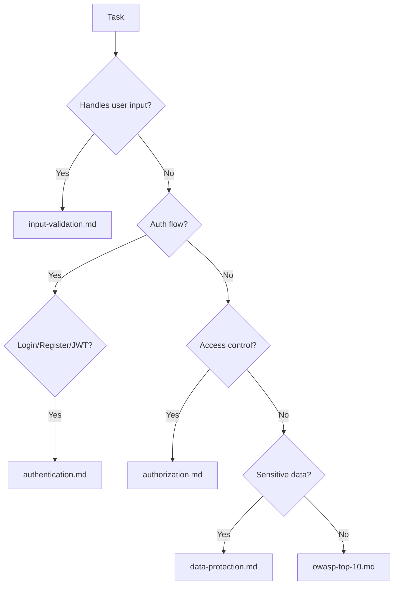

# Security Coding Patterns

Secure coding practices for TypeScript/Bun/Elysia applications following OWASP guidelines.

## Core Principles

| Principle | Meaning |
|-----------|---------|
| **Defense in Depth** | Input -> Validate -> Sanitize -> Process -> Encode -> Output |
| **Least Privilege** | Grant minimum permissions required; validate ownership on every access |
| **Fail Secure** | Default to deny; generic errors to users, detailed logs server-side |

## Security Decision Tree

```mermaid
graph TD
    T[Task] --> Q1{Handles user input?}
    Q1 -->|Yes| IV[input-validation.md]
    Q1 -->|No| Q2{Auth flow?}
    Q2 -->|Yes| Q3{Login/Register/JWT?}
    Q3 -->|Yes| AU[authentication.md]
    Q2 -->|No| Q4{Access control?}
    Q4 -->|Yes| AZ[authorization.md]
    Q4 -->|No| Q5{Sensitive data?}
    Q5 -->|Yes| DP[data-protection.md]
    Q5 -->|No| OW[owasp-top-10.md]
```

## Reference Files

| Scenario | File | Key Content |
|----------|------|-------------|
| Validating user input | `${CLAUDE_SKILL_DIR}/references/input-validation.md` | Zod schemas, sanitization functions |
| Password/JWT/Sessions | `${CLAUDE_SKILL_DIR}/references/authentication.md` | argon2id hashing, JWT with jose, cookie config |
| RBAC/Ownership | `${CLAUDE_SKILL_DIR}/references/authorization.md` | Role permissions, resource ownership guards |
| Env config/Encryption | `${CLAUDE_SKILL_DIR}/references/data-protection.md` | Zod env validation, AES-256-GCM encrypt/decrypt |
| SQL injection/XSS/CSRF | `${CLAUDE_SKILL_DIR}/references/owasp-top-10.md` | Parameterized queries, escape, rate limiting |
| Full implementation | `${CLAUDE_SKILL_DIR}/examples/complete-auth-service.ts` | AuthService class with register/login |
| Pre-commit review | `${CLAUDE_SKILL_DIR}/checklists/security-checklist.md` | Pre-implementation + review checklist |

## Quick OWASP Reference

| # | Vulnerability | Prevention |
|---|---------------|------------|
| 1 | **Injection** | Parameterized queries (ORM/query builder) |
| 2 | **Broken Auth** | argon2id + JWT rotation + rate limiting |
| 3 | **Sensitive Data Exposure** | AES-256-GCM at rest, TLS in transit |
| 4 | **XSS** | `escape()` output + `textContent` (never `innerHTML`) |
| 5 | **CSRF** | SameSite=strict cookies + CSRF tokens |

## Anti-Patterns (Quick)

| WRONG | CORRECT |
|-------|---------|
| `md5(password)` | `Bun.password.hash()` with argon2id |
| `"SELECT * WHERE id=" + id` | Parameterized query with ORM |
| `innerHTML = userInput` | `textContent` or DOMPurify |
| `JWT_SECRET = "mysecret123"` | `Bun.env.JWT_SECRET` (32+ chars) |
| `console.log({ password })` | Never log sensitive data |
| `Math.random()` for tokens | `crypto.randomUUID()` |

## Project Integration

| File | Security Pattern |
|------|------------------|
| `server/src/routes/auth.ts` | Login/register with Zod validation |
| `server/src/middleware/auth.ts` | JWT verification middleware |
| `server/src/services/claude.ts` | API key from env, no logging |
| `web/src/hooks/useAuth.ts` | Secure token storage, refresh |

---

**Version**: 2.0
**Spec**: SPEC-018
**For**: builder agent
