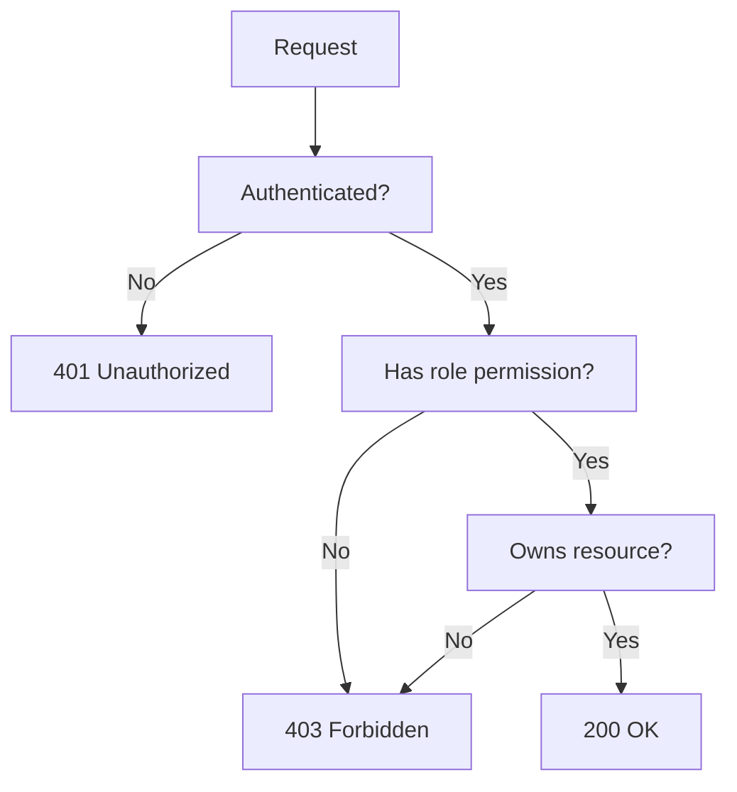

# Authorization

Role-Based Access Control (RBAC) and resource ownership patterns.

## Role-Based Access Control (RBAC)

```typescript
type Role = 'user' | 'moderator' | 'admin' | 'superadmin'

interface Permission {
  resource: string
  actions: ('read' | 'create' | 'update' | 'delete')[]
}

const ROLE_PERMISSIONS: Record<Role, Permission[]> = {
  user: [
    { resource: 'profile', actions: ['read', 'update'] },
    { resource: 'posts', actions: ['read', 'create'] },
  ],
  moderator: [
    { resource: 'profile', actions: ['read', 'update'] },
    { resource: 'posts', actions: ['read', 'create', 'update', 'delete'] },
    { resource: 'users', actions: ['read'] },
  ],
  admin: [
    { resource: '*', actions: ['read', 'create', 'update'] },
  ],
  superadmin: [
    { resource: '*', actions: ['read', 'create', 'update', 'delete'] },
  ],
}

function hasPermission(role: Role, resource: string, action: string): boolean {
  const permissions = ROLE_PERMISSIONS[role]
  return permissions.some(p =>
    (p.resource === '*' || p.resource === resource) &&
    p.actions.includes(action as any)
  )
}

// Middleware factory
function requirePermission(resource: string, action: string) {
  return ({ user }: { user: User }) => {
    if (!hasPermission(user.role, resource, action)) {
      throw new ForbiddenError(`Cannot ${action} ${resource}`)
    }
  }
}

// Usage in Elysia
app.get('/admin/users', ({ user }) => {
  requirePermission('users', 'read')({ user })
  return db.users.findAll()
})
```

## Resource Ownership Validation

```typescript
interface OwnedResource {
  ownerId: string
}

function requireOwnership<T extends OwnedResource>(
  userId: string,
  resource: T | null,
  resourceName: string = 'Resource'
): T {
  if (!resource) {
    throw new NotFoundError(`${resourceName} not found`)
  }
  if (resource.ownerId !== userId) {
    throw new ForbiddenError('Access denied')
  }
  return resource
}

// Usage
app.put('/posts/:id', async ({ params, user, body }) => {
  const post = await db.posts.find(params.id)
  requireOwnership(user.id, post, 'Post')
  return db.posts.update(params.id, body)
})
```

## Authorization Decision Flow



## Key Rules

| Rule | Why |
|------|-----|
| Check role AND ownership | Role alone is insufficient |
| Return 404 for missing resources | Don't leak existence info |
| Return 403 for non-owners | Separate from 401 (not authenticated) |
| Wildcard `*` only for admin+ | Principle of least privilege |
