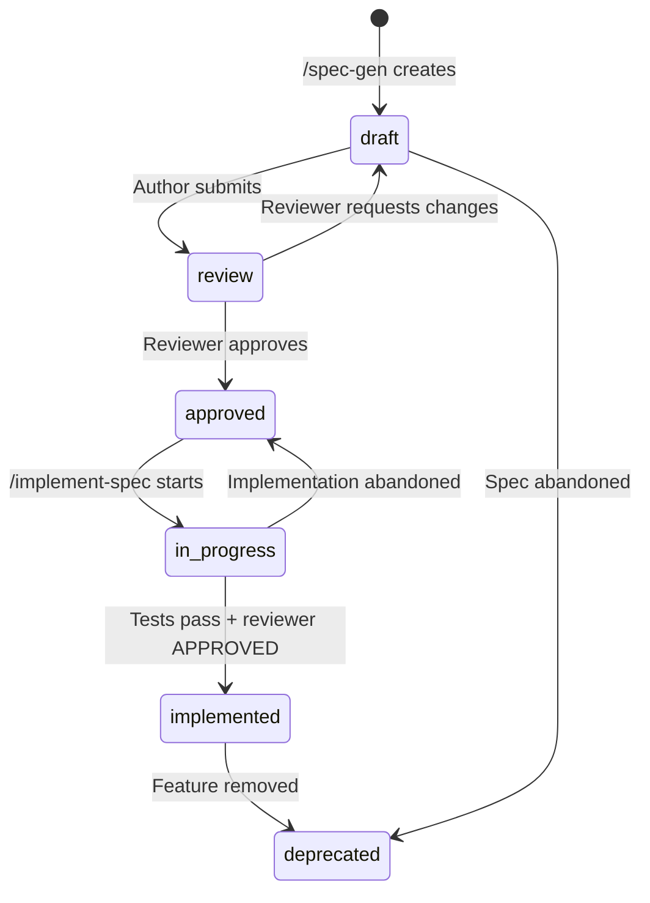
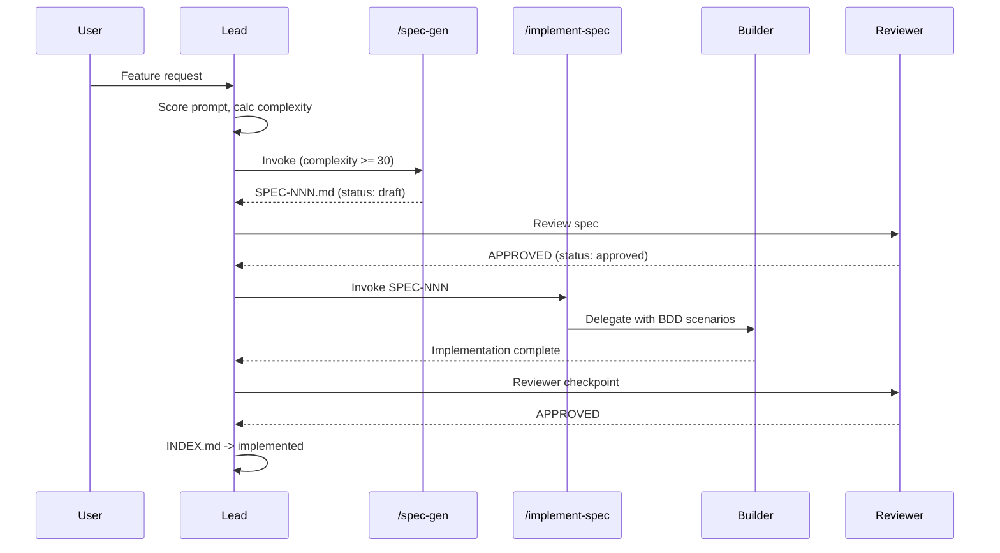

# Spec-Driven Development

Guides the Lead through the canonical SDD cycle: Intent -> Spec -> Plan -> Execute -> Validate. Ensures every non-trivial feature is backed by a formal specification with BDD acceptance criteria.

## When to Use

| Trigger | Action |
|---------|--------|
| Complexity >30 and no spec exists | Invoke `/spec-gen` before implementation |
| User invokes `/spec-gen` | Guide through spec creation with 10 sections |
| User invokes `/implement-spec` | Guide through BDD-driven implementation |
| Reviewing implementation tied to a spec | Run SpecComplianceCheck, validate against BDD |
| Complexity <30 | Skip spec workflow, delegate to builder directly |
| Spec status is `draft` or `review` | Do NOT invoke `/implement-spec` until `approved` |

## SDD Cycle

```mermaid
graph TD
    U[User Request] --> S[Score Prompt]
    S --> C[Calculate Complexity]
    C -->|< 30| B[Builder directo]
    C -->|>= 30| SP{Spec exists?}
    SP -->|Yes| IS[/implement-spec]
    SP -->|No| SG[/spec-gen]
    SG --> R[Review: draft -> approved]
    R --> IS
    IS --> BLD[Builder implements with BDD]
    BLD --> CV[SpecComplianceCheck]
    CV -->|>= 70| RV[Reviewer checkpoint]
    CV -->|< 70| FB[Feedback -> builder]
    RV -->|APPROVED| IX[INDEX.md -> implemented]
    RV -->|NEEDS_CHANGES| FB
    FB --> BLD
    IX --> Done
```

## Spec Lifecycle State Machine

### Valid Transitions

| From | To (valid) |
|------|-----------|
| draft | review, deprecated |
| review | approved, draft, deprecated |
| approved | in_progress, deprecated |
| in_progress | implemented, approved, deprecated |
| implemented | deprecated |
| deprecated | (none) |

### State Diagram



### Transition Rules

| Transition | Who Triggers | Condition |
|-----------|-------------|-----------|
| draft -> review | Lead / User | All 10 sections present |
| review -> approved | Reviewer | overallCompliance >= 70, BDD >= 5 scenarios |
| review -> draft | Reviewer | Requests changes |
| approved -> in_progress | Lead | `/implement-spec` invoked |
| in_progress -> implemented | Lead | All BDD tests pass + reviewer APPROVED |
| in_progress -> approved | Lead | Implementation abandoned, spec still valid |
| * -> deprecated | User | Feature removed or spec obsolete |

## Quality Gates

| Phase | Gate | Threshold |
|-------|------|-----------|
| Draft | All 10 sections present | Required |
| Draft | Research confidence not "low" | Required |
| Approved | overallCompliance >= 70 | Required |
| Approved | BDD scenarios >= 5 | Required |
| In Progress | SpecComplianceCheck advisory | Informational |
| Implemented | All BDD tests pass | Required |
| Implemented | Reviewer APPROVED | Required |

## Integration with Commands

| Command | Role in SDD | When |
|---------|------------|------|
| `/spec-gen` | Creates spec with 10 sections + research | Complexity >= 30, no spec exists |
| `/implement-spec` | Implements from spec with BDD | Spec status = approved |
| `/generate-from-spec` | Generates code from BDD only | Ad-hoc BDD generation |

### Command Flow



## Checklist for Lead

1. Calculate complexity score for user request
2. If >= 30: check if spec exists in `.specs/`
3. If no spec: invoke `/spec-gen` to create one
4. Review spec: ensure overallCompliance >= 70
5. Invoke `/implement-spec SPEC-NNN`
6. After builder completes: reviewer validates (incl. SpecComplianceCheck)
7. If APPROVED: update INDEX.md status -> implemented
8. If NEEDS_CHANGES: feedback loop to builder

### Decision Tree

| Condition | Action |
|-----------|--------|
| Complexity < 30 | Builder directo, skip SDD |
| Complexity >= 30, spec exists and approved | `/implement-spec` |
| Complexity >= 30, spec exists but draft | Review spec first |
| Complexity >= 30, no spec | `/spec-gen` first |
| Complexity >= 30, spec exists but deprecated | Create new spec |

## SpecComplianceCheck Scoring

| Component | Weight | What It Measures |
|-----------|--------|-----------------|
| Section presence | 40% | All 10 sections (0-9) exist and are non-empty |
| Section quality | 20% | Sections have substantive content (not placeholder) |
| BDD completeness | 20% | Scenarios have Given/When/Then, >= 5 scenarios |
| Sources present | 10% | Section 8 has >= 3 sources with URLs |
| Research confidence | 10% | Frontmatter confidence is "high" or "medium" |

### Score Interpretation

| Score | Meaning | Action |
|-------|---------|--------|
| 90-100 | Excellent | Auto-approve, proceed to implementation |
| 70-89 | Acceptable | Reviewer approves with minor feedback |
| 50-69 | Needs work | Reviewer requests changes, return to draft |
| < 50 | Incomplete | Block: significant sections missing |

### Per-Section Scoring

| Section | Name | Presence (4pts) | Quality (2pts) |
|---------|------|-----------------|----------------|
| 0 | Research Summary | Sources listed | >= 5 sources, confidence stated |
| 1 | Vision | Press release exists | Background + metrics defined |
| 2 | Goals & Non-Goals | Both subsections | >= 3 goals, >= 2 non-goals |
| 3 | Alternatives Considered | Table exists | >= 2 alternatives with pros/cons |
| 4 | Design | Architecture diagram | Interfaces + edge cases |
| 5 | FAQ | Q&A pairs | >= 3 questions with sourced answers |
| 6 | Acceptance Criteria | BDD scenarios | >= 5 scenarios, all with Given/When/Then |
| 7 | Open Questions | Table exists | Questions have proposed resolutions |
| 8 | Sources | Source table | >= 3 sources with URLs |
| 9 | Next Steps | Task table | Tasks have complexity estimates |

## Spec File Conventions

| Aspect | Convention |
|--------|-----------|
| Location | `.specs/vX.Y/SPEC-NNN-slug.md` |
| Frontmatter | HTML comment with status, priority, confidence, depends_on, enables |
| Section numbering | 0-9, matching SpecComplianceCheck |
| BDD format | Gherkin: Feature / Scenario / Given / When / Then |
| INDEX.md | Central registry with status, links, dependency graph |

## Edge Cases

| Edge Case | Handling |
|-----------|---------|
| Spec modified during implementation | Invalidate SpecComplianceCheck, notify builder |
| Feature requires changes to existing spec | Create new version, do not edit implemented specs |
| Complexity borderline (25-35) | Lead decides; if uncertain, create spec |
| Spec without BDD scenarios | SpecComplianceCheck fails section 6 |
| Implementation diverges from spec | Reviewer flags spec_drift issue |

---

**Version**: 1.0
**Spec**: SPEC-016
