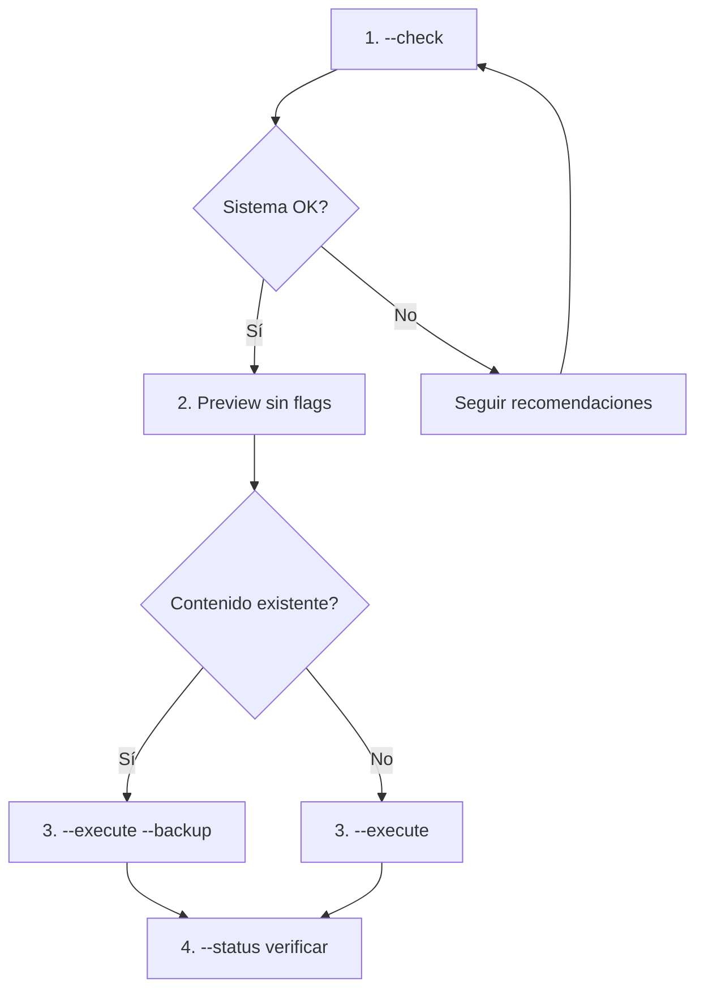

# Sync Claude Config

Crea symlinks en `~/.claude/` que apuntan a `poneglyph/.claude/`, permitiendo usar los skills/agents/commands en cualquier proyecto.

## Compatibilidad Multi-SO

| SO | Método por defecto | Permisos requeridos |
|----|-------------------|---------------------|
| Windows | Junction | Ninguno |
| Windows (Dev Mode) | Symlink | Developer Mode ON |
| macOS | Symlink | Permisos de usuario |
| Linux | Symlink | Permisos de usuario |

## Workflow Recomendado



## Uso

### 1. Verificar sistema (recomendado primero)

```bash
bun .claude/skills/sync-claude/scripts/sync-claude.ts --check
```

Muestra:
- OS y versión
- Si eres admin/root
- Developer Mode (Windows)
- Si puede crear symlinks/junctions
- Recomendaciones si algo falta

### 2. Preview de cambios

```bash
bun .claude/skills/sync-claude/scripts/sync-claude.ts
```

### 3. Ejecutar sincronización

```bash
# Normal
bun .claude/skills/sync-claude/scripts/sync-claude.ts --execute

# Con backup de contenido existente
bun .claude/skills/sync-claude/scripts/sync-claude.ts --execute --backup

# Forzar método específico
bun .claude/skills/sync-claude/scripts/sync-claude.ts --method junction --execute
```

### 4. Ver estado actual

```bash
bun .claude/skills/sync-claude/scripts/sync-claude.ts --status
```

### 5. Deshacer (eliminar symlinks)

```bash
bun .claude/skills/sync-claude/scripts/sync-claude.ts --unlink
```

## Opciones CLI

| Opción | Descripción |
|--------|-------------|
| `--check` | Verificar sistema y permisos |
| `--status` | Mostrar estado actual |
| `--execute` | Aplicar cambios |
| `--backup` | Guardar existentes antes de reemplazar |
| `--unlink` | Eliminar symlinks |
| `--method` | Forzar método: `auto`, `symlink`, `junction`, `copy` |
| `--force` | No pedir confirmación |

## Métodos de Vinculación

| Método | Ventajas | Desventajas |
|--------|----------|-------------|
| `symlink` | Estándar, funciona con archivos y carpetas | Windows: requiere Dev Mode o Admin |
| `junction` | Windows: sin permisos especiales | Solo carpetas, solo Windows |
| `copy` | Funciona siempre | No sincroniza cambios |

## Carpetas Sincronizadas

| Carpeta | Contenido |
|---------|-----------|
| `agents/` | Agentes delegados |
| `skills/` | Skills reutilizables |
| `commands/` | Slash commands |
| `rules/` | Reglas de comportamiento |
| `docs/` | Documentación técnica |
| `hooks/` | Automatizaciones |
| `workflows/` | Pipelines multi-agente |
| `knowledge/` | Base de conocimiento |
| `CLAUDE.md` | Instrucciones globales |

## NO Sincronizado (específico por proyecto)

| Carpeta | Razón |
|---------|-------|
| `agent_docs/` | Docs específicos del proyecto |
| `experts/` | Expertise aprendida |
| `plans/` | Planes temporales |
| `metrics/` | Métricas de sesión |

## Troubleshooting

### Windows: Developer Mode

Si `--check` muestra Developer Mode desactivado (y symlinks no disponibles):

1. **Opción A**: Activar Developer Mode
   - Settings → Privacy & Security → For developers → Developer Mode: ON
   - Reiniciar terminal

2. **Opción B**: Usar junction (default)
   - Las junctions funcionan sin permisos especiales
   - `--method junction` es automático si symlink no disponible

3. **Opción C**: Ejecutar como Admin
   - Click derecho en terminal → "Run as administrator"

### macOS: Permisos

```bash
# Verificar permisos de home
ls -la ~

# Si ~/.claude tiene permisos incorrectos
chmod 755 ~/.claude
```

### Linux: Permisos

```bash
# Verificar permisos
ls -la ~/.claude

# Arreglar si es necesario
sudo chown -R $USER:$USER ~/.claude
```

### Conflictos de Symlinks

Si hay symlinks apuntando a otro lugar:

```bash
# Ver a dónde apuntan
bun .claude/skills/sync-claude/scripts/sync-claude.ts --status

# Reemplazar con backup
bun .claude/skills/sync-claude/scripts/sync-claude.ts --execute --backup
```

---

**Version**: 2.0.0
