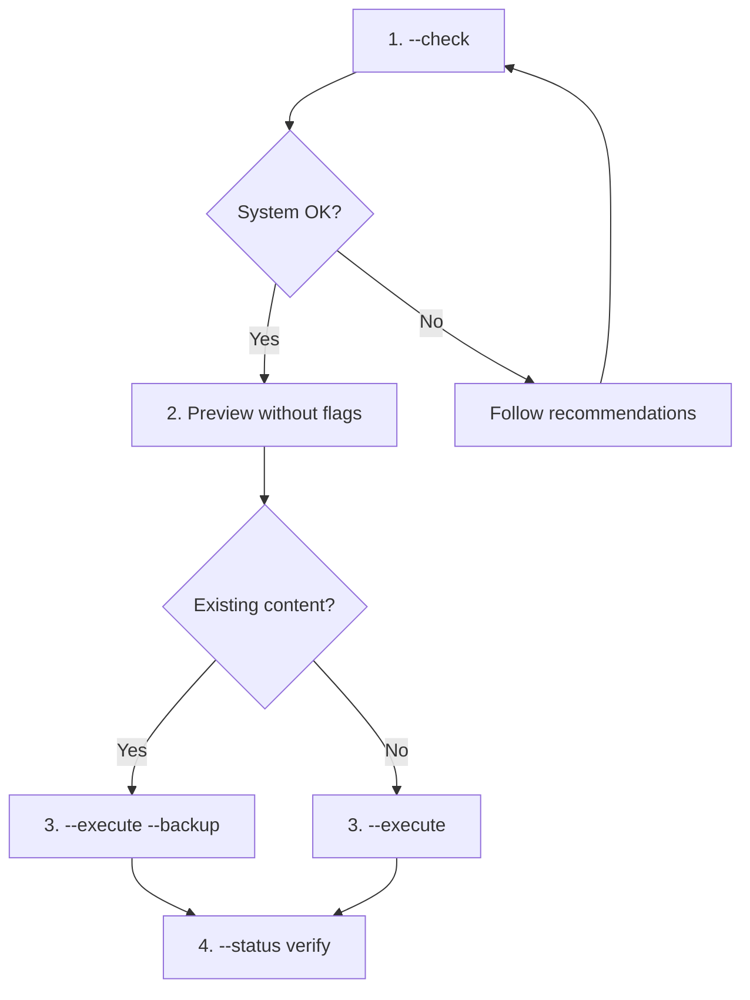

# Sync Claude Config

Creates symlinks in `~/.claude/` pointing to `poneglyph/.claude/`, allowing skills/agents/commands to be used in any project.

## Multi-OS Compatibility

| OS | Default method | Required permissions |
|----|----------------|----------------------|
| Windows | Junction | None |
| Windows (Dev Mode) | Symlink | Developer Mode ON |
| macOS | Symlink | User permissions |
| Linux | Symlink | User permissions |

## Recommended Workflow


```mermaid
graph TD
    A[1. --check] --> B{System OK?}
    B -->|Yes| C[2. Preview without flags]
    B -->|No| D[Follow recommendations]
    D --> A
    C --> E{Existing content?}
    E -->|Yes| F[3. --execute --backup]
    E -->|No| G[3. --execute]
    F --> H[4. --status verify]
    G --> H
```

## Usage

### 1. Verify system (recommended first)

```bash
bun .claude/skills/sync-claude/scripts/sync-claude.ts --check
```

Shows:
- OS and version
- Whether you are admin/root
- Developer Mode (Windows)
- Whether symlinks/junctions can be created
- Recommendations if anything is missing

### 2. Preview changes

```bash
bun .claude/skills/sync-claude/scripts/sync-claude.ts
```

### 3. Run sync

```bash
# Normal
bun .claude/skills/sync-claude/scripts/sync-claude.ts --execute

# With backup of existing content
bun .claude/skills/sync-claude/scripts/sync-claude.ts --execute --backup

# Force specific method
bun .claude/skills/sync-claude/scripts/sync-claude.ts --method junction --execute
```

### 4. View current status

```bash
bun .claude/skills/sync-claude/scripts/sync-claude.ts --status
```

### 5. Undo (remove symlinks)

```bash
bun .claude/skills/sync-claude/scripts/sync-claude.ts --unlink
```

## CLI Options

| Option | Description |
|--------|-------------|
| `--check` | Verify system and permissions |
| `--status` | Show current status |
| `--execute` | Apply changes |
| `--backup` | Save existing content before replacing |
| `--unlink` | Remove symlinks |
| `--method` | Force method: `auto`, `symlink`, `junction`, `copy` |
| `--force` | Do not prompt for confirmation |

## Linking Methods

| Method | Advantages | Disadvantages |
|--------|------------|---------------|
| `symlink` | Standard, works with files and folders | Windows: requires Dev Mode or Admin |
| `junction` | Windows: no special permissions needed | Folders only, Windows only |
| `copy` | Always works | Does not sync changes |

## Synced Folders

| Folder | Contents |
|--------|----------|
| `agents/` | Delegated agents |
| `skills/` | Reusable skills |
| `commands/` | Slash commands |
| `rules/` | Behavior rules |
| `docs/` | Technical documentation |
| `hooks/` | Automations |
| `workflows/` | Multi-agent pipelines |
| `knowledge/` | Knowledge base |
| `CLAUDE.md` | Global instructions |

## NOT Synced (project-specific)

| Folder | Reason |
|--------|--------|
| `agent_docs/` | Project-specific docs |
| `experts/` | Learned expertise |
| `plans/` | Temporary plans |
| `metrics/` | Session metrics |

## Troubleshooting

### Windows: Developer Mode

If `--check` shows Developer Mode disabled (and symlinks unavailable):

1. **Option A**: Enable Developer Mode
   - Settings → Privacy & Security → For developers → Developer Mode: ON
   - Restart terminal

2. **Option B**: Use junction (default)
   - Junctions work without special permissions
   - `--method junction` is automatic when symlink is unavailable

3. **Option C**: Run as Admin
   - Right-click terminal → "Run as administrator"

### macOS: Permissions

```bash
# Check home permissions
ls -la ~

# If ~/.claude has incorrect permissions
chmod 755 ~/.claude
```

### Linux: Permissions

```bash
# Check permissions
ls -la ~/.claude

# Fix if needed
sudo chown -R $USER:$USER ~/.claude
```

### Symlink Conflicts

If symlinks are pointing elsewhere:

```bash
# See where they point
bun .claude/skills/sync-claude/scripts/sync-claude.ts --status

# Replace with backup
bun .claude/skills/sync-claude/scripts/sync-claude.ts --execute --backup
```

---

**Version**: 2.0.0
