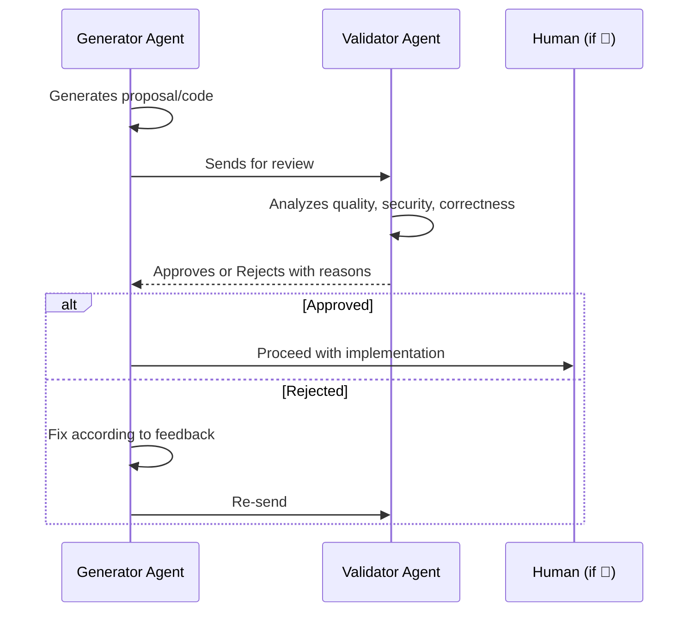

# Team Mode + Cross-Validation — references/07

## Cross-Validation (Four-Eyes Principle)

**Principle**: For critical decisions, use the LLM-as-Judge pattern where one agent reviews another's work.

### When to Apply

| Type of Decision | Requires Cross-Validation |
|-----------------|--------------------------|
| New architecture | Yes |
| Refactoring >5 files | Yes |
| Public API change | Yes |
| Data migration | Yes |
| Simple bug fix | No |
| Config change | No |
| New isolated endpoint | No |

### Validation Workflow



### Agent Combinations

| Task | Generator | Validator |
|------|-----------|-----------|
| New architecture | `planner` (Mode B) | `reviewer` |
| Complex refactoring | `builder` | `reviewer` |
| Feature with security | `builder` | `reviewer` |
| Critical tests | `builder` | `reviewer` |

---

## Team Mode Planning

When the Lead requests a plan with `execution_mode = team` (complexity > 60, 3+ independent domains), extend the standard plan with these additional sections.

### Team Assembly

Select agents based on task analysis:

| Agent | Condition | Required |
|-------|-----------|----------|
| `scout` | Codebase exploration | ALWAYS |
| `builder` | Code implementation | ALWAYS |
| `reviewer` | Quality validation | ALWAYS |
| `planner` (Mode B) | Complexity > 40 OR cross-domain interfaces — emits RFC + contracts inline | CONDITIONAL |
| `reviewer` (security) | Keywords: auth, token, password, jwt, encryption | CONDITIONAL |

### Domain Boundary Definition

For each teammate, define explicit boundaries in the plan:

| Field | Content | Example |
|-------|---------|---------|
| **Domain** | Logical area of responsibility | "Authentication service" |
| **Owned paths** | Files this teammate may modify | `src/auth/**`, `tests/auth/**` |
| **Forbidden paths** | Files this teammate must NOT touch | Everything outside owned paths |
| **Exposes** | Interfaces/contracts other domains consume | `AuthResult`, `validateToken()` |
| **Consumes** | Interfaces/contracts from other domains | `UserProfile` from user-domain |

### Teammate Prompt Template

Each teammate receives a structured prompt in the plan:

```
Domain: [X]. You own files in [paths]. Do NOT modify files outside your domain.

Tasks:
1. [subtask from roadmap]
2. [subtask from roadmap]

Interfaces:
- EXPOSE: [type/function] consumed by [other domain]
- CONSUME: [type/function] from [other domain]

Coordination: Use task list to signal completion and coordinate with other teammates.
```

### Recovery Plan (Team)

| Scenario | Action | Max retries |
|----------|--------|-------------|
| Teammate test failure | Analyze error, fix, re-run | 2 |
| NEEDS_CHANGES from reviewer | Apply feedback, re-submit | 3 then escalate |
| Teammate stuck (no progress) | Extract domain → run as builder subagent | 0 |
| File conflict between teammates | Lead arbitrates via reviewer, loser re-executes | 1 |
| Multiple teammates fail | Abort team mode → fallback to subagents | 0 |
| Architecture mismatch | Planner (Mode B) redesigns contracts, re-delegate | 1 |

### Correction Loop

```
1. builder/teammate implements
2. reviewer evaluates
3. If NEEDS_CHANGES:
   a. builder fixes according to feedback
   b. reviewer re-evaluates
   c. Max 3 iterations before escalating to Lead with full history
4. If APPROVED: mark task complete
```

### Team Plan Output Additions

When `execution_mode = team`, the standard output must additionally include:

| Section | Content |
|---------|---------|
| **Execution mode** | `team` in Objective section |
| **Domain boundaries** | Table per teammate with owned/forbidden paths |
| **Interface contracts** | Types and signatures shared between domains |
| **Env requirement** | `CLAUDE_CODE_EXPERIMENTAL_AGENT_TEAMS=1` |
| **Fallback strategy** | What happens if team mode prerequisites fail |
