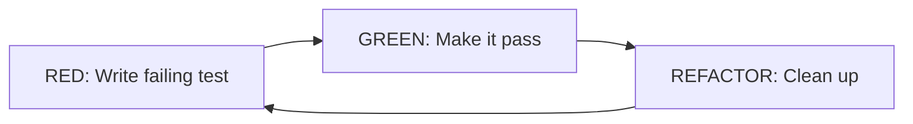

# Testing Strategy Skill

## Cuándo Usar

Activar cuando el prompt contenga: test, unit, integration, e2e, mock, fixture, tdd, bdd, coverage.

## Test Types

| Tipo | Scope | Velocidad | Dependencias |
|------|-------|-----------|--------------|
| Unit | Función/Clase | Rápido | Mockeadas |
| Integration | Módulos | Medio | Reales o parciales |
| E2E | Sistema | Lento | Todas reales |

### Pirámide de Tests

```
        /\
       /E2E\        <- Pocos, críticos
      /------\
     /Integr. \     <- Moderados
    /----------\
   /   Unit     \   <- Muchos, rápidos
  /--------------\
```

## Bun Test Patterns

### Estructura Básica

```typescript
import { describe, it, expect, beforeEach, afterEach, mock } from 'bun:test';

describe('UserService', () => {
  let service: UserService;

  beforeEach(() => {
    service = new UserService();
  });

  afterEach(() => {
    // cleanup
  });

  it('should create user with valid email', async () => {
    const user = await service.create({ email: 'test@example.com' });
    expect(user.email).toBe('test@example.com');
  });

  it('should throw on invalid email', () => {
    expect(() => service.create({ email: 'invalid' })).toThrow('Invalid email');
  });
});
```

### Assertions Comunes

```typescript
// Igualdad
expect(value).toBe(expected);           // ===
expect(value).toEqual(expected);        // deep equality
expect(value).toStrictEqual(expected);  // deep + types

// Truthiness
expect(value).toBeTruthy();
expect(value).toBeFalsy();
expect(value).toBeNull();
expect(value).toBeUndefined();

// Números
expect(value).toBeGreaterThan(3);
expect(value).toBeLessThanOrEqual(10);
expect(value).toBeCloseTo(0.3, 5);

// Strings
expect(value).toContain('substring');
expect(value).toMatch(/regex/);

// Arrays/Objects
expect(array).toContain(item);
expect(array).toHaveLength(3);
expect(object).toHaveProperty('key', 'value');

// Exceptions
expect(() => fn()).toThrow();
expect(() => fn()).toThrow('message');
expect(() => fn()).toThrow(ErrorClass);

// Async
await expect(promise).resolves.toBe(value);
await expect(promise).rejects.toThrow();
```

## Mocking

### Function Mocks

```typescript
import { mock, spyOn } from 'bun:test';

// Mock simple
const mockFn = mock(() => 'mocked value');
mockFn();
expect(mockFn).toHaveBeenCalled();
expect(mockFn).toHaveBeenCalledTimes(1);
expect(mockFn).toHaveBeenCalledWith(arg1, arg2);

// Mock con implementación
const mockFn = mock((x: number) => x * 2);
expect(mockFn(5)).toBe(10);

// Spy en objeto existente
const spy = spyOn(console, 'log');
console.log('test');
expect(spy).toHaveBeenCalledWith('test');
spy.mockRestore();
```

### Module Mocks

```typescript
import { mock } from 'bun:test';

// Mock de módulo completo
mock.module('./database', () => ({
  query: mock(() => Promise.resolve([{ id: 1 }])),
  connect: mock(() => Promise.resolve()),
}));

// Importar después del mock
const { query } = await import('./database');
```

### Service Mocks

```typescript
// Crear mock de servicio
const mockUserRepo = {
  findById: mock((id: string) => Promise.resolve({ id, name: 'Test' })),
  save: mock((user: User) => Promise.resolve(user)),
};

// Inyectar en servicio bajo test
const service = new UserService(mockUserRepo);

// Verificar llamadas
await service.updateName('123', 'New Name');
expect(mockUserRepo.findById).toHaveBeenCalledWith('123');
expect(mockUserRepo.save).toHaveBeenCalledWith(expect.objectContaining({ name: 'New Name' }));
```

## Fixtures

### Factory Pattern

```typescript
// fixtures/user.factory.ts
import { faker } from '@faker-js/faker';

export function createUserFixture(overrides?: Partial<User>): User {
  return {
    id: faker.string.uuid(),
    email: faker.internet.email(),
    name: faker.person.fullName(),
    createdAt: faker.date.past(),
    ...overrides,
  };
}

// En tests
const user = createUserFixture({ email: 'specific@test.com' });
```

### Database Fixtures

```typescript
// fixtures/db.setup.ts
import { db } from '../src/db';

export async function seedTestData() {
  await db.insert(users).values([
    { id: 'user-1', email: 'test1@example.com', name: 'User 1' },
    { id: 'user-2', email: 'test2@example.com', name: 'User 2' },
  ]);
}

export async function cleanupTestData() {
  await db.delete(posts);
  await db.delete(users);
}

// En test file
beforeEach(async () => {
  await cleanupTestData();
  await seedTestData();
});
```

### Snapshot Fixtures

```typescript
it('should render user profile correctly', () => {
  const result = renderUserProfile(userFixture);
  expect(result).toMatchSnapshot();
});
```

## TDD Workflow

### Red-Green-Refactor



### Ejemplo TDD

```typescript
// 1. RED - Write failing test first
describe('calculateDiscount', () => {
  it('should apply 10% discount for orders over $100', () => {
    expect(calculateDiscount(150)).toBe(135);
  });
});

// 2. GREEN - Minimal implementation
function calculateDiscount(amount: number): number {
  if (amount > 100) {
    return amount * 0.9;
  }
  return amount;
}

// 3. REFACTOR - Clean up
const DISCOUNT_THRESHOLD = 100;
const DISCOUNT_RATE = 0.1;

function calculateDiscount(amount: number): number {
  if (amount > DISCOUNT_THRESHOLD) {
    return amount * (1 - DISCOUNT_RATE);
  }
  return amount;
}
```

### Test-First Checklist

1. [ ] Escribir test que describe comportamiento deseado
2. [ ] Verificar que el test falla (RED)
3. [ ] Implementar código mínimo para pasar
4. [ ] Verificar que el test pasa (GREEN)
5. [ ] Refactorizar manteniendo tests verdes
6. [ ] Repetir para siguiente comportamiento

## Integration Tests

### API Integration

```typescript
import { describe, it, expect, beforeAll, afterAll } from 'bun:test';
import { app } from '../src/app';

describe('POST /api/users', () => {
  let server: ReturnType<typeof app.listen>;

  beforeAll(() => {
    server = app.listen(0); // Puerto aleatorio
  });

  afterAll(() => {
    server.stop();
  });

  it('should create user and return 201', async () => {
    const response = await fetch(`http://localhost:${server.port}/api/users`, {
      method: 'POST',
      headers: { 'Content-Type': 'application/json' },
      body: JSON.stringify({ email: 'new@test.com', name: 'New User' }),
    });

    expect(response.status).toBe(201);
    const user = await response.json();
    expect(user).toHaveProperty('id');
    expect(user.email).toBe('new@test.com');
  });
});
```

## Coverage

### Configuración

```toml
# bunfig.toml
[test]
coverage = true
coverageThreshold = { line = 0.8, function = 0.8, statement = 0.7 }
coverageReporter = ["text", "lcov"]
coverageDir = "./coverage"
coverageSkipTestFiles = true
```

### Ejecutar

```bash
# Con coverage
bun test --coverage

# Solo archivos específicos
bun test src/services/*.test.ts
```

## Checklist para Reviewer

- [ ] Tests cubren happy path y edge cases
- [ ] Mocks apropiados (no mockear lo que se testea)
- [ ] Fixtures reutilizables y limpios
- [ ] No dependencias entre tests (aislados)
- [ ] Nombres descriptivos (should...when...)
- [ ] Coverage > 80% para lógica de negocio
- [ ] Integration tests para flujos críticos
