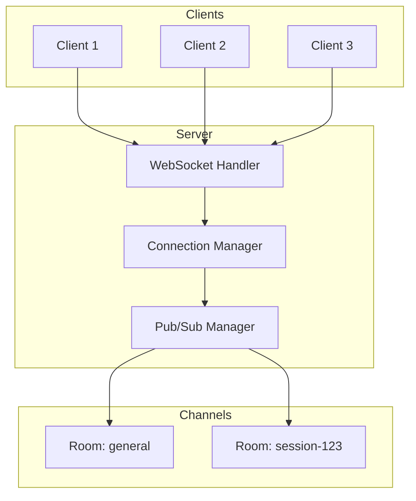

# WebSocket Patterns

Real-time communication patterns for Elysia/Bun applications.

## When to Use This Skill

- Implementing real-time features (chat, notifications, live updates)
- Bi-directional client-server communication
- Live data streaming (logs, metrics, events)
- Collaborative features (shared editing, presence)
- Server-sent events and push notifications
- Pub/sub messaging patterns

## Core Patterns

### WebSocket Architecture



### Key Concepts

| Concept | Purpose |
|---------|---------|
| Connection | Individual client WebSocket |
| Channel/Room | Logical group for broadcast |
| Pub/Sub | Message distribution pattern |
| Heartbeat | Connection health check |
| Reconnection | Client-side recovery |

## Elysia WebSocket Setup

### Basic Configuration

```typescript
import { Elysia, t } from 'elysia'

const app = new Elysia()
  .ws('/ws', {
    // Connection opened
    open(ws) {
      console.log(`[WS] Client connected: ${ws.id}`)
      ws.subscribe('global')
    },

    // Message received
    message(ws, message) {
      console.log(`[WS] Message from ${ws.id}:`, message)
      handleMessage(ws, message)
    },

    // Connection closed
    close(ws) {
      console.log(`[WS] Client disconnected: ${ws.id}`)
      ws.unsubscribe('global')
    },

    // Error occurred
    error(ws, error) {
      console.error(`[WS] Error for ${ws.id}:`, error)
    },
  })
  .listen(8080)

console.log('WebSocket server running on ws://localhost:8080/ws')
```

### Typed Message Schema

```typescript
import { Elysia, t } from 'elysia'

// Define message types
const MessageSchema = t.Object({
  type: t.Union([
    t.Literal('chat'),
    t.Literal('join'),
    t.Literal('leave'),
    t.Literal('ping'),
    t.Literal('subscribe'),
    t.Literal('unsubscribe'),
  ]),
  payload: t.Optional(t.Unknown()),
  room: t.Optional(t.String()),
  timestamp: t.Optional(t.Number()),
})

type WSMessage = typeof MessageSchema.static

const app = new Elysia()
  .ws('/ws', {
    body: MessageSchema,

    message(ws, message: WSMessage) {
      switch (message.type) {
        case 'chat':
          handleChat(ws, message)
          break
        case 'join':
          handleJoin(ws, message)
          break
        case 'leave':
          handleLeave(ws, message)
          break
        case 'ping':
          ws.send({ type: 'pong', timestamp: Date.now() })
          break
        case 'subscribe':
          if (message.room) ws.subscribe(message.room)
          break
        case 'unsubscribe':
          if (message.room) ws.unsubscribe(message.room)
          break
      }
    },
  })
```

### Authentication on Connect

```typescript
import { Elysia } from 'elysia'
import { verifyToken } from './auth'

interface WSData {
  userId: string
  username: string
  rooms: Set<string>
}

const app = new Elysia()
  .ws('/ws', {
    // Validate before upgrade
    async beforeHandle({ request, set }) {
      const url = new URL(request.url)
      const token = url.searchParams.get('token')

      if (!token) {
        set.status = 401
        return 'Missing token'
      }

      try {
        const payload = await verifyToken(token)
        return { userId: payload.sub, username: payload.username }
      } catch {
        set.status = 401
        return 'Invalid token'
      }
    },

    // Upgrade with user data
    upgrade(request) {
      return {
        data: {
          userId: request.userId,
          username: request.username,
          rooms: new Set<string>(),
        } as WSData,
      }
    },

    open(ws) {
      console.log(`User ${ws.data.username} connected`)
      ws.subscribe(`user:${ws.data.userId}`)
    },

    message(ws, message) {
      // ws.data.userId is available
      console.log(`Message from ${ws.data.username}:`, message)
    },
  })
```

## Connection Management

### Connection Registry

```typescript
interface Connection {
  id: string
  ws: WebSocket
  userId?: string
  username?: string
  connectedAt: Date
  lastActivity: Date
  rooms: Set<string>
  metadata: Record<string, unknown>
}

class ConnectionManager {
  private connections = new Map<string, Connection>()
  private userConnections = new Map<string, Set<string>>()

  add(ws: WebSocket, data?: Partial<Connection>): Connection {
    const conn: Connection = {
      id: ws.id,
      ws,
      connectedAt: new Date(),
      lastActivity: new Date(),
      rooms: new Set(),
      metadata: {},
      ...data,
    }

    this.connections.set(ws.id, conn)

    if (conn.userId) {
      if (!this.userConnections.has(conn.userId)) {
        this.userConnections.set(conn.userId, new Set())
      }
      this.userConnections.get(conn.userId)!.add(ws.id)
    }

    return conn
  }

  remove(wsId: string): void {
    const conn = this.connections.get(wsId)
    if (!conn) return

    // Clean up user mapping
    if (conn.userId) {
      const userConns = this.userConnections.get(conn.userId)
      userConns?.delete(wsId)
      if (userConns?.size === 0) {
        this.userConnections.delete(conn.userId)
      }
    }

    // Unsubscribe from all rooms
    conn.rooms.forEach(room => conn.ws.unsubscribe(room))

    this.connections.delete(wsId)
  }

  get(wsId: string): Connection | undefined {
    return this.connections.get(wsId)
  }

  getByUserId(userId: string): Connection[] {
    const connIds = this.userConnections.get(userId)
    if (!connIds) return []
    return Array.from(connIds)
      .map(id => this.connections.get(id))
      .filter((c): c is Connection => c !== undefined)
  }

  updateActivity(wsId: string): void {
    const conn = this.connections.get(wsId)
    if (conn) conn.lastActivity = new Date()
  }

  getAll(): Connection[] {
    return Array.from(this.connections.values())
  }

  getCount(): number {
    return this.connections.size
  }
}

// Global instance
export const connectionManager = new ConnectionManager()
```

### Usage in Elysia

```typescript
import { connectionManager } from './connection-manager'

const app = new Elysia()
  .ws('/ws', {
    open(ws) {
      const conn = connectionManager.add(ws, {
        userId: ws.data?.userId,
        username: ws.data?.username,
      })
      console.log(`Connections: ${connectionManager.getCount()}`)
    },

    message(ws, message) {
      connectionManager.updateActivity(ws.id)
      handleMessage(ws, message)
    },

    close(ws) {
      connectionManager.remove(ws.id)
      console.log(`Connections: ${connectionManager.getCount()}`)
    },
  })
```

## Pub/Sub Pattern

### Room Management

```typescript
const app = new Elysia()
  .ws('/ws', {
    open(ws) {
      // Auto-subscribe to global channel
      ws.subscribe('global')
      ws.subscribe(`user:${ws.data.userId}`)
    },

    message(ws, message) {
      switch (message.type) {
        case 'join_room': {
          const room = message.room
          if (isValidRoom(room) && canJoinRoom(ws.data.userId, room)) {
            ws.subscribe(room)
            ws.data.rooms.add(room)

            // Notify room members
            ws.publish(room, {
              type: 'user_joined',
              userId: ws.data.userId,
              username: ws.data.username,
              timestamp: Date.now(),
            })

            ws.send({ type: 'joined', room })
          }
          break
        }

        case 'leave_room': {
          const room = message.room
          if (ws.data.rooms.has(room)) {
            ws.publish(room, {
              type: 'user_left',
              userId: ws.data.userId,
              timestamp: Date.now(),
            })

            ws.unsubscribe(room)
            ws.data.rooms.delete(room)
            ws.send({ type: 'left', room })
          }
          break
        }

        case 'room_message': {
          const { room, content } = message
          if (ws.data.rooms.has(room)) {
            ws.publish(room, {
              type: 'message',
              room,
              userId: ws.data.userId,
              username: ws.data.username,
              content,
              timestamp: Date.now(),
            })
          }
          break
        }
      }
    },

    close(ws) {
      // Notify all rooms user was in
      ws.data.rooms.forEach(room => {
        ws.publish(room, {
          type: 'user_left',
          userId: ws.data.userId,
          timestamp: Date.now(),
        })
        ws.unsubscribe(room)
      })
    },
  })

function isValidRoom(room: string): boolean {
  return /^[a-z0-9-]+$/.test(room) && room.length <= 50
}

async function canJoinRoom(userId: string, room: string): Promise<boolean> {
  // Check permissions, room existence, etc.
  return true
}
```

### Broadcast Functions

```typescript
// Broadcast to all connections
function broadcastAll(app: Elysia, message: unknown): void {
  app.server?.publish('global', JSON.stringify(message))
}

// Broadcast to specific room
function broadcastRoom(app: Elysia, room: string, message: unknown): void {
  app.server?.publish(room, JSON.stringify(message))
}

// Send to specific user (all their connections)
function sendToUser(userId: string, message: unknown): void {
  const connections = connectionManager.getByUserId(userId)
  const payload = JSON.stringify(message)
  connections.forEach(conn => {
    if (conn.ws.readyState === 1) {
      conn.ws.send(payload)
    }
  })
}

// Broadcast to room except sender
function broadcastRoomExcept(
  ws: WebSocket,
  room: string,
  message: unknown
): void {
  ws.publish(room, JSON.stringify(message))
}
```

## Heartbeat / Keep-Alive

### Server-Side Ping

```typescript
const PING_INTERVAL_MS = 30000
const PONG_TIMEOUT_MS = 10000

interface HeartbeatData {
  pingInterval?: Timer
  pongTimeout?: Timer
  lastPong: number
}

const app = new Elysia()
  .ws('/ws', {
    open(ws) {
      const heartbeat: HeartbeatData = {
        lastPong: Date.now(),
      }
      ws.data.heartbeat = heartbeat

      // Start ping interval
      heartbeat.pingInterval = setInterval(() => {
        if (ws.readyState !== 1) {
          clearInterval(heartbeat.pingInterval)
          return
        }

        ws.send({ type: 'ping', timestamp: Date.now() })

        // Set timeout for pong response
        heartbeat.pongTimeout = setTimeout(() => {
          console.log(`[WS] Client ${ws.id} pong timeout, closing`)
          ws.close(4000, 'Pong timeout')
        }, PONG_TIMEOUT_MS)
      }, PING_INTERVAL_MS)
    },

    message(ws, message) {
      if (message.type === 'pong') {
        const heartbeat = ws.data.heartbeat as HeartbeatData
        heartbeat.lastPong = Date.now()
        if (heartbeat.pongTimeout) {
          clearTimeout(heartbeat.pongTimeout)
          heartbeat.pongTimeout = undefined
        }
        return
      }

      // Handle other messages...
    },

    close(ws) {
      const heartbeat = ws.data.heartbeat as HeartbeatData
      if (heartbeat.pingInterval) clearInterval(heartbeat.pingInterval)
      if (heartbeat.pongTimeout) clearTimeout(heartbeat.pongTimeout)
    },
  })
```

### Client-Side Reconnection

```typescript
// Client-side reconnecting WebSocket
class ReconnectingWebSocket {
  private ws: WebSocket | null = null
  private reconnectAttempts = 0
  private readonly maxReconnectAttempts = 10
  private readonly baseDelay = 1000
  private readonly maxDelay = 30000
  private isIntentionallyClosed = false

  private messageQueue: unknown[] = []
  private eventHandlers: Map<string, Set<(data: unknown) => void>> = new Map()

  constructor(private readonly url: string) {
    this.connect()
  }

  private connect(): void {
    console.log(`[WS] Connecting to ${this.url}`)
    this.ws = new WebSocket(this.url)

    this.ws.onopen = () => {
      console.log('[WS] Connected')
      this.reconnectAttempts = 0
      this.flushMessageQueue()
      this.emit('open', null)
    }

    this.ws.onclose = (event) => {
      console.log(`[WS] Closed: ${event.code} ${event.reason}`)
      this.emit('close', { code: event.code, reason: event.reason })

      if (!this.isIntentionallyClosed) {
        this.scheduleReconnect()
      }
    }

    this.ws.onerror = (error) => {
      console.error('[WS] Error:', error)
      this.emit('error', error)
    }

    this.ws.onmessage = (event) => {
      try {
        const message = JSON.parse(event.data)

        // Handle ping/pong
        if (message.type === 'ping') {
          this.send({ type: 'pong', timestamp: Date.now() })
          return
        }

        this.emit('message', message)
        this.emit(message.type, message.payload)
      } catch (e) {
        console.error('[WS] Failed to parse message:', e)
      }
    }
  }

  private scheduleReconnect(): void {
    if (this.reconnectAttempts >= this.maxReconnectAttempts) {
      console.error('[WS] Max reconnect attempts reached')
      this.emit('maxReconnectAttempts', null)
      return
    }

    // Exponential backoff with jitter
    const delay = Math.min(
      this.baseDelay * Math.pow(2, this.reconnectAttempts) + Math.random() * 1000,
      this.maxDelay
    )

    console.log(`[WS] Reconnecting in ${delay}ms (attempt ${this.reconnectAttempts + 1})`)
    this.reconnectAttempts++

    setTimeout(() => this.connect(), delay)
  }

  send(message: unknown): void {
    const payload = JSON.stringify(message)

    if (this.ws?.readyState === WebSocket.OPEN) {
      this.ws.send(payload)
    } else {
      // Queue message for when connection is restored
      this.messageQueue.push(message)
    }
  }

  private flushMessageQueue(): void {
    while (this.messageQueue.length > 0 && this.ws?.readyState === WebSocket.OPEN) {
      const message = this.messageQueue.shift()
      this.ws.send(JSON.stringify(message))
    }
  }

  on(event: string, handler: (data: unknown) => void): void {
    if (!this.eventHandlers.has(event)) {
      this.eventHandlers.set(event, new Set())
    }
    this.eventHandlers.get(event)!.add(handler)
  }

  off(event: string, handler: (data: unknown) => void): void {
    this.eventHandlers.get(event)?.delete(handler)
  }

  private emit(event: string, data: unknown): void {
    this.eventHandlers.get(event)?.forEach(handler => handler(data))
  }

  close(): void {
    this.isIntentionallyClosed = true
    this.ws?.close(1000, 'Client closed')
  }

  get readyState(): number {
    return this.ws?.readyState ?? WebSocket.CLOSED
  }
}

// Usage
const ws = new ReconnectingWebSocket('ws://localhost:8080/ws?token=xxx')

ws.on('open', () => console.log('Connected!'))
ws.on('message', (msg) => console.log('Received:', msg))
ws.on('chat', (payload) => console.log('Chat message:', payload))
ws.on('close', ({ code, reason }) => console.log(`Closed: ${code}`))

ws.send({ type: 'join_room', room: 'general' })
```

## Message Protocol

### Standard Message Format

```typescript
// Outgoing messages (client -> server)
interface ClientMessage<T = unknown> {
  type: string
  id: string          // For request-response correlation
  timestamp: number
  payload: T
}

// Incoming messages (server -> client)
interface ServerMessage<T = unknown> {
  type: string
  requestId?: string  // Correlates to client message id
  timestamp: number
  success: boolean
  data?: T
  error?: {
    code: string
    message: string
  }
}

// Factory functions
function createClientMessage<T>(type: string, payload: T): ClientMessage<T> {
  return {
    type,
    id: crypto.randomUUID(),
    timestamp: Date.now(),
    payload,
  }
}

function createServerMessage<T>(
  type: string,
  data: T,
  requestId?: string
): ServerMessage<T> {
  return {
    type,
    requestId,
    timestamp: Date.now(),
    success: true,
    data,
  }
}

function createErrorMessage(
  code: string,
  message: string,
  requestId?: string
): ServerMessage<never> {
  return {
    type: 'error',
    requestId,
    timestamp: Date.now(),
    success: false,
    error: { code, message },
  }
}
```

### Request-Response Pattern

```typescript
// Client-side request with timeout
class WSClient {
  private ws: ReconnectingWebSocket
  private pendingRequests = new Map<string, {
    resolve: (data: unknown) => void
    reject: (error: Error) => void
    timeout: Timer
  }>()

  constructor(url: string) {
    this.ws = new ReconnectingWebSocket(url)

    this.ws.on('message', (msg: ServerMessage) => {
      if (msg.requestId && this.pendingRequests.has(msg.requestId)) {
        const pending = this.pendingRequests.get(msg.requestId)!
        this.pendingRequests.delete(msg.requestId)
        clearTimeout(pending.timeout)

        if (msg.success) {
          pending.resolve(msg.data)
        } else {
          pending.reject(new Error(msg.error?.message ?? 'Request failed'))
        }
      }
    })
  }

  async request<T>(type: string, payload: unknown, timeoutMs = 30000): Promise<T> {
    return new Promise((resolve, reject) => {
      const id = crypto.randomUUID()

      const timeout = setTimeout(() => {
        this.pendingRequests.delete(id)
        reject(new Error('Request timeout'))
      }, timeoutMs)

      this.pendingRequests.set(id, { resolve, reject, timeout })

      this.ws.send({
        type,
        id,
        timestamp: Date.now(),
        payload,
      })
    })
  }

  // Fire and forget
  send(type: string, payload: unknown): void {
    this.ws.send(createClientMessage(type, payload))
  }
}

// Usage
const client = new WSClient('ws://localhost:8080/ws')

// Request-response
const user = await client.request<User>('get_user', { userId: '123' })

// Fire and forget
client.send('chat', { room: 'general', content: 'Hello!' })
```

### Server-Side Handler

```typescript
// Server handling request-response
const app = new Elysia()
  .ws('/ws', {
    async message(ws, message: ClientMessage) {
      try {
        const result = await handleRequest(ws, message)
        ws.send(createServerMessage(message.type, result, message.id))
      } catch (error) {
        const err = error instanceof Error ? error : new Error('Unknown error')
        ws.send(createErrorMessage(
          'REQUEST_FAILED',
          err.message,
          message.id
        ))
      }
    },
  })

async function handleRequest(ws: WebSocket, message: ClientMessage): Promise<unknown> {
  switch (message.type) {
    case 'get_user':
      return db.users.find(message.payload.userId)

    case 'get_messages':
      return db.messages.findByRoom(message.payload.room, {
        limit: message.payload.limit ?? 50,
      })

    case 'create_message':
      const msg = await db.messages.create({
        room: message.payload.room,
        userId: ws.data.userId,
        content: message.payload.content,
      })
      // Broadcast to room
      ws.publish(message.payload.room, createServerMessage('new_message', msg))
      return msg

    default:
      throw new Error(`Unknown message type: ${message.type}`)
  }
}
```

## Error Handling

### Server Error Handler

```typescript
const app = new Elysia()
  .ws('/ws', {
    error(ws, error) {
      console.error(`[WS] Error for ${ws.id}:`, error)

      // Send error to client
      try {
        ws.send({
          type: 'error',
          timestamp: Date.now(),
          success: false,
          error: {
            code: 'INTERNAL_ERROR',
            message: 'An internal error occurred',
          },
        })
      } catch {
        // Connection may be dead
      }
    },

    message(ws, message) {
      try {
        handleMessage(ws, message)
      } catch (error) {
        if (error instanceof ValidationError) {
          ws.send(createErrorMessage('VALIDATION_ERROR', error.message))
        } else if (error instanceof UnauthorizedError) {
          ws.send(createErrorMessage('UNAUTHORIZED', 'Access denied'))
        } else {
          console.error('[WS] Message handling error:', error)
          ws.send(createErrorMessage('INTERNAL_ERROR', 'Failed to process message'))
        }
      }
    },
  })
```

### Client Error Handling

```typescript
// React hook for WebSocket with error handling
function useWebSocket(url: string) {
  const [status, setStatus] = useState<'connecting' | 'connected' | 'disconnected'>('connecting')
  const [error, setError] = useState<Error | null>(null)
  const wsRef = useRef<ReconnectingWebSocket | null>(null)

  useEffect(() => {
    const ws = new ReconnectingWebSocket(url)
    wsRef.current = ws

    ws.on('open', () => {
      setStatus('connected')
      setError(null)
    })

    ws.on('close', () => {
      setStatus('disconnected')
    })

    ws.on('error', (err) => {
      setError(err instanceof Error ? err : new Error('WebSocket error'))
    })

    ws.on('maxReconnectAttempts', () => {
      setError(new Error('Could not connect to server'))
    })

    return () => ws.close()
  }, [url])

  const send = useCallback((type: string, payload: unknown) => {
    wsRef.current?.send({ type, payload, timestamp: Date.now() })
  }, [])

  return { status, error, send, ws: wsRef.current }
}
```

## Streaming Patterns

### Claude Response Streaming

```typescript
// Streaming Claude responses over WebSocket
import { Anthropic } from '@anthropic-ai/sdk'

const anthropic = new Anthropic()

async function streamClaudeResponse(
  ws: WebSocket,
  requestId: string,
  prompt: string
): Promise<void> {
  try {
    ws.send({
      type: 'stream_start',
      requestId,
      timestamp: Date.now(),
    })

    const stream = await anthropic.messages.stream({
      model: 'claude-sonnet-4-20250514',
      max_tokens: 4096,
      messages: [{ role: 'user', content: prompt }],
    })

    for await (const event of stream) {
      if (event.type === 'content_block_delta') {
        ws.send({
          type: 'stream_delta',
          requestId,
          timestamp: Date.now(),
          data: {
            text: event.delta.text,
          },
        })
      }
    }

    const finalMessage = await stream.finalMessage()

    ws.send({
      type: 'stream_end',
      requestId,
      timestamp: Date.now(),
      data: {
        usage: finalMessage.usage,
        stopReason: finalMessage.stop_reason,
      },
    })
  } catch (error) {
    ws.send(createErrorMessage(
      'STREAM_ERROR',
      error instanceof Error ? error.message : 'Stream failed',
      requestId
    ))
  }
}
```

### Server-Sent Events Alternative

```typescript
// SSE for one-way streaming (simpler than WebSocket)
app.get('/stream/:sessionId', ({ params }) => {
  return new ReadableStream({
    async start(controller) {
      const encoder = new TextEncoder()

      // Subscribe to events
      const unsubscribe = eventBus.subscribe(params.sessionId, (event) => {
        const data = `data: ${JSON.stringify(event)}\n\n`
        controller.enqueue(encoder.encode(data))
      })

      // Keep-alive
      const keepAlive = setInterval(() => {
        controller.enqueue(encoder.encode(': keepalive\n\n'))
      }, 30000)

      // Cleanup on close
      controller.close = () => {
        clearInterval(keepAlive)
        unsubscribe()
      }
    },
  }, {
    headers: {
      'Content-Type': 'text/event-stream',
      'Cache-Control': 'no-cache',
      'Connection': 'keep-alive',
    },
  })
})
```

## Checklist

Before completing WebSocket implementation:

- [ ] Message types are defined and validated with schema
- [ ] Connection state is tracked in ConnectionManager
- [ ] Heartbeat/ping-pong implemented for connection health
- [ ] Client has reconnection logic with exponential backoff
- [ ] Error handling covers both server and client sides
- [ ] Rooms/subscriptions cleaned up on disconnect
- [ ] Rate limiting applied to prevent message flooding
- [ ] Authentication verified on WebSocket upgrade
- [ ] Graceful shutdown handling for server restart
- [ ] Message queue for offline messages (if needed)
- [ ] Logging includes connection ID for debugging
- [ ] Typed messages used throughout

## Anti-Patterns

| WRONG | CORRECT |
|-------|---------|
| Storing WebSocket in closure | Use ConnectionManager with ws.id |
| No message validation | Validate all messages with schema |
| Synchronous heavy work in handler | Offload to worker or queue |
| No reconnection logic on client | Exponential backoff reconnect |
| Ignoring close codes | Handle different close scenarios |
| No heartbeat/ping | Implement server ping, client pong |
| Logging full message payloads | Log type and id only, redact data |
| No authentication on connect | Verify token in upgrade/beforeHandle |
| Broadcasting to dead connections | Check readyState before send |
| No timeout on request-response | Always set timeout, clean up pending |

## Integration

### Project-Specific Configuration

For **claude-code-poneglyph**, integrate WebSocket patterns in:

| File | Pattern |
|------|---------|
| `server/src/routes/ws.ts` | Main WebSocket handler |
| `server/src/services/connection-manager.ts` | Connection registry |
| `server/src/services/message-handler.ts` | Message routing |
| `web/src/hooks/useWebSocket.ts` | React WebSocket hook |
| `web/src/services/ws-client.ts` | ReconnectingWebSocket |

### Integration with Claude Service

```typescript
// server/src/routes/ws.ts
import { Elysia } from 'elysia'
import { connectionManager } from '../services/connection-manager'
import { claudeService } from '../services/claude'

export const wsRouter = new Elysia()
  .ws('/ws', {
    async beforeHandle({ request, set }) {
      // Verify auth token from query param
      const url = new URL(request.url)
      const token = url.searchParams.get('token')
      if (!token) {
        set.status = 401
        return 'Unauthorized'
      }
      // Verify and return user data
    },

    open(ws) {
      connectionManager.add(ws, { userId: ws.data.userId })
      ws.subscribe(`session:${ws.data.sessionId}`)
    },

    async message(ws, message) {
      if (message.type === 'execute') {
        // Stream Claude response
        await claudeService.streamResponse(
          message.payload.prompt,
          (delta) => ws.send({ type: 'delta', data: delta }),
          (result) => ws.send({ type: 'complete', data: result })
        )
      }
    },

    close(ws) {
      connectionManager.remove(ws.id)
    },
  })
```

### Session-Based Rooms

```typescript
// Each Claude session gets its own room for multi-tab support
app.ws('/ws', {
  open(ws) {
    const sessionId = ws.data.sessionId
    ws.subscribe(`session:${sessionId}`)

    // Notify other tabs
    ws.publish(`session:${sessionId}`, {
      type: 'tab_connected',
      tabId: ws.id,
    })
  },
})
```

---

**Version**: 1.0
**Spec**: SPEC-018
**For**: builder agent
