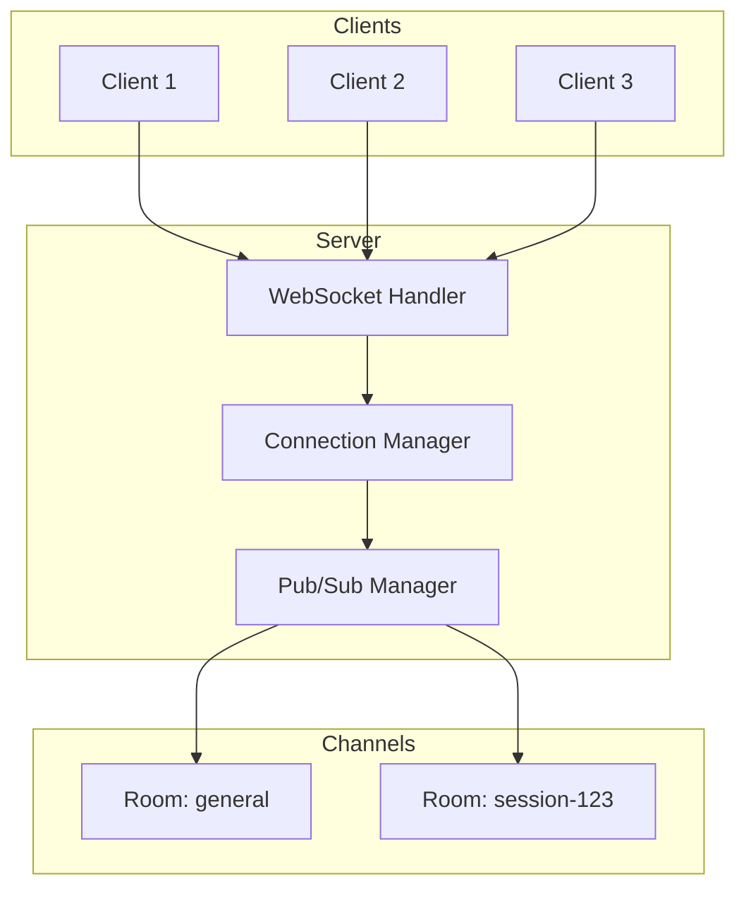

# WebSocket Architecture

## When to Use WebSockets

- Implementing real-time features (chat, notifications, live updates)
- Bi-directional client-server communication
- Live data streaming (logs, metrics, events)
- Collaborative features (shared editing, presence)
- Server-sent events and push notifications
- Pub/sub messaging patterns

## Architecture Diagram

## Key Concepts

| Concept | Purpose |
|---------|---------|
| Connection | Individual client WebSocket |
| Channel/Room | Logical group for broadcast |
| Pub/Sub | Message distribution pattern |
| Heartbeat | Connection health check |
| Reconnection | Client-side recovery |
