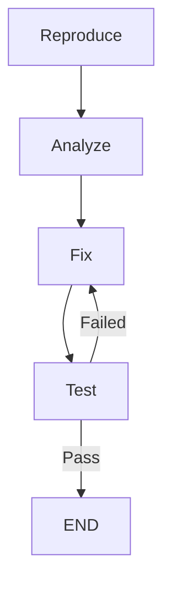

# Workflow: Bug Fix

Pipeline de corrección de bugs: reproduce → analyze → fix → test

## Trigger

| Tipo | Valor |
|------|-------|
| Keywords | `bug`, `fix`, `error`, `crash`, `broken`, `not working` |
| Complexity | >= 30 |

## Steps

### Step 1: Reproduce

| Campo | Valor |
|-------|-------|
| Agent | `scout` |
| Input | Descripción del bug, stacktrace si existe |
| Output | Pasos de reproducción, archivos afectados |
| Next | Step 2 |

### Step 2: Analyze

| Campo | Valor |
|-------|-------|
| Agent | `scout` (deep) |
| Input | Output de reproduce |
| Output | Root cause analysis, variables afectadas, scope del fix |
| Next | Step 3 |

### Step 3: Fix

| Campo | Valor |
|-------|-------|
| Agent | `builder` |
| Input | Análisis del bug + archivos afectados |
| Output | Código corregido |
| Next | Step 4 |

### Step 4: Test

| Campo | Valor |
|-------|-------|
| Agent | `reviewer` |
| Input | Fix aplicado |
| Output | Verificación de que el bug está resuelto, sin regresiones |
| Next | END o Step 3 (si persiste) |

## Parallel Execution

## Notes

- Si el bug no se reproduce, solicitar más información al usuario
- Priorizar fix mínimo que resuelva el problema
- Documentar root cause para prevención futura
- Actualizar AI_BUGS_KNOWLEDGE.md si aplica
