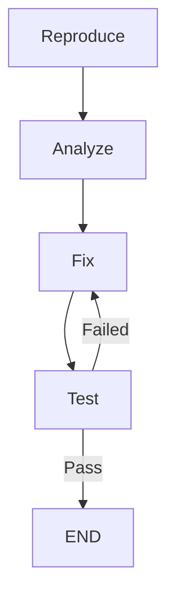

# Workflow: Bug Fix

Bug correction pipeline: reproduce → analyze → fix → test

## Trigger

| Type | Value |
|------|-------|
| Keywords | `bug`, `fix`, `error`, `crash`, `broken`, `not working` |
| Complexity | >= 30 |

## Steps

### Step 1: Reproduce

| Field | Value |
|-------|-------|
| Agent | `scout` |
| Input | Bug description, stacktrace if available |
| Output | Reproduction steps, affected files |
| Next | Step 2 |

### Step 2: Analyze

| Field | Value |
|-------|-------|
| Agent | `scout` (deep) |
| Input | Reproduce output |
| Output | Root cause analysis, affected variables, fix scope |
| Next | Step 3 |

### Step 3: Fix

| Field | Value |
|-------|-------|
| Agent | `builder` |
| Input | Bug analysis + affected files |
| Output | Corrected code |
| Next | Step 4 |

### Step 4: Test

| Field | Value |
|-------|-------|
| Agent | `reviewer` |
| Input | Applied fix |
| Output | Verification that the bug is resolved, no regressions |
| Next | END or Step 3 (if it persists) |

## Parallel Execution

```mermaid
graph TD
  R[Reproduce] --> A[Analyze]
  A --> F[Fix]
  F --> T[Test]
  T -->|Failed| F
  T -->|Pass| E[END]
```

## Notes

- If the bug cannot be reproduced, request more information from the user
- Prioritize the minimal fix that resolves the problem
- Document root cause for future prevention
- Update AI_BUGS_KNOWLEDGE.md if applicable
