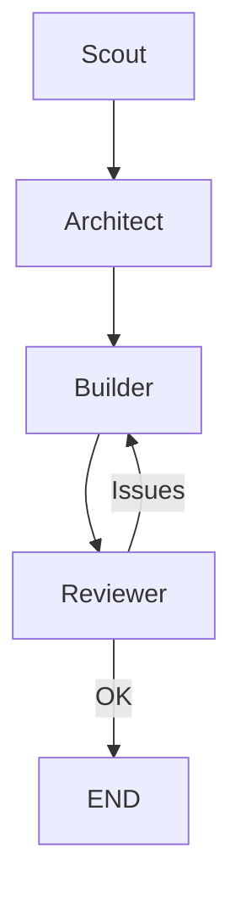

# Workflow: Dev Cycle

Pipeline completo de desarrollo: scout → architect → builder → reviewer

## Trigger

| Tipo | Valor |
|------|-------|
| Keywords | `implement`, `add feature`, `create`, `build`, `develop` |
| Complexity | >= 50 |

## Steps

### Step 1: Scout

| Campo | Valor |
|-------|-------|
| Agent | `scout` |
| Input | Contexto del codebase, archivos relevantes |
| Output | Estructura identificada, patrones existentes, archivos clave |
| Next | Step 2 |

### Step 2: Architect

| Campo | Valor |
|-------|-------|
| Agent | `architect` |
| Input | Output de scout + requirements |
| Output | Plan de implementación con decisiones técnicas |
| Next | Step 3 |

### Step 3: Builder

| Campo | Valor |
|-------|-------|
| Agent | `builder` |
| Input | Plan del architect |
| Output | Código implementado |
| Next | Step 4 |

### Step 4: Reviewer

| Campo | Valor |
|-------|-------|
| Agent | `reviewer` |
| Input | Código del builder |
| Output | Feedback, issues encontrados, aprobación |
| Next | END o Step 3 (si hay issues) |

## Parallel Execution

## Notes

- Si reviewer encuentra issues críticos, loop back a builder
- Máximo 2 iteraciones antes de escalar a usuario
- Cada step debe validar output del anterior antes de proceder
