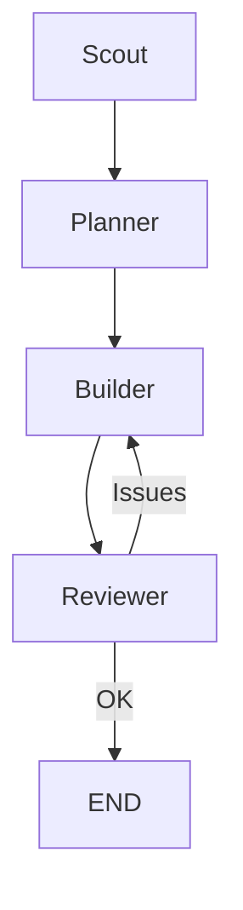

# Workflow: Dev Cycle

Full development pipeline: scout → planner → builder → reviewer

## Trigger

| Type | Value |
|------|-------|
| Keywords | `implement`, `add feature`, `create`, `build`, `develop` |
| Complexity | >= 50 |

## Steps

### Step 1: Scout

| Field | Value |
|-------|-------|
| Agent | `scout` |
| Input | Codebase context, relevant files |
| Output | Identified structure, existing patterns, key files |
| Next | Step 2 |

### Step 2: Plan

| Field | Value |
|-------|-------|
| Agent | `planner` |
| Input | Scout output + requirements |
| Output | Implementation plan with technical decisions (Mode A roadmap; Mode B RFC if design risk) |
| Next | Step 3 |

### Step 3: Builder

| Field | Value |
|-------|-------|
| Agent | `builder` |
| Input | Planner's roadmap |
| Output | Implemented code |
| Next | Step 4 |

### Step 4: Reviewer

| Field | Value |
|-------|-------|
| Agent | `reviewer` |
| Input | Builder's code |
| Output | Feedback, issues found, approval |
| Next | END or Step 3 (if issues) |

## Parallel Execution

```mermaid
graph TD
  S[Scout] --> P[Planner]
  P --> B[Builder]
  B --> R[Reviewer]
  R -->|Issues| B
  R -->|OK| E[END]
```

## Notes

- If reviewer finds critical issues, loop back to builder
- Maximum 2 iterations before escalating to user
- Each step must validate the previous step's output before proceeding
