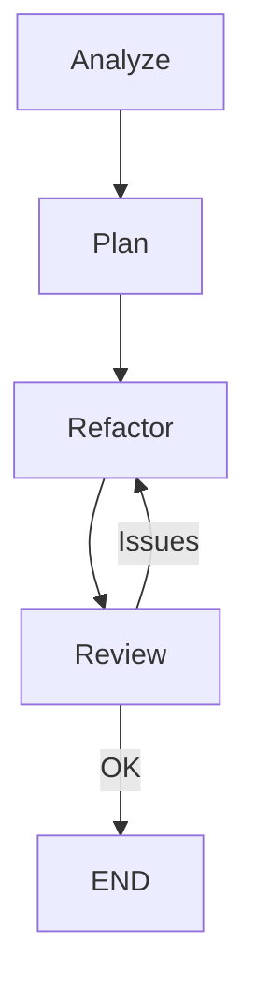

# Workflow: Refactor

Pipeline de refactorización: analyze → plan → refactor → review

## Trigger

| Tipo | Valor |
|------|-------|
| Keywords | `refactor`, `clean up`, `improve`, `simplify`, `restructure` |
| Complexity | >= 40 |

## Steps

### Step 1: Analyze

| Campo | Valor |
|-------|-------|
| Agent | `code-quality` |
| Input | Código a refactorizar |
| Output | Code smells, SOLID violations, complexity metrics |
| Next | Step 2 |

### Step 2: Plan

| Campo | Valor |
|-------|-------|
| Agent | `architect` |
| Input | Análisis de calidad + objetivo de refactor |
| Output | Plan de refactorización paso a paso |
| Next | Step 3 |

### Step 3: Refactor

| Campo | Valor |
|-------|-------|
| Agent | `refactor-agent` |
| Input | Plan de refactorización |
| Output | Código refactorizado |
| Next | Step 4 |

### Step 4: Review

| Campo | Valor |
|-------|-------|
| Agent | `reviewer` |
| Input | Código refactorizado vs original |
| Output | Verificación de comportamiento preservado, mejoras logradas |
| Next | END o Step 3 (si falla) |

## Parallel Execution

## Notes

- Mantener comportamiento idéntico (no añadir features)
- Tests deben pasar antes y después
- Aplicar transformaciones incrementales
- Si la complejidad es muy alta, dividir en múltiples PRs
