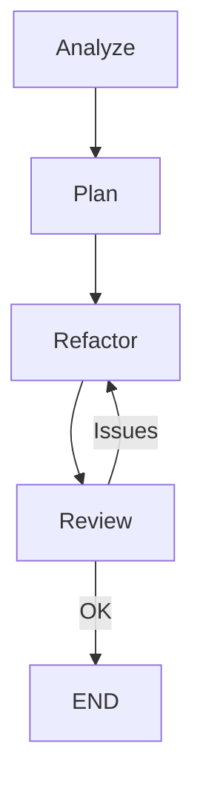

# Workflow: Refactor

Refactoring pipeline: analyze → plan → refactor → review

## Trigger

| Type | Value |
|------|-------|
| Keywords | `refactor`, `clean up`, `improve`, `simplify`, `restructure` |
| Complexity | >= 40 |

## Steps

### Step 1: Analyze

| Field | Value |
|-------|-------|
| Agent | `code-quality` |
| Input | Code to refactor |
| Output | Code smells, SOLID violations, complexity metrics |
| Next | Step 2 |

### Step 2: Plan

| Field | Value |
|-------|-------|
| Agent | `architect` |
| Input | Quality analysis + refactor objective |
| Output | Step-by-step refactoring plan |
| Next | Step 3 |

### Step 3: Refactor

| Field | Value |
|-------|-------|
| Agent | `refactor-agent` |
| Input | Refactoring plan |
| Output | Refactored code |
| Next | Step 4 |

### Step 4: Review

| Field | Value |
|-------|-------|
| Agent | `reviewer` |
| Input | Refactored code vs original |
| Output | Verification of preserved behavior, improvements achieved |
| Next | END or Step 3 (if it fails) |

## Parallel Execution

```mermaid
graph TD
  A[Analyze] --> P[Plan]
  P --> R[Refactor]
  R --> V[Review]
  V -->|Issues| R
  V -->|OK| E[END]
```

## Notes

- Maintain identical behavior (do not add features)
- Tests must pass before and after
- Apply incremental transformations
- If complexity is very high, split into multiple PRs
