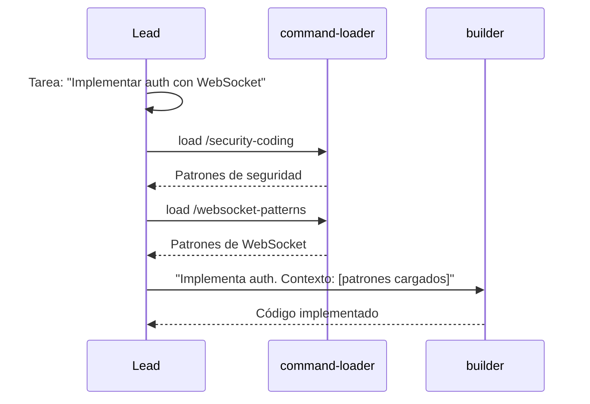
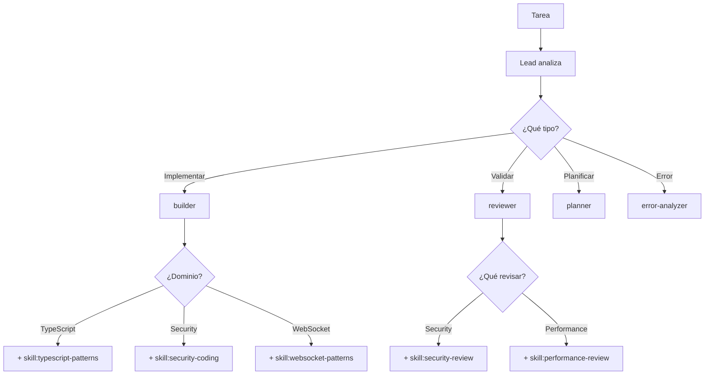

# Arquitectura: Agentes Base + Skills

<!--
status: approved
priority: critical
created: 2026-01-18
updated: 2026-01-18
version: 1.0
-->

## 1. Principio Fundamental

> **Pocos agentes base bien definidos + muchas skills para especialización.**

### Por qué este enfoque

| Beneficio | Explicación |
|-----------|-------------|
| **Simplicidad de routing** | Lead elige entre ~4 agentes, no 10+ |
| **Lazy loading** | Skills solo cargan cuando se necesitan |
| **Combinabilidad** | Un agente puede usar múltiples skills en una tarea |
| **Mantenibilidad** | Agentes estables, skills evolucionan |
| **Debugging** | Menos puntos de falla |

### Distinción Clave

| Concepto | Propósito | Ejemplo |
|----------|-----------|---------|
| **Agente** | WHAT + ROLE (qué puede hacer, qué rol juega) | `builder` puede Edit/Write |
| **Skill** | HOW (cómo hacerlo bien) | `typescript-patterns` informa patrones |

## 2. Agentes Base

### 2.1 Catálogo de Agentes

| Agente | Rol | Tools | Model |
|--------|-----|-------|-------|
| **builder** | Implementa código | All (Edit, Write, Bash) | sonnet |
| **reviewer** | Valida código | Read-only | sonnet |
| **planner** | Planifica ejecución | Read-only + MCPs | opus |
| **error-analyzer** | Analiza errores | Read-only | sonnet |

### 2.2 Comportamiento Base (inmutable)

Cada agente tiene comportamiento bien definido que NO cambia:

```yaml
builder:
  - Recibe UN paso del roadmap
  - Implementa código
  - Ejecuta tests del código que crea
  - Devuelve resultado estructurado
  - NUNCA revisa código de otros
  - NUNCA planifica

reviewer:
  - Recibe archivos a revisar
  - Ejecuta checklist de validación
  - Da veredicto (APPROVED/NEEDS_CHANGES)
  - NUNCA modifica código
  - NUNCA implementa fixes

planner:
  - Recibe tarea a planificar
  - Genera Execution Roadmap
  - Asigna agentes + skills por tarea
  - NUNCA implementa código
  - NUNCA ejecuta tareas

error-analyzer:
  - Recibe error/fallo a analizar
  - Diagnostica causa raíz
  - Recomienda estrategia de recovery
  - NUNCA implementa fixes
  - NUNCA modifica código
```

## 3. Skills

### 3.1 Propósito

Las skills aportan **conocimiento especializado** sin cambiar el rol del agente.

```
builder + skill:typescript-patterns
    → Builder sigue siendo builder (implementa código)
    → Pero ahora SABE patrones de TypeScript

reviewer + skill:security-review
    → Reviewer sigue siendo reviewer (valida código)
    → Pero ahora SABE qué buscar en security
```

### 3.2 Catálogo de Skills

#### Para Builder

| Skill | Propósito | Keywords |
|-------|-----------|----------|
| `typescript-patterns` | Patrones TS, async/await, types | typescript, async, types |
| `bun-best-practices` | APIs de Bun, Elysia, testing | bun, elysia, test |
| `security-coding` | Código seguro, OWASP, validación | security, auth, validation |
| `refactoring-patterns` | SOLID, extract-function, clean code | refactor, SOLID, extract |
| `websocket-patterns` | WS reconnection, streaming | websocket, realtime, ws |

#### Para Reviewer

| Skill | Propósito | Keywords |
|-------|-----------|----------|
| `security-review` | Checklist OWASP, vulnerabilidades | security, owasp, vuln |
| `performance-review` | N+1, memory leaks, profiling | performance, memory, slow |
| `code-quality` | Code smells, complexity, duplication | quality, smell, duplicate |

#### Para Error-Analyzer

| Skill | Propósito | Keywords |
|-------|-----------|----------|
| `retry-patterns` | Exponential backoff, circuit breaker | retry, timeout, backoff |
| `diagnostic-patterns` | Root cause analysis, error taxonomy | error, debug, diagnose |
| `recovery-strategies` | Checkpoint, rollback, escalation | recovery, rollback, escalate |

### 3.3 Dónde Viven las Skills

```
.claude/
├── commands/           # Slash commands (cargan contexto)
│   ├── load-security.md
│   ├── load-testing-strategy.md
│   └── ...
├── skills/             # Skills estructuradas
│   ├── typescript-patterns/
│   │   ├── SKILL.md
│   │   └── references/
│   ├── security-review/
│   │   ├── SKILL.md
│   │   └── checklists/
│   └── ...
└── agents/             # Agentes base
    ├── builder.md
    ├── reviewer.md
    ├── planner.md
    └── error-analyzer.md
```

### 3.4 Cómo se Cargan las Skills



## 4. Flujo de Trabajo

### 4.1 Lead Decide Agente + Skills



### 4.2 Planner Asigna Agente + Skill

El planner genera roadmap indicando agente Y skill sugerida:

```json
{
  "tasks": [
    {
      "id": "1.1",
      "action": "Create",
      "file": "services/auth.ts",
      "agent": "builder",
      "suggestedSkills": ["typescript-patterns", "security-coding"],
      "reason": "Auth service requiere patrones seguros de TypeScript"
    },
    {
      "id": "1.2",
      "action": "Create",
      "file": "services/ws-notify.ts",
      "agent": "builder",
      "suggestedSkills": ["websocket-patterns", "bun-best-practices"],
      "reason": "WebSocket con Bun específico"
    },
    {
      "id": "2.1",
      "action": "Review",
      "scope": ["1.1", "1.2"],
      "agent": "reviewer",
      "suggestedSkills": ["security-review"],
      "reason": "Auth requiere review de seguridad"
    }
  ]
}
```

## 5. Migración de Agentes Especializados

### Antes → Después

| Agente Especializado (antes) | Agente Base + Skill (después) |
|------------------------------|-------------------------------|
| `refactor-agent` | `builder` + skill:refactoring-patterns |
| `security-auditor` | `reviewer` + skill:security-review |
| `code-quality` | `reviewer` + skill:code-quality |
| `expert:websocket` | `builder/reviewer` + skill:websocket-patterns |
| `test-watcher` | `reviewer` + skill:testing-strategy |

### Qué se Elimina

Los siguientes agentes YA NO son necesarios como entidades separadas:
- ~~refactor-agent~~
- ~~security-auditor~~
- ~~code-quality~~
- ~~expert:websocket~~
- ~~test-watcher~~

### Qué se Mantiene

Solo 4 agentes base:
- `builder`
- `reviewer`
- `planner`
- `error-analyzer`

(+ `Explore` nativo de Claude Code para exploración)

## 6. Ventajas del Nuevo Enfoque

| Aspecto | Muchos Agentes | Pocos + Skills |
|---------|----------------|----------------|
| Routing | Lead elige entre 10+ | Lead elige entre 4 |
| Mantenimiento | 10+ archivos de agente | 4 agentes + N skills |
| Combinación | Un agente por tarea | Múltiples skills por tarea |
| Context | Cada agente es independiente | Skills son lazy-loaded |
| Evolución | Crear nuevo agente | Añadir nueva skill |

## 7. Reglas de Diseño

### 7.1 Agentes

1. **Máximo 4-5 agentes base**
2. **Comportamiento inmutable** - no cambia con skills
3. **Roles claros** - implementar, revisar, planificar, analizar
4. **Tools fijas** - definidas por rol, no por tarea

### 7.2 Skills

1. **Aportan conocimiento, no comportamiento**
2. **Específicas por dominio** (security, websocket, etc.)
3. **Combinables** - un agente puede usar varias
4. **Lazy-loaded** - solo cuando se necesitan
5. **Evolucionan independientemente** de agentes

### 7.3 Anti-Patterns

| ❌ No hacer | ✅ Hacer |
|-------------|----------|
| Skill que cambia rol del agente | Skill que informa cómo hacer el rol |
| Agente por cada dominio | Agente base + skill por dominio |
| Skills con Edit/Write | Skills solo con conocimiento |
| Cargar todas las skills | Cargar solo las relevantes |

---

## Changelog

| Versión | Fecha | Cambios |
|---------|-------|---------|
| 1.0.0 | 2026-01-18 | Arquitectura inicial: 4 agentes base + skills |
